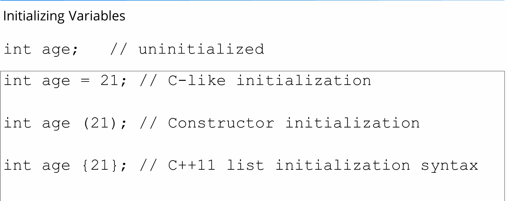

# cpp
learn and practice with cpp

* [Object file](#object-file-obj-o)
* [Keywords](#keywords)
    * [Extern](#extern)

## Object File (*.obj, *.o)
A C++ object file is an intermediate file produced by a C++ compiler from a C++ implementation file and the C++ header files that the implementation file includes. The C++ linker produces the output executable or library of your project from your C++ object files.

Object files (or object code) are machine code files generated by a compiler from source code.

The difference with an executable is that the object file isn't linked, so references to functions, symbols, etc aren't defined yet (their memory addresses is basically left blank).


Object files (or object code) are machine code files generated by a compiler from source code.

The difference with an executable is that the object file isn't linked, so references to functions, symbols, etc aren't defined yet (their memory addresses is basically left blank).

When you compile a C file with GCC:

```
gcc -Wall -o test test.c
```

Here you are compiling AND linking. So you'll got an executable, containing all the memory addresses references for the symbols it contains (libraries, headers, etc).

But when you do this:

```
gcc -Wall -o test.o -c test.c
```

You'll produce and object file. It's also machine code, but it will need to be linked in order to produce an executable, or a library.

When you have a project with many C files (for instance), you'll compile each one into object code, and then you will link all object files together in order to produce the final product.

For instance:
```
gcc -Wall -o foo.o -c foo.c              // Object file for foo.c
gcc -Wall -o bar.o -c bar.c              // Object file for bar.c
gcc -Wall -o main.o -c main.c            // Object file for main.c
gcc -Wall -o software foo.o bar.o main.o // Executable (foo + bar + main)
```

## Keywords
### Extern
The extern keyword in C++ is used to declare a global variable or function which can be accessed from any part of the program or from other files included in the program's header. The variables or functions declared with the extern keyword will have a larger scope than normally declared variables. Those variables can be accessed from any part of the program

extern keyword in C applies to C variables (data objects) and C functions. Basically, the extern keyword extends the visibility of the C variables and C functions. That’s probably the reason why it was named extern

Though most people probably understand the difference between the “declaration” and the “definition” of a variable or function, for the sake of completeness, let’s clarify it

* **Declaration** of a variable or function simply declares that the variable or function exists somewhere in the program, but the memory is not allocated for them. The declaration of a variable or function serves an important role–it tells the program what its type is going to be. In the case of function declarations, it also tells the program the arguments, their data types, the order of those arguments, and the return type of the function. So that’s all about the declaration.
* Coming to the **definition**, when we define a variable or function, in addition to everything that a declaration does, it also allocates memory for that variable or function. Therefore, we can think of the definition as a superset of the declaration (or declaration as a subset of the definition).
* Extern is a short name for external.
* The extern variable is used when a particular files need to access a variable from another file.

#### Syntax of extern
The syntax to define an extern variable in C++ is just to use the extern keyword before the variable declaration.

```
extern data_type variable_name;
```

Example of extern
```
#include <iostream> 
  
int a;            // int var;  ->  declaration and definition 
extern int b;     // extern int var;  -> declaration 
                  
  
int main()  
{   
   std::cout << b << std::endl;    
   return 0; 
}
```

#### Properties of extern Variable
* When we write extern some_data_type some_variable_name;  no memory is allocated. Only the property of the variable is announced.

* The extern variable says to the compiler  “Go outside my scope and you will find the definition of the variable that I declared.”

* The compiler believes that whatever that extern variable said is true and produces no error. Linker throws an error when it finds no such variable exists.

* When an extern variable is initialized, then memory for this is allocated and it will be considered defined.

A variable or function can be declared any number of times, but it can be defined only once. (Remember the basic principle that you can’t have two locations of the same variable or function).

## Preprocessor
The C++ preprocessor is a program that processes your source code befor the compiler sees it.

### C++ Preprocessors and Macros
As the name suggests, C++ preprocessors are tools that transform (preprocess) our program before it is compiled.

Preprocessors use preprocessor directives in order to control the code transformation. For example,

```
#include <iostream>
```

Here, #include is a preprocessor directive that inserts the contents of the <iostream> header file into our program before compiling it.


### Preprocessor Directives

In C++, all preprocessor directives begin with the # symbol. For example, #include, #define, #if, and so on.
Some of the common applications of C++ preprocessors are:

* #include - to include header files
* #define - to define macros
* #if - to provide conditional compilation

Now, let's learn about each of these preprocessor directives in detail.

### #include Preprocessor Directive
The #include directive is used to include header files in our program. For example,

```
#include <cmath>
```

Here, cmath is a header file. The #include directive tells the preprocessor to replace the above line of code with the contents of the cmath header file.

This is the reason we need to use #include <cmath> to use functions like pow() and sqrt().

We can also create our own custom header files and use them in our program using the #include directive. For example,

```
#include "path_to_file/my_header.h"
```

Here, we have included a custom header file named my_header.h in our program.

This way, we can divide a larger program into multiple files.

### #define Preprocessor Directive
The #define directive is used to "define" preprocessor variables which can be used in our programs. For example,

```
#define PI 3.1415   // value of pi
```

Now, when we use PI in our program, it is replaced with 3.1415.
Here, PI is known as a macro. A macro is a fragment of code which has been given a name.

#### Example 1: C++ #define
```
#include <iostream>

// create a macro named PI
// with the value 3.1415
#define PI 3.1415

using namespace std;

int main() {

    double radius, area;
    
    cout << "Enter the radius: ";
    cin >> radius;

    // use PI to calculate area of a circle
    area = PI * radius * radius;
    cout << "Area = " << area;
    
    return 0;
}
```

Output
```
Enter the radius: 4
Area = 50.264
```

### Function-like Macros
We can also use #define to create macros that work like a function. For example,

```
#define circleArea(r) (3.1415 * r * r)
```

Let's take a working example:
```
#include <iostream>
#define PI 3.1415

// macro that calculates area of circle
// and takes parameter 'r'
#define circle_area(r) (PI * r * r)

using namespace std;

int main() {
    
    double radius = 2.5;

    // call the circle_area() macro
    // pass radius as an argument
    cout << "Area = " << circle_area(radius);
    
    return 0;
}
```

Output
```
Area = 19.6344
Here, the code circleArea(radius); expands to 3.1415 * 2.5 * 2.5.
```

### #if Preprocessor Directive
The #if directive is used to instruct the preprocessor whether to include a block of code or not depending on certain conditions.

It can also be used in conjunction with the #else and #elif directives in case of multiple conditions.

Hence, the #if, #else, and #elif directives are quite similar to if...else statements in C++ with one major difference.

The if...else statements are tested during execution time to check if the block of code should be executed or not.

On the other hand, conditional directives are tested by the preprocessor before compilation to decide whether to include a block of code in the program or not.
```
Here's a simple example,
#include <iostream>  

// create NUMBER macro with a value of 3
#define NUMBER 3 

using namespace std;

int main() {
    
    // use #if directive to check
    // if NUMBER is greater than 0
    #if (NUMBER > 0) 
        cout << NUMBER << " is greater than 0.";
    #else
        cout << NUMBER << " is less than 0.";
    #endif         
 
    return 0;    
}
```

Output
```
3 is greater than 0.
```

Here, the #endif directive is used to indicate the completion of the #if and #else directives.

However, if...else statements are preferred over preprocessor directives for deciding which part of the code to execute during runtime.

Nevertheless, there are a few situations where #if directives are more applicable:

* To use different code depending on the operating system (platform-specific code).
* To include debugging codes (like printing debugging messages) that are run only on debugging builds.
* To toggle features on and off depending on certain conditions.
* To include code that is specific to certain versions or releases of the software (version-specific code).

Example 2: Platform-Specific C++ Code
```
#include <iostream>
using namespace std;

int main() {
    
    // include if running on windows
    #ifdef _WIN32
        cout << "Hello from Windows!" << endl;
    
    // include if running on linux
    #elif __linux__
        cout << "Hello from Linux!" << endl;
    
    // include if running on some other system
    #else
        cout << "Hello from an unknown platform!" << endl;
    #endif

    return 0;
}
```

Output
```
Hello from Linux!
```
This is an example of platform-specific code using conditional compiling.

Here,

* _WIN32 - a macro defined by the Microsoft Visual C++ compiler on Windows platforms
* __linux__ - a macro defined by GNU C Compiler on Linux systems
* #ifdef - a variant of #if which checks if a macro has been defined or not
The macros _WIN32 and __linux__ are used to determine the system on which the program is running.

### Predefined Macros
Here are some commonly used predefined macros in C++ programming.

```
Macro	Value
__DATE__	A string containing the current date.
__FILE__	A string containing the file name of the currently executing program.
__LINE__	An integer representing the current line number.
__TIME__	A string containing the current time (GMT).
```

Example 3: Predefined Macros
```
#include <iostream>
using namespace std;

int main() {

  // print the current time
  cout << "Current time: " << __TIME__;

  return 0;
}
```

Output
```
Current time: 04:23:31
```

This program prints the current time (GMT) using the __TIME__ macro.

## Comments
The compiler is never going to see commnet this because the preprocessor will see the comment and strip it out and just replace it with a single space

## Initial varible
the best way to initialize variables in C++ is using {}. Because it ensures type safety, let's talk more about it.

### Type Safety
Every object in C++ is used according to its type and an object needs to be initialized before its use.

### Safe Initialization: {}
The compiler protects from information loss during type conversion. For example,
```
int a{7}; The initialization is OK
int b{7.5} Compiler shows ERROR because of information loss.
```

### Unsafe Initialization: = or ()
The compiler doesn't protect from information loss during type conversion.
```
int a = 7 The initialization is OK
int a = 7.5 The initialization is OK, but information loss occurs. The actual value of a will become 7.0
int c(7) The initialization is OK
int c(7.5) The initialization is OK, but information loss occurs. The actual value of a will become 7.0
```


In C++, there are three main ways to initialize variables: using the assignment operator (`=`), using parentheses (`()`), and using braces (`{}`). Each of these methods has its own implications and uses. Here’s a detailed explanation of the differences between them:

### 1. Initializing a Variable using the Assignment Operator (`=`)

This is the most traditional way of initializing variables. It’s straightforward and easy to understand.

```cpp
int x = 10;       // x is initialized to 10
double y = 3.14;  // y is initialized to 3.14
std::string str = "Hello";  // str is initialized to "Hello"
```

### 2. Initializing a Variable using Parentheses (`()`)

This syntax is commonly used in the context of constructors and is especially common in object initialization.

```cpp
int x(10);       // x is initialized to 10
double y(3.14);  // y is initialized to 3.14
std::string str("Hello");  // str is initialized to "Hello"
```

### 3. Initializing a Variable using Braces (`{}`)

This is known as brace or uniform initialization, introduced in C++11. It provides a uniform way to initialize variables and objects and helps to avoid certain pitfalls like narrowing conversions.

```cpp
int x{10};       // x is initialized to 10
double y{3.14};  // y is initialized to 3.14
std::string str{"Hello"};  // str is initialized to "Hello"
```

#### Differences and Specifics

1. **Type Safety and Narrowing Conversions:**
   - Brace initialization `{}` prevents narrowing conversions, which means you cannot initialize a variable if it would lose data in the process.
   ```cpp
   int x = 3.14;   // Allowed, x becomes 3
   int y(3.14);    // Allowed, y becomes 3
   int z{3.14};    // Error: narrowing conversion from double to int
   ```

2. **Default Initialization:**
   - For classes and structs, brace initialization ensures all members are initialized.
   ```cpp
   struct Point {
       int x, y;
   };
   
   Point p1;        // Members x and y are uninitialized
   Point p2{};      // Members x and y are initialized to 0
   Point p3 = {};   // Members x and y are initialized to 0
   ```

3. **Initialization of Arrays and Containers:**
   - Brace initialization is particularly useful for initializing arrays and containers.
   ```cpp
   int arr[3] = {1, 2, 3};  // Array of integers
   std::vector<int> vec{1, 2, 3};  // Vector of integers
   ```

4. **Distinguishing between Function Declarations and Variable Declarations:**
   - Parentheses can sometimes be confusing because they can be interpreted as function declarations. Brace initialization avoids this ambiguity.
   ```cpp
   int x();  // This is a function declaration, not a variable declaration
   int y{};  // This is a variable declaration and initialization
   ```

5. **Uniform Initialization for Complex Types:**
   - Brace initialization provides a uniform way to initialize complex types, including objects of classes and structs.
   ```cpp
   class MyClass {
   public:
       MyClass(int a, double b) : x(a), y(b) {}
   private:
       int x;
       double y;
   };
   
   MyClass obj1(10, 3.14);  // Using parentheses
   MyClass obj2{10, 3.14};  // Using braces (preferred)
   ```

### Summary

- **Assignment Operator (`=`):** Traditional, simple, and widely used. Allows narrowing conversions.
- **Parentheses (`()`):** Often used for direct initialization, particularly for constructors and function arguments. Can lead to ambiguity in certain contexts.
- **Braces (`{}`):** Introduced in C++11, preferred for uniform initialization. Prevents narrowing conversions, ensures all members are initialized, and avoids ambiguity.

Using brace initialization is generally recommended for its safety and clarity, especially in modern C++ code.

## limits.h 
The maximum and minimum size of integral values are quite useful or in simple terms, limits of any integral type plays quite a role in programming. Instead of remembering these values, different macros can be used.

```
<climits>(limits.h) defines sizes of integral types.
```

This header defines constants with the limits of fundamental integral types for the specific system and compiler implementation used.
The limits for fundamental floating-point types are defined in <cfloat> (<float.h>). 
The limits for width-specific integral types and other typedef types are defined in <cstdint> (<stdint.h>).

Different macro constants are :

1. CHAR_MIN : 
```
Minimum value for an object of type char
Value of CHAR_MIN is either -127 (-27+1) or less* or 0
```

2. CHAR_MAX :  
```
Maximum value for an object of type char
Value of CHAR_MAX is either 127 (27-1) or 255 (28-1) or greater*    
```

3. SHRT_MIN :  
```
Minimum value for an object of type short int
Value of SHRT_MIN is -32767 (-215+1) or less*
```

4. SHRT_MAX :  
```
Maximum value for an object of type short int
Value of SHRT_MAX is 32767 (215-1) or greater*
```

5. USHRT_MAX :  
```
Maximum value for an object of type unsigned short int    
Value of USHRT_MAX is 65535 (216-1) or greater*
```

6. INT_MIN :  
```
Minimum value for an object of type int    
Value of INT_MIN is -2147483648 (-231) or less*
```

7. INT_MAX : 
```
Maximum value for an object of type int    
Value of INT_MAX is 2147483647 ( 231-1)
```

8. UINT_MAX :  
```
Maximum value for an object of type unsigned int    
Value of UINT_MAX is 4294967295 (232-1) or greater*
```

9. LONG_MIN :  
```
Minimum value for an object of type long int    
Value of LONG_MIN is -2147483647 (-231+1) or less*
```

10. LONG_MAX :  
```
Maximum value for an object of type long int    
Value of LONG_MAX is 2147483647 (231-1) or greater*
```

## sizeof
The sizeof is a keyword, but it is a compile-time operator that determines the size, in bytes, of a variable or data type.

The sizeof operator can be used to get the size of classes, structures, unions and any other user defined data type.

The syntax of using sizeof is as follows −

sizeof (data type)
Where data type is the desired data type including classes, structures, unions and any other user defined data type.

Try the following example to understand all the sizeof operator available in C++. Copy and paste following C++ program in test.cpp file and compile and run this program.

```
#include <iostream>
using namespace std;
 
int main() {
   cout << "Size of char : " << sizeof(char) << endl;
   cout << "Size of int : " << sizeof(int) << endl;
   cout << "Size of short int : " << sizeof(short int) << endl;
   cout << "Size of long int : " << sizeof(long int) << endl;
   cout << "Size of float : " << sizeof(float) << endl;
   cout << "Size of double : " << sizeof(double) << endl;
   cout << "Size of wchar_t : " << sizeof(wchar_t) << endl;
   
   return 0;
}
```

When the above code is compiled and executed, it produces the following result, which can vary from machine to machine −

```
Size of char : 1
Size of int : 4
Size of short int : 2
Size of long int : 4
Size of float : 4
Size of double : 8
Size of wchar_t : 4
```

## Constants
In C++, a constant is a value that cannot be altered by the program during its execution. Constants are used to define values that remain the same throughout the program. There are several ways to define constants in C++. Let's go through each type with detailed explanations and examples.

### 1. Literal Constants
Literal constants are the simplest form of constants. They are values written directly in the code. Here are some examples:

- **Integer literals**: `42`, `0`, `-7`
- **Floating-point literals**: `3.14`, `-0.001`, `2.0e10`
- **Character literals**: `'a'`, `'Z'`, `'\n'` (newline)
- **String literals**: `"Hello, World!"`, `"C++"`

Example:
```cpp
#include <iostream>
using namespace std;

int main() {
    int age = 25;          // integer literal
    double pi = 3.14159;   // floating-point literal
    char grade = 'A';      // character literal
    string name = "Alice"; // string literal

    cout << "Age: " << age << endl;
    cout << "PI: " << pi << endl;
    cout << "Grade: " << grade << endl;
    cout << "Name: " << name << endl;

    return 0;
}
```

### 2. `const` Keyword
The `const` keyword is used to define variables whose values cannot be changed after initialization.

Example:
```cpp
#include <iostream>
using namespace std;

int main() {
    const int birthYear = 1995; // constant integer
    const double gravity = 9.81; // constant floating-point number

    cout << "Birth Year: " << birthYear << endl;
    cout << "Gravity: " << gravity << endl;

    // Uncommenting the following lines will cause a compilation error
    // birthYear = 2000;
    // gravity = 9.8;

    return 0;
}
```

### 3. Enumerated Constants (`enum`)
An `enum` is a user-defined type that consists of a set of named integral constants. This is useful for defining a collection of related constants.

Example:
```cpp
#include <iostream>
using namespace std;

enum Color { RED, GREEN, BLUE };

int main() {
    Color favoriteColor = BLUE;

    if (favoriteColor == BLUE) {
        cout << "Your favorite color is blue." << endl;
    }

    // The underlying values of enum constants are integers starting from 0
    cout << "Value of RED: " << RED << endl;
    cout << "Value of GREEN: " << GREEN << endl;
    cout << "Value of BLUE: " << BLUE << endl;

    return 0;
}
```

### 4. `constexpr` Keyword
The `constexpr` keyword is used to define constants that can be evaluated at compile time. This is useful for defining constants that involve complex expressions.

Example:
```cpp
#include <iostream>
using namespace std;

constexpr int getSquare(int x) {
    return x * x;
}

int main() {
    constexpr int sideLength = 5;
    constexpr int area = getSquare(sideLength);

    cout << "Side Length: " << sideLength << endl;
    cout << "Area: " << area << endl;

    return 0;
}
```

### 5. `#define` Preprocessor Directive
The `#define` directive is used to define constant macros. These are replaced by their values before the compilation process begins. However, using `#define` for constants is generally discouraged in favor of `const` or `constexpr` due to better type safety and scope control.

Example:
```cpp
#include <iostream>
using namespace std;

#define PI 3.14159
#define CIRCLE_AREA(radius) (PI * (radius) * (radius))

int main() {
    double radius = 4.5;
    double area = CIRCLE_AREA(radius);

    cout << "Radius: " << radius << endl;
    cout << "Circle Area: " << area << endl;

    return 0;
}
```

### Summary
- **Literal Constants**: Directly written values (e.g., `42`, `3.14`, `"Hello"`).
- **`const` Keyword**: Defines immutable variables.
- **`enum`**: Defines a set of related integral constants.
- **`constexpr` Keyword**: For compile-time evaluated constants.
- **`#define` Preprocessor Directive**: Defines macros, though less preferred.

Each of these types has its own use case and advantages, providing flexibility in how constants are defined and used in C++ programs.

## constexpr
constexpr is a feature added in C++ 11. The main idea is a performance improvement of programs by doing computations at compile time rather than run time. Note that once a program is compiled and finalized by the developer, it is run multiple times by users. The idea is to spend time in compilation and save time at run time (similar to template metaprogramming).  constexpr specifies that the value of an object or a function can be evaluated at compile-time and the expression can be used in other constant expressions. 

Example:
```
// C++ program to demonstrate constexpr function for product
// of two numbers. By specifying constexpr, we suggest
// compiler to evaluate value at compile time
#include <iostream>

constexpr int product(int x, int y) { return (x * y); }

int main()
{
    constexpr int x = product(10, 20);
    std::cout << x;
    return 0;
}
```
Output
```
200
```
A function be declared as constexpr

* In C++ 11, a constexpr function should contain only one return statement. C++ 14 allows more than one statement.
* constexpr function should refer only to constant global variables.
* constexpr function can call only other constexpr functions not simple functions.
* The function should not be of a void type.
* In C++11, prefix increment (++v) was not allowed in constexpr function but this restriction has been removed in C++14.

It might seem like unnecessary to write a function that just returns the multiplication of a given number as constexpr. Other than performance improvement where could this feature be useful?

The main advantage of this feature is that it allows us to use a function to evaluate compile-time constant. With this, we could calculate the size of the array at compile time which was not possible before.

```
// C++ program to demonstrate constexpr function to evaluate
// the size of array at compile time.
#include <iostream>

constexpr int product(int x, int y) { return (x * y); }

int main()
{
    int arr[product(2, 3)] = {1, 2, 3, 4, 5, 6};
    std::cout << arr[5];
    return 0;
}
```

Output
```
6
```

Another practical use case is to convert the unit from one system to another. E.g., trigonometric function in C/C++ takes angle in radian whereas most of the people finds easier to use angle in degree. So, we could write ConvertDegreeToRadian() function as constexpr without compromising with performance and readability of the code.

```
#include <iostream>
using namespace std;
const double PI = 3.14159265359;
constexpr double ConvertDegreeToRadian(const double& dDegree)
{
    return (dDegree * (PI / 180));
}

int main() 
{
    auto dAngleInRadian = ConvertDegreeToRadian(90.0);
    cout << "Angle in radian: " << dAngleInRadian;
    return 0;
}
```

Output
```
Angle in radian: 1.5708
```

Example of performance improvement by constexpr: 
```
// A C++ program to demonstrate the use of constexpr 
#include<iostream>  

constexpr long int fib(int n) 
{ 
    return (n <= 1) ? n : fib(n-1) + fib(n-2); 
} 

int main () 
{ 
    // value of res is computed at compile time. 
    constexpr long int res = fib(30); 
    std::cout << res; 
    return 0; 
} 
```

Output
```
832040
```
When the above program is run on GCC, it takes 0.003 seconds (We can measure time using the time command) If we remove const from the below line, then the value of fib(5) is not evaluated at compile-time, because the result of constexpr is not used in a const expression.

```
Change,
  constexpr long int res = fib(30);  
To,
  long int res = fib(30);
```

After making the above change, the time taken by the program becomes higher by 0.017 seconds.

constexpr with constructors: A constructor that is declared with a constexpr specifier is a constexpr constructor also constexpr can be used in the making of constructors and objects. A constexpr constructor is implicitly inline.

Restrictions on constructors that can use constexpr:
* No virtual base class
* Each parameter should be literal
* It is not a try block function

Example:
```
// C++ program to demonstrate uses 
// of constexpr in constructor 
#include <iostream> 

// A class with constexpr 
// constructor and function 
class Rectangle 
{ 
    int _h, _w; 
public: 
    // A constexpr constructor 
    constexpr Rectangle(int h, int w) : _h(h), _w(w) {} 
    
    constexpr int getArea() const { return _h * _w; } 
}; 

// driver program to test function 
int main() 
{ 
    // Below object is initialized at compile time 
    constexpr Rectangle obj(10, 20); 
    std::cout << obj.getArea(); 
    return 0; 
} 
```