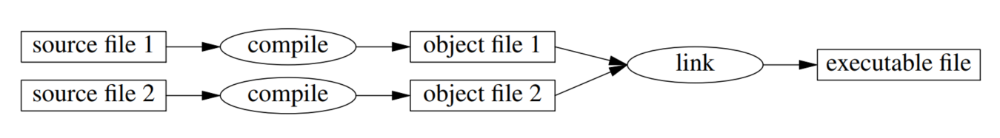
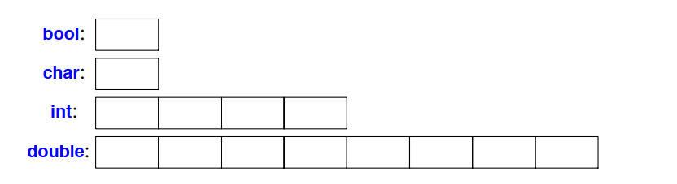
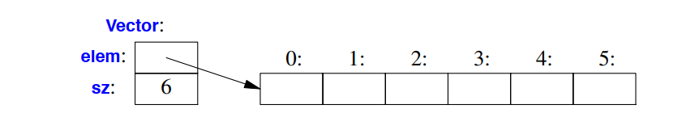
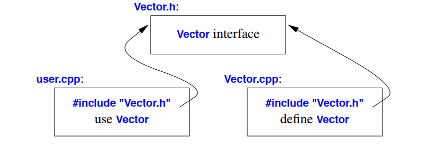

## Introduction
هدف این فصل و سه فصل بعدی، این است که به شما ایده‌ای درباره‌ی C++ بدهد، بدون اینکه وارد جزئیات زیادی شود. این فصل به طور غیررسمی به ارائه‌ی نمادگذاری C++، مدل حافظه و محاسبات در C++ و مکانیزم‌های پایه‌ای برای سازمان‌دهی کد به یک برنامه می‌پردازد. اینها امکانات زبان هستند که از سبک‌هایی که اغلب در C دیده می‌شود و گاهی به آن‌ها برنامه‌نویسی رویه‌ای گفته می‌شود، پشتیبانی می‌کنند. فصل 3 با ارائه مکانیزم‌های انتزاعی C++ ادامه می‌یابد. فصل 4 و فصل 5 نیز مثال‌هایی از امکانات کتابخانه استاندارد ارائه می‌دهند.

---

در **Procedural programming** (برنامه‌نویسی رویه‌ای) یک سبک یا پارادایم برنامه‌نویسی است که در آن برنامه‌ها به عنوان مجموعه‌ای از توابع یا رویه‌ها تعریف می‌شوند. این رویکرد به جای تمرکز بر اشیا و داده‌ها، بر روی ترتیب اجرای دستورات و توابع تأکید دارد. در این سبک، برنامه‌نویس عملیات مورد نیاز برای حل یک مسئله را به بخش‌های کوچک‌تر (رویه‌ها یا توابع) تقسیم می‌کند که هر کدام کار خاصی را انجام می‌دهند.

ویژگی‌های اصلی برنامه‌نویسی رویه‌ای عبارتند از:

1. **توابع (Procedures/Functions)**: کد به صورت توابع یا زیرروال‌ها سازمان‌دهی می‌شود که هر کدام وظیفه خاصی را انجام می‌دهند. این توابع می‌توانند بارها و بارها در قسمت‌های مختلف برنامه فراخوانی شوند.
  
2. **ساختار کنترل**: برای کنترل جریان برنامه از ساختارهای کنترلی مانند حلقه‌ها (loops) و شرط‌ها (if/else) استفاده می‌شود.
  
3. **متغیرها و داده‌های سراسری**: متغیرها می‌توانند به صورت سراسری (global) یا محلی (local) تعریف شوند و در سراسر برنامه یا فقط در یک تابع خاص قابل دسترسی باشند.

4. **الگوریتم‌محور**: برنامه‌نویسی رویه‌ای بیشتر بر طراحی الگوریتم‌ها برای انجام کارها و ترتیب اجرای دستورات تمرکز دارد.

زبان‌هایی مثل C و پاسکال نمونه‌های بارزی از زبان‌های برنامه‌نویسی رویه‌ای هستند. در C++، با وجود اینکه این زبان از شی‌گرایی پشتیبانی می‌کند، هنوز هم می‌توان از این سبک برنامه‌نویسی استفاده کرد، همان‌طور که در زبان C انجام می‌شود.

---

این مرور سریع از C++ ما را از یک ارائه کاملاً «پایین به بالا» از امکانات زبان و کتابخانه نجات می‌دهد، با این امکان که حتی در فصل‌های اولیه هم از مجموعه‌ای غنی از امکانات استفاده کنیم. به عنوان مثال، حلقه‌ها تا فصل ۱۰ به‌طور مفصل بحث نمی‌شوند، اما خیلی زودتر از آن به شکل‌های آشکاری مورد استفاده قرار خواهند گرفت. به همین ترتیب، توضیحات جزئی درباره کلاس‌ها، الگوها (templates)، استفاده از حافظه پویا (free-store)، و کتابخانه استاندارد در طول فصل‌های زیادی پخش شده است، اما از انواع کتابخانه استاندارد مانند **vector**، **string**، **complex**، **map**، **unique_ptr**، و **ostream** در هر جا که لازم باشد، برای بهبود مثال‌های کد استفاده خواهد شد.

به‌عنوان یک قیاس، این مرور سریع را می‌توانید به یک تور دیدنی کوتاه از یک شهر، مانند کپنهاگ یا نیویورک، تشبیه کنید. در عرض چند ساعت، یک نگاه سریع به جاذبه‌های اصلی دارید، چند داستان پس‌زمینه شنیده‌اید و معمولاً چند پیشنهاد برای دیدن چیزهای دیگر دریافت می‌کنید. پس از چنین توری، شما شهر را به‌طور کامل نمی‌شناسید و همه آنچه دیده‌اید و شنیده‌اید را درک نمی‌کنید. برای شناخت واقعی یک شهر، باید سال‌ها در آن زندگی کنید. اما با کمی شانس، یک نمای کلی از شهر، ایده‌ای از ویژگی‌های خاص آن و چیزهایی که ممکن است برایتان جالب باشد به دست آورده‌اید. پس از این تور، اکتشاف واقعی می‌تواند آغاز شود.

این مرور، C++ را به‌عنوان یک کل یکپارچه ارائه می‌دهد، نه به‌عنوان یک «کیک چندلایه». به همین دلیل، ویژگی‌های زبان به‌عنوان ویژگی‌هایی که در C وجود داشته، بخشی از C++98 هستند یا در C++11 جدید هستند، مشخص نمی‌شوند. این اطلاعات تاریخی را می‌توانید در بخش ۱.۴ و فصل ۴۴ پیدا کنید.

## The Basics
زبان C++ یک زبان **کامپایل‌شونده** است. برای اجرای یک برنامه، کد منبع آن باید توسط کامپایلر پردازش شود که منجر به تولید فایل‌های شیء (object files) می‌شود. این فایل‌ها سپس توسط یک لینک‌کننده (linker) با هم ترکیب شده و یک برنامه اجرایی (executable) تولید می‌کنند. معمولاً یک برنامه C++ شامل بسیاری از فایل‌های کد منبع (که معمولاً به سادگی فایل‌های منبع نامیده می‌شوند) است.



یک برنامه اجرایی برای یک ترکیب خاص از سخت‌افزار/سیستم ساخته می‌شود؛ بنابراین، به‌طور مستقیم قابل انتقال از یک سیستم به سیستم دیگر، مثلاً از مک به ویندوز، نیست. هنگامی که درباره **قابلیت حمل (portability)** برنامه‌های C++ صحبت می‌کنیم، معمولاً منظور ما قابلیت حمل کد منبع است؛ یعنی کد منبع می‌تواند به‌طور موفقیت‌آمیز روی سیستم‌های مختلف کامپایل و اجرا شود.

استاندارد ISO C++ دو نوع موجودیت را تعریف می‌کند:
- **ویژگی‌های اصلی زبان**: مانند انواع داخلی (مثل `char` و `int`) و حلقه‌ها (مثل دستورات `for` و `while`).
- **اجزای کتابخانه استاندارد**: مانند **container**‌ها (مانند `vector` و `map`) و عملیات ورودی/خروجی (مثل `<<` و `getline()`).

اجزای کتابخانه استاندارد، کدهای عادی C++ هستند که توسط هر پیاده‌سازی C++ ارائه می‌شوند. به عبارت دیگر، کتابخانه استاندارد C++ می‌تواند در خود C++ پیاده‌سازی شود (و این کار انجام می‌شود، به جز استفاده‌های بسیار جزئی از کد ماشین برای چیزهایی مانند تعویض زمینه‌ی (context switching) رشته‌ها). این بدان معناست که C++ به اندازه کافی **بیان‌پذیر** و **کارآمد** برای انجام سخت‌ترین وظایف برنامه‌نویسی سیستم است.

زبان C++ یک زبان **با نوع ایستا** (statically typed) است. یعنی نوع هر موجودیت (مانند شیء، مقدار، نام و عبارت) باید در زمان استفاده از آن توسط کامپایلر مشخص باشد. نوع یک شیء تعیین می‌کند که چه مجموعه‌ای از عملیات روی آن قابل اجرا است.

---

در یک زبان **کامپایل‌شونده** مثل C++، فرآیند اجرای یک برنامه شامل چند مرحله است که در نهایت منجر به تولید یک فایل اجرایی می‌شود که می‌تواند روی سیستم اجرا شود. این فرآیند به شکل زیر انجام می‌شود:

1. **نوشتن کد منبع (Source Code)**:
   ابتدا برنامه‌نویس کد برنامه را به زبان C++ می‌نویسد. این کد به صورت فایل‌های متنی ذخیره می‌شود که به آن‌ها **فایل‌های منبع** یا **source files** گفته می‌شود. معمولاً فایل‌های C++ دارای پسوند `.cpp` یا `.h` هستند. 

2. **کامپایلر (Compiler)**:
   کامپایلر وظیفه دارد که کد منبع را به زبان ماشین ترجمه کند. زبان ماشین کدی است که مستقیماً توسط پردازنده سیستم قابل درک و اجرا است. هر کامپایلر برای معماری‌های سخت‌افزاری خاص و سیستم‌عامل‌های خاص طراحی می‌شود.

   فرآیند کامپایل به دو مرحله اصلی تقسیم می‌شود:
   - **تجزیه و تحلیل (Parsing)**: کامپایلر ابتدا کد منبع را تجزیه می‌کند و بررسی می‌کند که آیا قواعد نحوی (syntax) زبان C++ رعایت شده است یا خیر. همچنین، کامپایلر بررسی می‌کند که آیا انواع داده‌ها و ساختارهای تعریف شده در برنامه صحیح هستند یا خیر (چک کردن نوع، نوع ایستا).
   - **تولید کد (Code Generation)**: پس از تجزیه موفق، کامپایلر کد زبان ماشین را تولید می‌کند و آن را به عنوان فایل‌های **شیء** یا **object files** ذخیره می‌کند. فایل‌های شیء حاوی کدهای باینری هستند که فقط بخشی از برنامه را تشکیل می‌دهند و برای اجرا کامل نیاز به لینک شدن دارند.

3. **لینک‌کننده (Linker)**:
   در مرحله لینک کردن، **لینک‌کننده** فایل‌های شیء (object files) را با هم ترکیب می‌کند تا یک برنامه کامل و اجرایی ایجاد شود. لینک‌کننده وظیفه دارد که تمام توابع و متغیرهای تعریف‌شده در فایل‌های مختلف را به یکدیگر مرتبط کند. به‌عنوان مثال، ممکن است شما در یک فایل منبع یک تابع تعریف کرده باشید و در فایل دیگری آن را فراخوانی کنید. لینک‌کننده اطمینان می‌دهد که این ارتباطات به درستی برقرار می‌شوند.

   علاوه بر این، لینک‌کننده کتابخانه‌های خارجی (مثل کتابخانه استاندارد C++) را نیز به برنامه متصل می‌کند تا بتوان از امکانات آن‌ها استفاده کرد. پس از اتمام لینک کردن، نتیجه یک فایل **اجرایی (executable)** است که می‌تواند توسط سیستم‌عامل و سخت‌افزار مربوطه اجرا شود.

4. **فایل اجرایی (Executable)**:
   این فایل نهایی، همان برنامه‌ای است که روی یک سیستم خاص قابل اجراست. این برنامه برای ترکیب خاصی از سخت‌افزار و سیستم‌عامل ساخته شده و به‌طور مستقیم نمی‌تواند روی سیستم‌های متفاوتی اجرا شود. به عنوان مثال، یک فایل اجرایی که روی سیستم عامل ویندوز تولید شده، روی مک به‌صورت مستقیم اجرا نمی‌شود.

### قابلیت حمل (Portability)
وقتی از قابلیت حمل در C++ صحبت می‌کنیم، منظور **قابلیت حمل کد منبع** است، نه فایل اجرایی. به این معنا که کد منبعی که شما نوشته‌اید، باید بتواند روی سیستم‌های مختلف (مثل ویندوز، مک، لینوکس) کامپایل و اجرا شود. اما فایل اجرایی تولیدشده توسط کامپایلر معمولاً فقط روی همان سیستم و سخت‌افزاری که برای آن کامپایل شده است، قابل اجراست. بنابراین، برای اجرای برنامه روی سیستم‌های مختلف، باید کد منبع مجدداً روی آن سیستم کامپایل شود. 

در نتیجه:
- **کامپایلر** کد منبع را به کد ماشین ترجمه می‌کند.
- **لینک‌کننده** فایل‌های شیء و کتابخانه‌ها را ترکیب می‌کند تا یک فایل اجرایی ایجاد شود.
- فایل اجرایی تنها برای سیستم خاصی که برای آن کامپایل شده قابل اجراست، اما کد منبع می‌تواند روی سیستم‌های مختلف کامپایل و اجرا شود.


---


---

برای اینکه فرآیند کامپایل، لینک و ایجاد برنامه اجرایی در C++ را بهتر درک کنیم، بیایید آن را با دقت بیشتری همراه با مثال توضیح دهیم.

### 1. نوشتن کد منبع (Source Code)

فرض کنید شما می‌خواهید یک برنامه ساده بنویسید که دو عدد را جمع بزند. برای این کار ابتدا باید کد منبع برنامه را بنویسید. این کد به زبان C++ نوشته می‌شود و در یک فایل متنی با پسوند `.cpp` ذخیره می‌شود. به‌عنوان مثال:

**File: `main.cpp`**
```cpp
#include <iostream>  // این خط کتابخانه iostream را برای استفاده از ورودی و خروجی وارد می‌کند

int add(int a, int b) {
    return a + b;   // تابعی که دو عدد را می‌گیرد و آن‌ها را جمع می‌زند
}

int main() {
    int x = 5;    // عدد اول
    int y = 10;   // عدد دوم
    std::cout << "Sum: " << add(x, y) << std::endl;  // چاپ نتیجه جمع دو عدد
    return 0;
}
```

### 2. کامپایلر (Compiler)

پس از نوشتن کد، باید آن را کامپایل کنید. **کامپایلر** وظیفه دارد که کد C++ را به **کد ماشین** (که پردازنده سیستم می‌تواند آن را بفهمد) تبدیل کند.

#### مراحل کامپایل:
- **تجزیه و تحلیل نحوی (Parsing)**: کامپایلر ابتدا کد را بررسی می‌کند که آیا همه چیز مطابق با قوانین نحو (syntax) C++ است یا خیر. مثلاً بررسی می‌کند که `int` به درستی برای نوع داده استفاده شده و اینکه تابع `add` به درستی تعریف شده است.
- **تجزیه و تحلیل نوع (Type Checking)**: سپس کامپایلر مطمئن می‌شود که انواع داده‌ها (مثل `int`) به درستی استفاده شده‌اند. اگر مثلاً به جای عدد صحیح، یک رشته به تابع `add` ارسال شود، کامپایلر خطا خواهد داد.
- **تولید کد (Code Generation)**: در این مرحله، کامپایلر کد ماشین را تولید می‌کند. این کد مستقیماً توسط پردازنده قابل اجرا است.

نتیجه کامپایل، تولید فایل‌های شیء (object files) است. فایل‌های شیء فایل‌هایی هستند که شامل کد باینری قابل اجرا هستند، اما به صورت کامل لینک نشده‌اند. برای مثال، خروجی کامپایلر برای فایل `main.cpp` می‌تواند `main.o` باشد.

### 3. لینک‌کننده (Linker)

پس از اینکه فایل‌های شیء توسط کامپایلر تولید شدند، این فایل‌ها هنوز آماده اجرا نیستند. اینجاست که **لینک‌کننده (linker)** وارد عمل می‌شود.

#### وظایف لینک‌کننده:
- **لینک کردن توابع و متغیرها**: در فایل‌های منبع مختلف، ممکن است توابع و متغیرهایی تعریف شده باشند که در فایل‌های دیگر مورد استفاده قرار می‌گیرند. لینک‌کننده وظیفه دارد که این موارد را به هم مرتبط کند. به‌عنوان مثال، در کد بالا، تابع `add` در جایی جدا تعریف شده و در تابع `main` استفاده شده است. لینک‌کننده باید این دو را به هم وصل کند.
- **اتصال به کتابخانه‌ها (Libraries)**: علاوه بر فایل‌های شیء برنامه شما، لینک‌کننده همچنین کتابخانه‌های خارجی مثل کتابخانه استاندارد C++ (که شامل توابعی مثل `std::cout` و `std::endl` است) را به برنامه متصل می‌کند. برای مثال، `iostream` کتابخانه‌ای است که به شما اجازه می‌دهد از ورودی و خروجی استفاده کنید، و این کتابخانه باید توسط لینک‌کننده به برنامه شما متصل شود.

نتیجه لینک کردن یک فایل اجرایی (Executable) است که می‌تواند مستقیماً توسط سیستم‌عامل اجرا شود. در این مثال، فایل اجرایی ممکن است `main.exe` در ویندوز یا `a.out` در لینوکس نامیده شود.

### 4. فایل اجرایی (Executable)

فایل اجرایی نهایی شامل تمام کدهای باینری است که پردازنده سیستم می‌تواند آن را مستقیماً اجرا کند. شما می‌توانید این فایل اجرایی را در خط فرمان یا با دوبار کلیک کردن روی آن اجرا کنید. مثلاً در لینوکس:

```
./a.out
```

خروجی:
```
Sum: 15
```

### مثال جامع‌تر: برنامه چند فایل

حالا فرض کنید برنامه شما بزرگ‌تر باشد و از چندین فایل منبع استفاده کند. برای مثال:

**File: `math.cpp`**
```cpp
int add(int a, int b) {
    return a + b;
}
```

**File: `main.cpp`**
```cpp
#include <iostream>
int add(int, int);  // اعلام تابع add

int main() {
    int x = 5;
    int y = 10;
    std::cout << "Sum: " << add(x, y) << std::endl;
    return 0;
}
```

در اینجا، تابع `add` در فایل `math.cpp` تعریف شده و در `main.cpp` استفاده می‌شود. هر دو فایل باید کامپایل شوند، سپس لینک‌کننده آن‌ها را به هم متصل می‌کند.

#### کامپایل جداگانه:
```
g++ -c main.cpp -o main.o
g++ -c math.cpp -o math.o
```

#### لینک کردن:
```
g++ main.o math.o -o myprogram
```

خروجی:
```
./myprogram
Sum: 15
```

### توضیح مراحل:
1. **کامپایلر** هر فایل را جداگانه کامپایل می‌کند و فایل‌های شیء (مثل `main.o` و `math.o`) تولید می‌کند.
2. **لینک‌کننده** فایل‌های شیء را ترکیب کرده و یک فایل اجرایی نهایی به نام `myprogram` ایجاد می‌کند.

### نکته درباره **قابلیت حمل (Portability)**:
فایل اجرایی (`myprogram`) که روی سیستم‌عامل خاصی مثل لینوکس ساخته شده، نمی‌تواند به‌طور مستقیم روی سیستم‌عاملی دیگر مثل ویندوز اجرا شود. برای اجرای برنامه روی ویندوز، باید کد منبع (`main.cpp` و `math.cpp`) را روی آن سیستم کامپایل و لینک کنید.

اما **کد منبع** معمولاً قابل حمل است؛ یعنی اگر از ویژگی‌های مستقل از سیستم‌عامل استفاده کرده باشید، می‌توانید همین کد منبع را روی سیستم‌های مختلف (مثل ویندوز، مک، یا لینوکس) کامپایل کنید و برنامه اجرایی مخصوص آن سیستم تولید شود.

---

## Hello, World!
کوچکترین برنامه C++ به صورت زیر است:

```cpp
int main() { } // the minimal C++ program
```

این یک تابع به نام `main` تعریف می‌کند که هیچ آرگومانی نمی‌گیرد و هیچ کاری انجام نمی‌دهد. آکولادها `{ }` در C++ برای گروه‌بندی استفاده می‌شوند. در اینجا، آن‌ها شروع و پایان بدنه تابع را نشان می‌دهند. دو اسلش `//` یک کامنت را آغاز می‌کند که تا پایان خط ادامه دارد. کامنت برای خواننده انسان است؛ کامپایلر کامنت‌ها را نادیده می‌گیرد.

هر برنامه C++ باید دقیقاً یک تابع سراسری به نام `main()` داشته باشد. برنامه با اجرای این تابع شروع می‌شود. مقدار `int` که توسط تابع `main()` برگردانده می‌شود (در صورت وجود) مقدار بازگشتی برنامه به «سیستم» است. اگر هیچ مقداری برگردانده نشود، سیستم مقداری که نشان‌دهنده موفقیت‌آمیز بودن اجرای برنامه است را دریافت می‌کند. یک مقدار غیر صفر از `main()` نشان‌دهنده شکست است. هر سیستم‌عامل یا محیط اجرایی لزوماً از مقدار بازگشتی استفاده نمی‌کند: محیط‌های مبتنی بر لینوکس/یونیکس اغلب این کار را می‌کنند، اما محیط‌های مبتنی بر ویندوز به‌ندرت این کار را انجام می‌دهند.

معمولاً یک برنامه مقداری خروجی تولید می‌کند. در اینجا یک برنامه ساده که عبارت "Hello, World!" را می‌نویسد:

```cpp
#include <iostream>

int main()
{
    std::cout << "Hello, World!\n";  
}
```

این برنامه از کتابخانه استاندارد `iostream` استفاده می‌کند تا عبارت "Hello, World!" را به خروجی (معمولاً کنسول) بنویسد.

خط `#include <iostream>` به کامپایلر دستور می‌دهد تا اعلان‌های مربوط به امکانات ورودی/خروجی استاندارد (stream I/O) که در فایل هدر **iostream** تعریف شده‌اند را وارد کند. بدون این اعلان‌ها، عبارت زیر معنایی نداشت:

```cpp
std::cout << "Hello, World!\n";
```

اپراتور `<<` (به معنی "put to") آرگومان دوم خود را به آرگومان اول منتقل می‌کند. در اینجا، رشته‌ی "Hello, World!\n" به جریان خروجی استاندارد **std::cout** منتقل می‌شود. یک **رشته‌ی متنی (string literal)** دنباله‌ای از کاراکترهاست که با علامت‌های نقل‌قول دوگانه محصور شده است. درون یک رشته‌ی متنی، کاراکتر بک‌اسلش `\` به همراه کاراکتر دیگری یک **کاراکتر خاص** را نشان می‌دهد. در این مثال، `\n` به معنی کاراکتر **newline** (خط جدید) است، بنابراین کاراکترهایی که نوشته می‌شوند، عبارت **Hello, World!** به‌همراه یک خط جدید هستند.

عبارت `std::` مشخص می‌کند که نام **cout** در فضای نام (namespace) استاندارد (std) قرار دارد. به طور معمول، وقتی درباره ویژگی‌های استاندارد صحبت می‌کنم، از `std::` استفاده نمی‌کنم. در بخش `§2.4.2` توضیح داده شده که چگونه می‌توان نام‌ها را از یک فضای نام قابل مشاهده کرد بدون نیاز به استفاده از `std::` در هر بار.

تقریباً همه‌ی کدهای اجرایی در توابع قرار می‌گیرند و مستقیماً یا غیرمستقیم از تابع **main()** فراخوانی می‌شوند. برای مثال:

```cpp
#include <iostream>
using namespace std; // نام‌های موجود در فضای نام std بدون نیاز به std:: قابل استفاده می‌شوند

double square(double x) // محاسبه‌ی مربع یک عدد اعشاری با دقت دوگانه (double)
{
    return x * x;
}

void print_square(double x) // تابعی برای چاپ نتیجه‌ی محاسبه‌ی مربع
{
    cout << "the square of " << x << " is " << square(x) << "\n";
}

int main()
{
    print_square(1.234); // خروجی: the square of 1.234 is 1.52276
}
```

در این مثال، **void** به‌عنوان **نوع بازگشتی (return type)** به این معنی است که تابع هیچ مقداری را بازنمی‌گرداند. برای مثال، تابع `print_square` هیچ مقداری برنمی‌گرداند، اما خروجی مورد نظر را به کنسول چاپ می‌کند.

## Types, Variables, and Arithmetic
در زبان C++، هر نام و هر عبارت دارای یک **نوع (type)** است که تعیین می‌کند چه عملیات‌هایی می‌توان روی آن انجام داد. به عنوان مثال، اعلان زیر را در نظر بگیرید:

```cpp
int inch;
```

این خط مشخص می‌کند که متغیر `inch` از نوع `int` است؛ یعنی `inch` یک متغیر صحیح (integer) است.

### تعریف‌ها:
- **اعلان (Declaration)**: عبارتی که یک نام جدید را وارد برنامه می‌کند و نوع آن را مشخص می‌کند.
- **نوع (Type)**: مجموعه‌ای از مقادیر ممکن و مجموعه‌ای از عملیات‌های ممکن که روی یک شیء قابل انجام است.
- **شیء (Object)**: مقداری از حافظه که دارای یک مقدار از یک نوع خاص است.
- **مقدار (Value)**: مجموعه‌ای از بیت‌ها که بر اساس نوع مشخصی تفسیر می‌شوند.
- **متغیر (Variable)**: شیء‌ای است که دارای یک نام است.

C++ انواع پایه‌ای متعددی را ارائه می‌دهد. هر نوع پایه‌ای به طور مستقیم با امکانات سخت‌افزاری مطابقت دارد و اندازه ثابتی دارد که محدوده مقادیری که می‌توانند در آن ذخیره شوند را تعیین می‌کند.

### انواع پایه‌ای رایج:
- **`bool`**: نوع بولین، مقادیر ممکن آن `true` و `false` است.
- **`char`**: نوع کاراکتر، مقادیر ممکن شامل کاراکترهایی مانند `'a'`، `'z'` و `'9'` است.
- **`int`**: نوع عدد صحیح، مقادیر ممکن شامل اعدادی مانند `1`، `42` و `1066` است.
- **`double`**: نوع عدد اعشاری با دقت دوگانه، مقادیر ممکن شامل اعدادی مانند `3.14` و `299793.0` است.

### نوع‌ها و اندازه‌ها:

هر یک از این نوع‌ها اندازه‌ی مشخصی دارند که محدوده مقادیری که می‌توانند در آن‌ها ذخیره شوند را تعیین می‌کند. اندازه هر نوع توسط سخت‌افزار یا استاندارد زبان C++ تعریف شده و ممکن است در سیستم‌های مختلف متفاوت باشد. به عنوان مثال، یک متغیر `int` معمولاً ۴ بایت فضا اشغال می‌کند و قادر است مقادیر عدد صحیح بین حدود `-2,147,483,648` تا `2,147,483,647` را نگه دارد.

مثال‌های استفاده از این نوع‌ها:

```cpp
bool is_raining = true;     // متغیر بولین
char letter = 'A';          // متغیر کاراکتر
int age = 25;               // متغیر عدد صحیح
double pi = 3.14159;        // متغیر عدد اعشاری با دقت دوگانه
```

هر نوع دارای یک سری عملیات و مقادیر ممکن است که بر اساس آن نوع تعریف شده‌اند. به عنوان مثال، می‌توان عملیات‌های منطقی مانند AND و OR را روی نوع `bool` اعمال کرد، یا عملیات‌های جمع و ضرب را روی نوع‌های `int` و `double` انجام داد.



یک متغیر از نوع `char` به اندازه‌ی طبیعی برای نگهداری یک کاراکتر در یک ماشین خاص است (معمولاً یک بایت 8-بیتی)، و اندازه‌ی سایر نوع‌ها به صورت مضربی از اندازه‌ی `char` بیان می‌شود. اندازه‌ی یک نوع توسط پیاده‌سازی مشخص می‌شود (یعنی می‌تواند در ماشین‌های مختلف متفاوت باشد) و می‌توان آن را با استفاده از عملگر `sizeof` به دست آورد؛ به عنوان مثال، `sizeof(char)` برابر با ۱ است و `sizeof(int)` معمولاً ۴ است.

در C++، می‌توان از عملگرهای مختلفی برای انجام عملیات‌های ریاضی و مقایسه‌ای استفاده کرد:

### عملگرهای ریاضی:
- `x + y` // جمع
- `+x` // علامت مثبت (عملگر یک‌دانه‌ای برای مثبت کردن)
- `x - y` // تفریق
- `-x` // علامت منفی (عملگر یک‌دانه‌ای برای منفی کردن)
- `x * y` // ضرب
- `x / y` // تقسیم
- `x % y` // باقیمانده (برای اعداد صحیح، عملگر مدولوس)

### عملگرهای مقایسه‌ای:
- `x == y` // برابر
- `x != y` // نابرابر
- `x < y` // کوچکتر از
- `x > y` // بزرگتر از
- `x <= y` // کوچکتر یا مساوی
- `x >= y` // بزرگتر یا مساوی

در عملیات‌های محاسباتی و انتساب، C++ تمامی تبدیل‌های معنادار بین انواع پایه‌ای را انجام می‌دهد تا بتوان آن‌ها را به‌صورت ترکیبی استفاده کرد. برای مثال:

```cpp
void some_function() // تابعی که مقداری برنمی‌گرداند
{
    double d = 2.2; // مقداردهی اولیه به یک عدد اعشاری
    int i = 7; // مقداردهی اولیه به یک عدد صحیح
    d = d + i; // جمع و انتساب نتیجه به d
    i = d * i; // ضرب و انتساب نتیجه به i (مقدار اعشاری d*i به یک عدد صحیح تبدیل و مقادیر اضافی حذف می‌شود)
}
```

دقت کنید که `=` عملگر **انتساب** است، در حالی که `==` برای **برابری** استفاده می‌شود.

C++ چندین روش برای مقداردهی اولیه ارائه می‌دهد، مانند استفاده از `=` در مثال بالا، یا استفاده از **لیست‌های مقداردهی محصور در آکولاد** به‌صورت زیر:

```cpp
double d1 = 2.3; 
double d2 {2.3}; // استفاده از {} برای مقداردهی اولیه
complex<double> z = 1; // عدد مختلط با مقادیر اعشاری
complex<double> z2 {d1, d2}; // عدد مختلط با دو عدد اعشاری
complex<double> z3 = {1, 2}; // علامت = اختیاری است وقتی از {} استفاده می‌کنیم
vector<int> v {1, 2, 3, 4, 5, 6}; // برداری از اعداد صحیح
```

استفاده از فرم `=` سنتی است و به زبان C برمی‌گردد، اما اگر شک دارید، بهتر است از فرم کلی `{}` استفاده کنید. این روش شما را از تبدیل‌های نادرست که منجر به از دست دادن اطلاعات می‌شوند، محافظت می‌کند. برای مثال:

```cpp
int i1 = 7.2; // i1 تبدیل به 7 می‌شود (اطلاعات اعشاری حذف می‌شود)
int i2 {7.2}; // خطا: تبدیل اعشاری به عدد صحیح مجاز نیست
int i3 = {7.2}; // خطا: تبدیل اعشاری به عدد صحیح (علامت = اضافی است)
```

یک **ثابت** نمی‌تواند بدون مقداردهی اولیه باشد، و یک **متغیر** فقط در شرایط بسیار خاص باید بدون مقداردهی اولیه رها شود. تا زمانی که یک مقدار مناسب ندارید، نامی را معرفی نکنید. انواع تعریف‌شده توسط کاربر (مانند `string`، `vector`، `Matrix`، `Motor_controller` و `Orc_warrior`) می‌توانند به‌طور ضمنی مقداردهی اولیه شوند.

هنگام تعریف یک متغیر، نیازی نیست که نوع آن را به‌طور صریح بیان کنید، زمانی که می‌توان آن را از مقداردهی اولیه استنباط کرد. برای مثال:

```cpp
auto b = true;    // یک متغیر از نوع bool
auto ch = 'x';    // یک متغیر از نوع char
auto i = 123;     // یک متغیر از نوع int
auto d = 1.2;     // یک متغیر از نوع double
auto z = sqrt(y); // نوع z همان نوع خروجی تابع sqrt(y) است
```

هنگام استفاده از `auto`، از سینتکس `=` استفاده می‌کنیم چون هیچ تبدیل نوعی که باعث مشکلات شود، دخیل نیست.

از `auto` در جایی استفاده می‌کنیم که دلیل خاصی برای ذکر صریح نوع نداشته باشیم. برخی از این دلایل خاص عبارتند از:
- تعریف در یک محدوده بزرگ که می‌خواهیم نوع متغیر برای خوانندگان کد به‌وضوح مشخص باشد.
- می‌خواهیم در مورد دقت یا محدوده متغیر به‌طور صریح صحبت کنیم (مانند استفاده از `double` به جای `float`).

با استفاده از `auto`، از تکرار غیرضروری و نوشتن نام‌های طولانی نوع جلوگیری می‌کنیم. این موضوع در برنامه‌نویسی جنریک (generic programming) که نوع دقیق یک شیء ممکن است برای برنامه‌نویس به‌سختی مشخص باشد، اهمیت بیشتری دارد، به‌خصوص وقتی نام‌های نوع می‌توانند بسیار طولانی باشند.

### عملگرهای ترکیبی برای تغییر متغیر:
علاوه بر عملگرهای محاسباتی و منطقی معمول، C++ عملگرهای خاص‌تری برای تغییر مقادیر متغیرها ارائه می‌دهد:

- `x += y` // معادل `x = x + y`
- `++x` // افزایش مقدار: `x = x + 1`
- `x -= y` // معادل `x = x - y`
- `--x` // کاهش مقدار: `x = x - 1`
- `x *= y` // مقیاس‌بندی: `x = x * y`
- `x /= y` // مقیاس‌بندی: `x = x / y`
- `x %= y` // معادل `x = x % y`

این عملگرها مختصر، کاربردی و بسیار رایج هستند.

---

در C++، دو روش برای مقداردهی اولیه متغیرها وجود دارد که هر دو در مثال‌های زیر نشان داده شده‌اند:

```cpp
double d1 = 2.3; // مقداردهی اولیه به سبک سنتی با استفاده از علامت =
double d2 {2.3}; // مقداردهی اولیه به سبک لیست با استفاده از {}
```

### تفاوت‌های اصلی بین این دو روش:

1. **مقداردهی سنتی (`=`)**:
   - در این روش از علامت `=` برای مقداردهی اولیه استفاده می‌شود. این روش سنتی است و از زبان C به ارث رسیده است.
   - در اینجا مقدار به متغیر اختصاص داده می‌شود، و اگر نوع مقدار با نوع متغیر سازگار نباشد، ممکن است تبدیل ضمنی انجام شود. به‌عنوان مثال، اگر مقدار `2.3` را به یک متغیر صحیح (`int`) اختصاص دهید، بدون خطا فقط قسمت صحیح عدد در نظر گرفته می‌شود.

   مثال:
   ```cpp
   int i = 7.8;  // i مقدار 7 را می‌گیرد (قسمت اعشاری حذف می‌شود)
   ```

2. **مقداردهی به سبک لیست (`{}`)**:
   - این روش در C++11 معرفی شده است و از آکولاد (`{}`) برای مقداردهی اولیه استفاده می‌کند.
   - این روش امن‌تر است، زیرا از تبدیل‌های ناخواسته و غیرقابل کنترل جلوگیری می‌کند. به این معنا که اگر نوع مقدار با نوع متغیر کاملاً سازگار نباشد، کامپایلر خطا می‌دهد. برای مثال، اگر سعی کنید یک مقدار اعشاری را به یک متغیر صحیح اختصاص دهید، کامپایلر خطا خواهد داد.

   مثال:
   ```cpp
   int i {7.8};  // خطا: تبدیل اعشاری به صحیح مجاز نیست
   ```

### جمع‌بندی:
- `=` برای مقداردهی اولیه به سبک سنتی استفاده می‌شود و در برخی موارد ممکن است باعث تبدیل‌های ضمنی شود که می‌تواند به از دست رفتن دقت منجر شود.
- `{}` برای مقداردهی اولیه به سبک لیست استفاده می‌شود که امن‌تر است و از تبدیل‌های غیرمجاز جلوگیری می‌کند، بنابراین استفاده از آن در شرایطی که می‌خواهید مطمئن شوید خطاهای تبدیل رخ نمی‌دهد، توصیه می‌شود.

---

---
دستور زیر:

```cpp
complex<double> z = 1;
```

یک شیء از نوع `complex<double>` تعریف می‌کند و مقداردهی اولیه‌ای برای آن انجام می‌دهد. این نوع به معنای عدد مختلط با قسمت‌های حقیقی و موهومی از نوع `double` است. اما چیزی که در اینجا خاص است، مقداردهی اولیه با عدد صحیح `1` است.

### تجزیه و تحلیل:

1. **نوع `complex<double>`:**
   - این نوع داده متعلق به کتابخانه استاندارد C++ است و برای نشان دادن اعداد مختلط استفاده می‌شود. 
   - `complex<double>` یک عدد مختلط است که قسمت حقیقی و موهومی آن از نوع `double` هستند.

2. **مقداردهی اولیه با `1`:**
   - مقدار `1` به عنوان عدد حقیقی در نظر گرفته می‌شود.
   - در اینجا، کامپایلر مقدار `1` را به عنوان قسمت حقیقی عدد مختلط تفسیر می‌کند و قسمت موهومی را به صورت پیش‌فرض برابر با `0` در نظر می‌گیرد.
   - بنابراین، `z` برابر با عدد مختلطی خواهد بود که قسمت حقیقی آن `1.0` و قسمت موهومی آن `0.0` است.

   به صورت صریح می‌توانیم این عدد را به صورت `complex<double> z(1.0, 0.0);` نیز تعریف کنیم که معنای مشابهی دارد.

### نتیجه نهایی:
این دستور `complex<double> z = 1;` باعث می‌شود که شیء `z` برابر با عدد مختلطی باشد که دارای قسمت حقیقی `1.0` و قسمت موهومی `0.0` است.

### مثال تکمیلی:
اگر مقداردهی به صورت زیر انجام شود:

```cpp
complex<double> z2(2.0, 3.0);  // عدد مختلطی با قسمت حقیقی 2.0 و قسمت موهومی 3.0
```

در این حالت، `z2` یک عدد مختلط خواهد بود که هم قسمت حقیقی و هم قسمت موهومی به وضوح مشخص شده‌اند.

---

## Constants
ترجمه:

C++ دو مفهوم تغییرناپذیری را پشتیبانی می‌کند:
- **const**: به معنای تقریبی «من قول می‌دهم این مقدار را تغییر ندهم» است. این بیشتر برای مشخص کردن رابط‌ها استفاده می‌شود، به طوری که داده‌ها می‌توانند به توابع منتقل شوند بدون اینکه ترس از تغییر آنها وجود داشته باشد. کامپایلر به وعده‌ای که توسط `const` داده شده، عمل می‌کند.
- **constexpr**: به معنای تقریبی «در زمان کامپایل ارزیابی شود» است. این بیشتر برای مشخص کردن ثابت‌ها استفاده می‌شود تا امکان قرارگیری داده‌ها در حافظه‌ای فراهم شود که احتمال خراب شدن آن کم است و همچنین برای بهبود عملکرد استفاده می‌شود.

```cpp
double sum(const vector<double>&); // sum آرگومان خود را تغییر نخواهد داد
vector<double> v {1.2, 3.4, 4.5}; // v یک ثابت نیست
const double s1 = sum(v); // قابل قبول: در زمان اجرا ارزیابی می‌شود
constexpr double s2 = sum(v); // خطا: sum(v) یک عبارت ثابت نیست
```

برای اینکه یک تابع قابل استفاده در یک عبارت ثابت باشد، یعنی در عبارتی که توسط کامپایلر ارزیابی می‌شود، باید به صورت `constexpr` تعریف شود. برای مثال:

```cpp
constexpr double square(double x) { return x * x; }
```

برای اینکه یک تابع `constexpr` باشد، باید نسبتاً ساده باشد: فقط یک عبارت `return` که مقداری را محاسبه می‌کند. یک تابع `constexpr` می‌تواند برای آرگومان‌های غیرثابت نیز استفاده شود، اما در این حالت نتیجه یک عبارت ثابت نخواهد بود. ما به تابع `constexpr` اجازه می‌دهیم که با آرگومان‌های غیرثابت فراخوانی شود در زمینه‌هایی که عبارات ثابت نیاز ندارند، تا مجبور نباشیم دو تابع تقریباً مشابه تعریف کنیم: یکی برای عبارات ثابت و دیگری برای متغیرها.

در چند مورد، عبارات ثابت توسط قوانین زبان الزامی هستند (مثلاً اندازه آرایه‌ها، برچسب‌های case، برخی از آرگومان‌های الگو و ثابت‌هایی که با `constexpr` اعلام می‌شوند). در موارد دیگر، ارزیابی در زمان کامپایل برای عملکرد مهم است. مستقل از مسائل عملکردی، مفهوم تغییرناپذیری (یک شیء با حالت غیرقابل تغییر) یک نگرانی مهم در طراحی است.

برای مثال:

```cpp
const int dmv = 17; // dmv یک ثابت نام‌گذاری شده است
int var = 17; // var یک ثابت نیست
constexpr double max1 = 1.4 * square(dmv); // اگر square(17) یک عبارت ثابت باشد، قابل قبول است
constexpr double max2 = 1.4 * square(var); // خطا: var یک عبارت ثابت نیست
const double max3 = 1.4 * square(var); // قابل قبول، ممکن است در زمان اجرا ارزیابی شود
```

---

در C++، کلیدواژه‌های **`const`** و **`constexpr`** هر دو برای بیان مفهوم ثابت بودن و تغییرناپذیری استفاده می‌شوند، اما هر کدام کاربردها، محدودیت‌ها و رفتارهای متفاوتی دارند. در ادامه با توضیحات دقیق‌تر و مثال‌های بیشتری به بررسی این دو مفهوم می‌پردازیم:

### 1. `const`
کلمه کلیدی `const` به این معناست که **یک متغیر پس از مقداردهی اولیه دیگر نمی‌تواند تغییر کند**. اما این مقدار می‌تواند در زمان **اجرا** (run-time) تعیین شود. بنابراین، `const` صرفاً یک نوع **تعهد** یا **قول** به کامپایلر است که این متغیر نباید پس از مقداردهی تغییر کند.

#### ویژگی‌ها:
- **مقدار متغیر در زمان اجرا تعیین می‌شود**.
- پس از مقداردهی اولیه، مقدار آن دیگر قابل تغییر نیست.
- از `const` می‌توان برای حفاظت از پارامترهای ورودی توابع استفاده کرد تا از تغییر آن‌ها در داخل تابع جلوگیری شود.

#### مثال ۱: تعریف یک متغیر ثابت
```cpp
const int x = 10;
x = 20;  // خطا: نمی‌توان مقدار یک متغیر const را تغییر داد.
```

#### مثال ۲: استفاده از `const` در پارامترهای توابع
```cpp
void printVector(const vector<int>& v) {
    for (int i : v) {
        cout << i << " ";  // فقط خواندن داده‌ها
    }
    // v.push_back(10);  // خطا: نمی‌توان یک مقدار جدید به بردار اضافه کرد.
}

int main() {
    vector<int> nums = {1, 2, 3, 4};
    printVector(nums);  // فراخوانی تابع با آرگومان ثابت
}
```
در این مثال، پارامتر ورودی `v` یک بردار از نوع `const` است، بنابراین تابع نمی‌تواند محتوای بردار را تغییر دهد.

#### مثال ۳: تعریف اشاره‌گر `const`
```cpp
int a = 10;
int b = 20;
const int* ptr = &a;  // اشاره‌گر به یک متغیر ثابت
*ptr = 30;  // خطا: نمی‌توان مقدار a را از طریق اشاره‌گر تغییر داد.
ptr = &b;  // قابل قبول: می‌توان اشاره‌گر را به یک آدرس دیگر تغییر داد.
```
در اینجا، `ptr` یک اشاره‌گر به یک متغیر ثابت است، به این معنا که از طریق این اشاره‌گر نمی‌توان مقدار متغیری که به آن اشاره شده است را تغییر داد، اما خود اشاره‌گر می‌تواند به آدرس دیگری اشاره کند.

### 2. `constexpr`
کلمه کلیدی `constexpr` به این معناست که **مقدار متغیر یا تابع باید در زمان کامپایل محاسبه شود**. از `constexpr` زمانی استفاده می‌شود که بخواهیم یک مقدار ثابت را در زمان کامپایل تعیین کنیم، که این موضوع می‌تواند باعث بهبود عملکرد برنامه شود زیرا کامپایلر می‌تواند نتیجه را در زمان کامپایل محاسبه کرده و از محاسبه‌های زمان اجرا جلوگیری کند.

#### ویژگی‌ها:
- **مقدار متغیر باید در زمان کامپایل قابل محاسبه باشد**.
- توابع `constexpr` باید ساده و حاوی یک عبارت `return` باشند که کامپایلر بتواند آن را در زمان کامپایل ارزیابی کند.
- اگر تابع `constexpr` با مقادیری که در زمان کامپایل قابل ارزیابی نیستند فراخوانی شود، تابع به‌طور عادی در زمان اجرا ارزیابی خواهد شد.

#### مثال ۱: تعریف ثابت زمان کامپایل
```cpp
constexpr int x = 10;  // 'x' در زمان کامپایل مقداردهی می‌شود.
```

#### مثال ۲: استفاده از `constexpr` در تابع
```cpp
constexpr int square(int x) {
    return x * x;
}

constexpr int result = square(5);  // این مقدار در زمان کامپایل محاسبه می‌شود.
```
در این مثال، تابع `square` به عنوان `constexpr` تعریف شده است و چون آرگومان آن یک مقدار ثابت (۵) است، نتیجه‌ی تابع نیز در زمان کامپایل محاسبه می‌شود.

#### مثال ۳: ارزیابی زمان کامپایل و زمان اجرا
```cpp
constexpr int square(int x) {
    return x * x;
}

int main() {
    constexpr int constValue = square(5);  // محاسبه در زمان کامپایل
    int dynamicValue = 10;
    int result = square(dynamicValue);  // محاسبه در زمان اجرا
}
```
در این مثال، وقتی تابع `square` با مقدار ثابت `5` فراخوانی می‌شود، کامپایلر مقدار `square(5)` را در زمان کامپایل محاسبه می‌کند. اما وقتی تابع با متغیر `dynamicValue` که مقدار آن فقط در زمان اجرا مشخص می‌شود، فراخوانی شود، کامپایلر نمی‌تواند مقدار را در زمان کامپایل محاسبه کند و این محاسبه در زمان اجرا انجام خواهد شد.

### تفاوت‌های دقیق‌تر بین `const` و `constexpr`:

1. **زمان محاسبه**:
   - `const`: مقدار متغیر می‌تواند در زمان اجرا محاسبه شود.
   - `constexpr`: مقدار متغیر یا نتیجه تابع **باید** در زمان کامپایل محاسبه شود.

2. **کاربرد**:
   - `const`: برای ثابت کردن مقدارهایی که در زمان اجرا تعیین می‌شوند.
   - `constexpr`: برای ثابت کردن مقدارهایی که در زمان کامپایل باید محاسبه شوند.

3. **توابع**:
   - توابع `const` نداریم، اما می‌توانیم از `const` برای پارامترها و اعضای توابع استفاده کنیم.
   - توابع `constexpr` می‌توانند هم برای محاسبات زمان کامپایل و هم زمان اجرا استفاده شوند، اما وقتی از ورودی‌های ثابت استفاده شود، در زمان کامپایل ارزیابی می‌شوند.

#### مثال ۴: استفاده ترکیبی از `const` و `constexpr`
```cpp
constexpr int square(int x) {
    return x * x;
}

int main() {
    const int a = 5;   // 'a' یک ثابت در زمان اجرا است.
    constexpr int b = 10;  // 'b' یک ثابت در زمان کامپایل است.
    
    constexpr int result1 = square(b);  // در زمان کامپایل محاسبه می‌شود.
    const int result2 = square(a);  // ممکن است در زمان اجرا محاسبه شود.
    
    return 0;
}
```
در این مثال:
- `result1` یک مقدار ثابت است که در زمان کامپایل محاسبه می‌شود زیرا `b` ثابت زمان کامپایل است.
- `result2` ممکن است در زمان اجرا محاسبه شود زیرا `a` فقط یک مقدار ثابت زمان اجرا است.

### جمع‌بندی:
- **`const`** برای مواقعی استفاده می‌شود که می‌خواهید پس از مقداردهی، دیگر نتوان مقدار یک متغیر را تغییر داد. این مقدار ممکن است در زمان اجرا محاسبه شود.
- **`constexpr`** برای مواقعی استفاده می‌شود که می‌خواهید کامپایلر مقدار را در زمان کامپایل محاسبه کند. این قابلیت باعث بهبود عملکرد و جلوگیری از محاسبات غیرضروری در زمان اجرا می‌شود.


---

---

دلیل خطا در این خط:

```cpp
constexpr double max2 = 1.4 * square(var); // error: var is not a constant expression
```

این است که متغیر `var` یک **ثابت زمان کامپایل** (compile-time constant) نیست.

### توضیح بیشتر:
کلیدواژه `constexpr` به این معناست که **تمام** مقادیر و عملیات‌هایی که در محاسبه‌ی مقدار یک متغیر `constexpr` دخیل هستند، باید در زمان **کامپایل** قابل ارزیابی باشند. به عبارت دیگر، **تمام آرگومان‌های توابع `constexpr` باید ثابت‌های زمان کامپایل** باشند.

- در خطی که خطا می‌دهد، متغیر `var` یک متغیر ساده است:
  
  ```cpp
  int var = 17;  // var is not a constant
  ```

  چون `var` یک **ثابت زمان اجرا** (run-time constant) نیست، کامپایلر نمی‌تواند مقدار `square(var)` را در زمان کامپایل محاسبه کند. برای اینکه کامپایلر بتواند یک مقدار را در زمان کامپایل محاسبه کند، همه مقادیر باید ثابت زمان کامپایل باشند.

### دلیل خطا:
- در خط زیر:
  
  ```cpp
  constexpr double max2 = 1.4 * square(var);  // خطا
  ```
  
  چون `var` یک متغیر عادی است که مقدار آن در زمان اجرا (run-time) تعیین می‌شود، نمی‌توان از آن در یک عبارت `constexpr` که در زمان کامپایل محاسبه می‌شود، استفاده کرد. بنابراین، کامپایلر نمی‌تواند مقدار `max2` را در زمان کامپایل محاسبه کند و خطا می‌دهد.

### تفاوت با `dmv`:
در مقایسه با `var`، متغیر `dmv` که در خط زیر استفاده شده است:
  
```cpp
constexpr double max1 = 1.4 * square(dmv);  // OK
```

متغیر `dmv` به صورت `const` و با یک مقدار ثابت زمان کامپایل (`17`) تعریف شده است:

```cpp
const int dmv = 17;  // dmv یک ثابت است
```

چون مقدار `dmv` در زمان کامپایل مشخص است، محاسبه `square(dmv)` در زمان کامپایل بدون مشکل انجام می‌شود و کامپایلر می‌تواند مقدار `max1` را به عنوان یک عبارت ثابت زمان کامپایل تعیین کند.

### خلاصه:
دلیل خطا این است که `var` یک مقدار ثابت زمان اجرا است، در حالی که محاسبات مربوط به `constexpr` باید در زمان کامپایل انجام شوند.

---

---

در زبان ++C، تابع `constexpr` به تابعی گفته می‌شود که قابلیت ارزیابی در زمان کامپایل (compile-time) را دارد. به این معنا که اگر تمامی آرگومان‌های ورودی به این تابع مقادیر ثابت (مانند ثابت‌های عددی) باشند، کامپایلر می‌تواند نتیجه آن را در زمان کامپایل محاسبه کند.

با این حال، نکته مهم این است که توابع `constexpr` تنها به مقادیر ثابت محدود نمی‌شوند و می‌توانند با آرگومان‌های غیرثابت (non-constant) نیز کار کنند. در این صورت، تابع به جای اینکه در زمان کامپایل ارزیابی شود، در زمان اجرا (runtime) اجرا می‌شود. در واقع، یک تابع `constexpr` هم می‌تواند در زمان کامپایل استفاده شود و هم در زمان اجرا، بسته به نوع ورودی‌ها.

### مثال:
فرض کنید تابعی داریم که دو عدد را با هم جمع می‌کند و این تابع را به عنوان `constexpr` تعریف کرده‌ایم:

```cpp
constexpr int add(int a, int b) {
    return a + b;
}
```

در اینجا اگر تابع با مقادیر ثابت فراخوانی شود:

```cpp
constexpr int result = add(3, 4);
```

کامپایلر مقدار `result` را در زمان کامپایل محاسبه می‌کند و در کد نهایی مقدار آن مستقیماً جایگزین می‌شود.

اما اگر تابع با مقادیر غیرثابت (مثلاً متغیرهایی که در زمان اجرا مقداردهی می‌شوند) فراخوانی شود:

```cpp
int x = 5;
int y = 10;
int result = add(x, y);
```

در این حالت، تابع `add` در زمان اجرا (runtime) اجرا می‌شود، زیرا متغیرهای `x` و `y` در زمان کامپایل مقدار مشخصی ندارند.

### نکات مهم:
1. **تابع `constexpr` هم در زمان کامپایل و هم در زمان اجرا می‌تواند استفاده شود.** اگر ورودی‌ها ثابت باشند، تابع در زمان کامپایل ارزیابی می‌شود و اگر ورودی‌ها غیرثابت باشند، در زمان اجرا محاسبه می‌شود.
2. **انعطاف‌پذیری توابع `constexpr`**: این قابلیت به توابع `constexpr` انعطاف‌پذیری می‌دهد تا در هر دو حالت کامپایل و اجرا به کار گرفته شوند، و از آن‌ها برای بهینه‌سازی برنامه‌ها استفاده کرد.
3. **قواعد `constexpr`**: این توابع همچنان باید یک سری قواعد را رعایت کنند. مثلاً، بدنه تابع باید فقط شامل عملیاتی باشد که قابل ارزیابی در زمان کامپایل هستند.

در نتیجه، استفاده از توابع `constexpr` می‌تواند به بهینه‌سازی‌های قدرتمندی در کدهای ++C منجر شود، در صورتی که با داده‌های ثابت کار می‌کنند، اما همچنان قابلیت استفاده با داده‌های متغیر در زمان اجرا را نیز دارند.

---


---

در زبان‌های برنامه‌نویسی مدرن، مثل C++، مفهوم «عبارت ثابت» (constant expression) و «تابع constexpr» نقش مهمی در بهبود عملکرد و طراحی کد ایفا می‌کند. برای درک بهتر مطالب گفته شده، بیایید به صورت جزئی‌تر به توضیح این مفاهیم بپردازیم:

### 1. **عبارت ثابت (Constant Expression)**
یک عبارت ثابت، عبارتی است که می‌تواند در زمان کامپایل محاسبه شود. یعنی کامپایلر می‌تواند قبل از اجرای برنامه مقدار این عبارت را بداند و در جای مناسب از آن استفاده کند. این نوع عبارات در زمان اجرای برنامه دوباره محاسبه نمی‌شوند، بلکه در حین کامپایل ثابت می‌شوند و از آنجا به بعد برنامه به جای محاسبه، از این مقدار ثابت استفاده می‌کند.

برای مثال:

```cpp
constexpr int x = 5 + 3; // کامپایلر این مقدار را در زمان کامپایل محاسبه می‌کند.
int arr[x]; // اندازه آرایه به یک مقدار ثابت نیاز دارد.
```

### 2. **تابع `constexpr`**
تابع `constexpr` تابعی است که کامپایلر می‌تواند آن را در زمان کامپایل اجرا کند و نتیجه آن را به عنوان یک مقدار ثابت در نظر بگیرد. این توابع به کامپایلر کمک می‌کنند که بتواند برخی محاسبات را زودتر انجام دهد و نیازی به انجام آن‌ها در زمان اجرای برنامه نباشد.

مثال:

```cpp
constexpr int factorial(int n) {
    return (n <= 1) ? 1 : (n * factorial(n - 1));
}
```

در اینجا، اگر تابع `factorial` را با یک مقدار ثابت فراخوانی کنیم، مثلاً `factorial(5)`، کامپایلر می‌تواند مقدار آن را در زمان کامپایل محاسبه کند.

### 3. **شرایط تابع `constexpr`**
تا زمانی که تابع شما خیلی پیچیده نباشد، می‌توانید آن را به صورت `constexpr` تعریف کنید. محدودیت‌های اصلی تابع `constexpr` عبارت‌اند از:
- تابع باید فقط شامل یک عبارت بازگشتی (`return`) باشد که یک مقدار را محاسبه و برگرداند.
- نمی‌توان درون تابع از عملیات‌های پیچیده یا استفاده از متغیرهای متغیرپذیر (قابل تغییر) استفاده کرد.
- استفاده از عملیات‌های I/O یا سیستم‌عاملی مجاز نیست.

مثلاً، یک تابع `constexpr` نمی‌تواند مستقیماً از یک آرایه پویا استفاده کند، چون در زمان کامپایل اندازه‌های پویا قابل محاسبه نیستند.

### 4. **استفاده‌های تابع `constexpr`**
تابع `constexpr` هم برای بهینه‌سازی عملکرد مهم است و هم در جاهایی که قوانین زبان نیاز به عبارات ثابت دارند. برخی از مواردی که به عبارات ثابت نیاز دارند، عبارت‌اند از:
- **اندازه آرایه‌ها**: در C++، اندازه آرایه‌ها باید در زمان کامپایل مشخص باشد. پس اگر بخواهید از یک تابع برای تعیین اندازه آرایه استفاده کنید، آن تابع باید `constexpr` باشد.
  
  مثال:
  ```cpp
  constexpr int size_of_array = factorial(5); // اندازه آرایه باید ثابت باشد
  int arr[size_of_array]; // آرایه‌ای با اندازه ثابت
  ```

- **برچسب‌های `case` در switch**: در یک دستور `switch`، برچسب‌های `case` باید مقدارهای ثابت باشند. بنابراین، اگر بخواهید از یک تابع برای محاسبه این مقدار استفاده کنید، باید تابع `constexpr` باشد.

  مثال:
  ```cpp
  constexpr int value = factorial(3);
  
  switch(value) {
      case 6: // این مقدار باید در زمان کامپایل مشخص شود
          // کارهایی که باید انجام شود
          break;
  }
  ```

- **آرگومان‌های الگو (Template Arguments)**: برخی آرگومان‌های الگو، به خصوص در الگوهای تابع یا کلاس، باید ثابت باشند. پس اگر یک تابع برای محاسبه آرگومان‌ها استفاده می‌شود، باید `constexpr` باشد.

  مثال:
  ```cpp
  template<int N>
  struct Array {
      int data[N];
  };
  
  constexpr int length = factorial(4);
  Array<length> myArray; // N باید یک مقدار ثابت باشد
  ```

### 5. **چرا `constexpr` برای عملکرد مهم است؟**
استفاده از توابع `constexpr` باعث می‌شود که بسیاری از محاسبات که به صورت عادی باید در زمان اجرا انجام شوند، در زمان کامپایل انجام شوند. این کار می‌تواند سرعت اجرای برنامه را بهبود دهد، زیرا بسیاری از محاسبات از قبل انجام شده و فقط نتایج نهایی ذخیره و استفاده می‌شوند.

### 6. **تفاوت با توابع معمولی**
اگر تابعی `constexpr` باشد، می‌تواند در زمان اجرا (runtime) نیز برای آرگومان‌های غیرثابت استفاده شود. اما وقتی این تابع با آرگومان‌های غیرثابت فراخوانی شود، نتیجه آن دیگر یک عبارت ثابت نخواهد بود.

به این معنی که:
- اگر آرگومان تابع `constexpr` در زمان کامپایل شناخته‌شده باشد، کامپایلر مقدار را در زمان کامپایل محاسبه می‌کند.
- اگر آرگومان در زمان اجرا مشخص شود، تابع در زمان اجرا محاسبه می‌شود.

این انعطاف باعث می‌شود که ما مجبور نباشیم یک تابع را دو بار تعریف کنیم: یک بار برای محاسبات ثابت و یک بار برای محاسبات متغیر.

---

به طور کلی، `constexpr` یکی از ویژگی‌های قدرتمند C++ است که به ما اجازه می‌دهد محاسبات پیچیده را به زمان کامپایل منتقل کنیم و به این ترتیب هم عملکرد بهتری داشته باشیم و هم از نوشتن کد تکراری جلوگیری کنیم.

---

```
????

const int dmv = 17; // dmv is a named constant
int var = 17; // var is not a constant
constexpr double max1 = 1.4∗square(dmv); // OK if square(17) is a constant expression
constexpr double max2 = 1.4∗square(var); // error : var is not a constant expression
const double max3 = 1.4∗square(var); // OK, may be evaluated at run timeSection 2.2.3 Constants 43
double sum(const vector<double>&); // sum will not modify its argument (§2.2.5)
vector<double> v {1.2, 3.4, 4.5}; // v is not a constant
const double s1 = sum(v); // OK: evaluated at run time
constexpr double s2 = sum(v); // error : sum(v) not constant expression
```

## Tests and Loops
زبان C++ یک مجموعه متعارف از دستورات برای بیان انتخاب و تکرار فراهم می‌کند. به عنوان مثال، در اینجا یک تابع ساده است که از کاربر می‌پرسد و یک مقدار بولین را برمی‌گرداند که نشان‌دهنده‌ی پاسخ است:

```cpp
bool accept() {
    cout << "Do you want to proceed (y or n)?\n"; // نمایش سوال
    char answer = 0;
    cin >> answer; // دریافت پاسخ
    if (answer == 'y') return true;
    return false;
}
```

برای مطابقت با عملگر خروجی `<<` ("ارسال به خروجی")، عملگر `>>` ("دریافت از ورودی") برای ورودی استفاده می‌شود؛ `cin` جریان ورودی استاندارد است. نوع عملوند سمت راست `>>` تعیین می‌کند که چه ورودی پذیرفته شود و عملوند سمت راست آن هدف عملیات ورودی است. کاراکتر `\n` در انتهای رشته خروجی نمایانگر یک خط جدید است.

این مثال می‌تواند با در نظر گرفتن پاسخ "n" (برای "نه") بهبود یابد:

```cpp
bool accept2() {
    cout << "Do you want to proceed (y or n)?\n"; // نمایش سوال
    char answer = 0;
    cin >> answer; // دریافت پاسخ
    switch (answer) {
        case 'y':
            return true;
        case 'n':
            return false;
        default:
            cout << "I'll take that for a no.\n";
            return false;
    }
}
```

یک دستور `switch` یک مقدار را در برابر مجموعه‌ای از ثابت‌ها آزمایش می‌کند. ثابت‌های case باید متفاوت باشند و اگر مقدار آزمایش شده با هیچ یک از آن‌ها مطابقت نداشته باشد، حالت `default` انتخاب می‌شود. اگر هیچ حالت `default` تعریف نشده باشد، هیچ اقدامی انجام نمی‌شود اگر مقدار با هیچ یک از ثابت‌های case مطابقت نداشته باشد.

کمتر برنامه‌ای بدون حلقه‌ها نوشته می‌شود. به عنوان مثال، ما ممکن است بخواهیم به کاربر چند بار فرصت بدهیم تا ورودی قابل قبولی را تولید کند:

```cpp
bool accept3() {
    int tries = 1;
    while (tries < 4) {
        cout << "Do you want to proceed (y or n)?\n"; // نمایش سوال
        char answer = 0;
        cin >> answer; // دریافت پاسخ
        switch (answer) {
            case 'y':
                return true;
            case 'n':
                return false;
            default:
                cout << "Sorry, I don't understand that.\n";
                ++tries; // افزایش شمارش
        }
    }
    cout << "I'll take that for a no.\n";
    return false;
}
```

دستور `while` تا زمانی که شرط آن نادرست شود، اجرا می‌شود.

## Pointers, Arrays, and Loops
این متن به فارسی ترجمه شده است:

می‌توان یک آرایه‌ای از عناصر نوع `char` را به این صورت تعریف کرد:
```cpp
char v[6]; // آرایه‌ای از 6 کاراکتر
```
همچنین می‌توان یک اشاره‌گر را به این صورت تعریف کرد:
```cpp
char* p; // اشاره‌گر به کاراکتر
```
در تعاریف، `[]` به معنای «آرایه‌ای از» و `*` به معنای «اشاره‌گر به» است. همه آرایه‌ها شاخصی با مقدار صفر به عنوان اولین عنصر دارند؛ بنابراین، `v` دارای شش عنصر است، یعنی `v[0]` تا `v[5]`. اندازه‌ی آرایه باید یک عبارت ثابت باشد. 

یک متغیر اشاره‌گر می‌تواند آدرس یک شیء از نوع مناسب را در خود نگه دارد:
```cpp
char* p = &v[3]; // p به چهارمین عنصر v اشاره می‌کند
char x = *p; // *p شیئی است که p به آن اشاره می‌کند
```
در یک عبارت، `*` به عنوان یک عملگر پیشوندی به معنای «محتوای» است و `&` به معنای «آدرس» است.

می‌توان نتیجه‌ی تعریف‌های مقداردهی شده را به صورت نموداری نمایش داد:


---

به عنوان مثال، برای کپی کردن ده عنصر از یک آرایه به آرایه‌ی دیگر:
```cpp
void copy_fct()
{
    int v1[10] = {0,1,2,3,4,5,6,7,8,9};
    int v2[10]; // تا کپی‌ای از v1 بشود
    for (auto i = 0; i != 10; ++i) // کپی کردن عناصر
        v2[i] = v1[i];
    // ...
}
```
این دستور `for` را می‌توان به این صورت خواند: «مقدار i را صفر قرار بده؛ تا وقتی i برابر 10 نشده، عنصر iام را کپی کن و i را افزایش بده.» وقتی این عملگر افزایش (`++`) روی یک متغیر عدد صحیح اعمال شود، فقط 1 به آن اضافه می‌کند.

C++ یک دستور `for` ساده‌تر به نام دستور `range-for` ارائه می‌دهد که برای حلقه‌هایی استفاده می‌شود که به سادگی از توالی عناصر عبور می‌کنند:
```cpp
void print()
{
    int v[] = {0,1,2,3,4,5,6,7,8,9};
    for (auto x : v) // برای هر x در v
        cout << x << '\n';
    for (auto x : {10,21,32,43,54,65})
        cout << x << '\n';
    // ...
}
```
اولین دستور `range-for` را می‌توان به این صورت خواند: «برای هر عنصر از v، از اولین تا آخرین، یک کپی در x قرار بده و آن را چاپ کن.» توجه کنید که هنگام مقداردهی اولیه با یک لیست، نیازی به مشخص کردن اندازه‌ی آرایه نیست.

اگر نمی‌خواستیم مقادیر را از `v` به متغیر `x` کپی کنیم، بلکه فقط می‌خواستیم `x` به یک عنصر اشاره کند:
```cpp
void increment()
{
    int v[] = {0,1,2,3,4,5,6,7,8,9};
    for (auto& x : v)
        ++x;
    // ...
}
```
در یک تعریف، عملگر `&` به معنای «مرجع به» است. یک مرجع شبیه به یک اشاره‌گر است، با این تفاوت که نیازی به استفاده از `*` برای دسترسی به مقدار آن نیست. همچنین، پس از مقداردهی اولیه، یک مرجع نمی‌تواند به شیء دیگری اشاره کند.

هنگام استفاده در تعاریف، عملگرها (مانند `&`, `*`, و `[]`) به عنوان عملگرهای تعریف‌کننده شناخته می‌شوند:
```cpp
T a[n]; // T[n]: آرایه‌ای از n عدد T
T* p;   // T*: اشاره‌گر به T
T& r;   // T&: مرجع به T
T f(A); // T(A): تابعی که یک آرگومان از نوع A می‌گیرد و نتیجه‌ای از نوع T برمی‌گرداند
```

ما سعی می‌کنیم که یک اشاره‌گر همیشه به یک شیء اشاره کند تا دسترسی به آن معتبر باشد. هنگامی که شیء‌ای برای اشاره وجود ندارد، یا زمانی که نیاز به نمایاندن «هیچ شیءی در دسترس نیست» (مثلاً برای پایان یک لیست) داریم، به اشاره‌گر مقدار `nullptr` (یعنی «اشاره‌گر خالی») می‌دهیم. تنها یک `nullptr` وجود دارد که توسط تمامی انواع اشاره‌گرها استفاده می‌شود:
```cpp
double* pd = nullptr;
Link<Record>* lst = nullptr; // اشاره‌گر به یک لینک به یک رکورد
int x = nullptr; // خطا: nullptr یک اشاره‌گر است، نه یک عدد صحیح
```
اغلب عاقلانه است که بررسی کنیم آیا یک آرگومان اشاره‌گر که باید به چیزی اشاره کند، در واقع به چیزی اشاره می‌کند یا نه:
```cpp
int count_x(char* p, char x)
// شمارش تعداد دفعات x در p[]
// فرض شده که p به آرایه‌ای از نوع char که با صفر خاتمه یافته، اشاره می‌کند (یا به هیچ‌چیز اشاره نمی‌کند)
{
    if (p == nullptr) return 0;
    int count = 0;
    for (; *p != 0; ++p)
        if (*p == x)
            ++count;
    return count;
}
```
توجه کنید که می‌توانیم یک اشاره‌گر را با استفاده از `++` به عنصر بعدی یک آرایه منتقل کنیم و در صورتی که به مقدار اولیه نیازی نداشته باشیم، می‌توانیم آن را در دستور `for` حذف کنیم.

تعریف `count_x()` فرض می‌کند که `char*` یک رشته به سبک C است، به این معنی که اشاره‌گر به یک آرایه‌ی خاتمه‌یافته با صفر از نوع `char` اشاره می‌کند.

در کدهای قدیمی، معمولاً از `0` یا `NULL` به جای `nullptr` استفاده می‌شود. با این حال، استفاده از `nullptr` باعث می‌شود که از اشتباهات احتمالی بین اعداد صحیح (مانند `0` یا `NULL`) و اشاره‌گرها (مانند `nullptr`) جلوگیری شود.


---

در زبان C++، از مفهوم **null pointer** یا همان مقدار `nullptr` برای نشان دادن این استفاده می‌کنیم که اشاره‌گر به هیچ شیء معتبری اشاره نمی‌کند. این به‌ویژه زمانی مفید است که یا هیچ شیء موجودی برای اشاره کردن نداریم یا وقتی می‌خواهیم مفهومی مانند "شیء موجود نیست" یا "پایان لیست" را نشان دهیم.

به بیان دیگر، `nullptr` به این معنی است که اشاره‌گر، به هیچ جای خاصی در حافظه اشاره نمی‌کند. استفاده از `nullptr` به جای یک آدرس معتبر کمک می‌کند تا از اشتباهات مربوط به دسترسی‌های نامعتبر در حافظه جلوگیری کنیم. با استفاده از `nullptr`، اگر سعی کنیم اشاره‌گری را که مقدارش `nullptr` است، **دسترسی یا dereference** کنیم (مثلاً به وسیله عملگر `*`)، برنامه با خطا مواجه می‌شود و این کمک می‌کند که اشتباهات به‌راحتی پیدا شوند.

در مثالی که آورده‌اید:

```cpp
double* pd = nullptr;       // اشاره‌گر به نوع double که به هیچ مکانی اشاره نمی‌کند
Link<Record>* lst = nullptr; // اشاره‌گر به یک نوع Link که شامل Record است و به هیچ شیء Link اشاره نمی‌کند
int x = nullptr;            // خطا: نمی‌توان nullptr را به int انتساب داد
```

در دو خط اول، از `nullptr` برای تعیین مقدار اولیه‌ی اشاره‌گرها استفاده شده است که نشان‌دهنده این است که این اشاره‌گرها به هیچ شیء خاصی اشاره نمی‌کنند.

اما در خط سوم:

```cpp
int x = nullptr;   // خطا
```

این خط باعث خطا می‌شود، زیرا `nullptr` مخصوص **اشاره‌گرها** است و نمی‌توان آن را به نوع‌های ساده‌ای مثل `int` تخصیص داد. `nullptr` تنها به انواع اشاره‌گر (`pointer`) قابل انتساب است و نمی‌توان آن را به مقادیر غیر از اشاره‌گرها مانند `int` انتساب داد.

---

---

در C++، تفاوت‌های ظریفی بین `NULL` و `nullptr` وجود دارد. این دو هر دو برای نشان دادن "اشاره‌گر به هیچ‌جا" (null pointer) استفاده می‌شوند، اما تفاوت‌های مهمی دارند:

1. **نوع (Type)**:
   - `NULL` معمولاً به‌صورت یک ماکرو تعریف شده و معمولاً مقدار آن برابر با `0` است. به‌طور خاص، در C و C++ تا قبل از C++11، `NULL` یک مقدار عددی `0` بود که به عنوان یک **int** تلقی می‌شد.
   - `nullptr` در C++11 معرفی شد و نوع آن `std::nullptr_t` است. این یک نوع جدید است که به‌طور خاص برای null pointer طراحی شده و می‌تواند به هر نوع اشاره‌گر (`pointer`) منتسب شود.

2. **نوع‌دهی امن (Type-Safety)**:
   - `NULL` به دلیل اینکه یک عدد است (معمولاً `0`) می‌تواند باعث بروز ابهام در کد شود. به عنوان مثال، اگر تابعی چندین نسخه overload شده داشته باشد که یکی از آن‌ها برای اشاره‌گرها (pointers) و دیگری برای int باشد، استفاده از `NULL` می‌تواند ابهام ایجاد کند، زیرا کامپایلر ممکن است آن را به عنوان int تفسیر کند.
   - `nullptr` از نوع‌دهی امن برخوردار است و کامپایلر به طور مشخص آن را به عنوان یک **null pointer** شناسایی می‌کند. به همین دلیل، استفاده از `nullptr` امکان بروز ابهام را کاهش می‌دهد و کامپایلر را وادار می‌کند که آن را به عنوان یک اشاره‌گر تفسیر کند.

3. **سازگاری با انواع اشاره‌گرها**:
   - `nullptr` به هر نوع اشاره‌گر (مثلاً `int*`, `double*` یا حتی `void*`) به‌راحتی تخصیص داده می‌شود. به این معنی که `nullptr` با انواع مختلف اشاره‌گرها کاملاً سازگار است.
   - `NULL` در این مورد سازگاری کمتری دارد، زیرا یک مقدار `int` است و ممکن است در برخی شرایط باعث اخطارهای کامپایلری شود یا نیاز به **تبدیل صریح (explicit cast)** داشته باشد.

### مثال مقایسه

در اینجا یک مثال برای نشان دادن این تفاوت‌ها آورده شده است:

```cpp
void func(int);       // نسخه‌ای از تابع که int می‌گیرد
void func(int*);      // نسخه‌ای از تابع که یک int pointer می‌گیرد

func(NULL);           // ابهام: آیا باید به عنوان int تفسیر شود یا int pointer؟
func(nullptr);        // بدون ابهام: به عنوان یک اشاره‌گر null تلقی می‌شود
```

در این مثال، `NULL` می‌تواند باعث ابهام شود، زیرا `NULL` یک مقدار `0` است و کامپایلر نمی‌داند باید آن را به عنوان `int` یا `int*` در نظر بگیرد. اما `nullptr` به طور خاص به عنوان null pointer در نظر گرفته می‌شود و بدون ابهام به نسخه‌ای از تابع که `int*` می‌پذیرد تخصیص داده می‌شود.

### نتیجه‌گیری
به‌طور خلاصه، استفاده از `nullptr` به جای `NULL` در C++11 و نسخه‌های بعدی توصیه می‌شود، زیرا:
- نوع‌دهی امن‌تر است.
- خطر بروز ابهام را کاهش می‌دهد.
- به‌طور خاص برای استفاده به عنوان null pointer طراحی شده است.

---


---

در C++، اشاره‌گر (pointer) و ارجاع (reference) دو روش برای دسترسی غیرمستقیم به مقادیر در حافظه هستند. در زیر تفاوت‌ها و مثال‌هایی از آن‌ها آورده شده است:

### اشاره‌گر (Pointer)

یک اشاره‌گر، متغیری است که آدرس یک متغیر دیگر را ذخیره می‌کند. با استفاده از اشاره‌گر می‌توان به مکان حافظه‌ای که آن متغیر در آن قرار دارد، دسترسی پیدا کرد.

#### مثال اشاره‌گر:
```cpp
#include <iostream>
using namespace std;

int main() {
    int a = 10;        // متغیر اصلی
    int* p = &a;       // اشاره‌گری که آدرس متغیر a را نگه می‌دارد

    cout << "Value of a: " << a << endl;
    cout << "Address of a: " << &a << endl;
    cout << "Pointer p points to address: " << p << endl;
    cout << "Value pointed to by p: " << *p << endl;

    *p = 20;           // مقدار a را از طریق اشاره‌گر تغییر می‌دهیم
    cout << "New value of a: " << a << endl;

    return 0;
}
```

#### توضیحات:
- `int* p = &a;` - اینجا `p` یک اشاره‌گر از نوع `int` است که به آدرس متغیر `a` اشاره می‌کند.
- `*p` - عملگر `*` به ما اجازه می‌دهد به مقدار داخل آدرس اشاره‌گر دسترسی داشته باشیم. این عمل را **dereferencing** می‌گویند.
- با تغییر مقدار `*p = 20;`، مقدار متغیر `a` نیز تغییر می‌کند، زیرا `p` به آدرس `a` اشاره دارد.

### ارجاع (Reference)

یک ارجاع، نام مستعار یا نام دیگری برای یک متغیر موجود است. وقتی ارجاعی به متغیری ایجاد می‌کنیم، در واقع نام دومی برای آن متغیر می‌سازیم و مستقیماً به آن متغیر اصلی دسترسی داریم. بر خلاف اشاره‌گرها، ارجاع‌ها نمی‌توانند تغییر کنند و باید در زمان تعریف مقداردهی شوند.

#### مثال ارجاع:
```cpp
#include <iostream>
using namespace std;

int main() {
    int a = 10;        // متغیر اصلی
    int& ref = a;      // ارجاعی که به a اشاره می‌کند

    cout << "Value of a: " << a << endl;
    cout << "Value of ref: " << ref << endl;

    ref = 20;          // مقدار a را از طریق ارجاع تغییر می‌دهیم
    cout << "New value of a: " << a << endl;

    return 0;
}
```

#### توضیحات:
- `int& ref = a;` - `ref` ارجاعی به `a` است. هر تغییری که از طریق `ref` اعمال شود، مستقیماً روی `a` اثر می‌گذارد.
- `ref = 20;` - مقدار `a` با استفاده از `ref` تغییر می‌کند.

### تفاوت‌های اصلی بین اشاره‌گر و ارجاع

1. **مقداردهی اولیه**: ارجاع‌ها باید در زمان تعریف مقداردهی شوند و نمی‌توانند به متغیر دیگری اشاره کنند. اشاره‌گرها می‌توانند مقداردهی نشوند یا تغییر کنند تا به متغیرهای مختلف اشاره کنند.
   
2. **تغییرپذیری**: اشاره‌گر می‌تواند آدرس متغیرهای مختلف را ذخیره کند، اما ارجاع پس از مقداردهی نمی‌تواند تغییر کند و همواره به همان متغیر اصلی اشاره می‌کند.

3. **نحوه دسترسی**: برای دسترسی به مقدار اشاره‌شده توسط اشاره‌گر، باید از عملگر `*` استفاده کرد، اما برای ارجاع نیازی به عملگر اضافی نیست و مانند یک نام معمولی استفاده می‌شود.

### مثال ترکیبی از اشاره‌گر و ارجاع
```cpp
#include <iostream>
using namespace std;

void modifyWithPointer(int* p) {
    *p = 30;
}

void modifyWithReference(int& ref) {
    ref = 40;
}

int main() {
    int a = 10;

    modifyWithPointer(&a);    // ارسال آدرس a به تابع
    cout << "After modifyWithPointer, a = " << a << endl;

    modifyWithReference(a);    // ارسال ارجاعی به a به تابع
    cout << "After modifyWithReference, a = " << a << endl;

    return 0;
}
```

#### توضیحات:
- در `modifyWithPointer`، تابع از اشاره‌گر `int*` استفاده می‌کند و آدرس `a` به آن ارسال می‌شود. این تابع مقدار `a` را تغییر می‌دهد.
- در `modifyWithReference`، تابع از ارجاع `int&` استفاده می‌کند و ارجاعی به `a` دریافت می‌کند. این تابع نیز مقدار `a` را تغییر می‌دهد.

این مثال نشان می‌دهد که هم اشاره‌گرها و هم ارجاعات می‌توانند برای تغییر مقادیر متغیرها در یک تابع استفاده شوند، اما نحو استفاده از آن‌ها متفاوت است.

---

## User-Defined Types
انواعی که می‌توان از انواع بنیادی (§2.2.2)، اصلاح‌کننده‌ی `const` (§2.2.3) و عملگرهای اعلان‌کننده (§2.2.5) ساخت، انواع داخلی نامیده می‌شوند. مجموعه‌ی انواع داخلی و عملیات C++ بسیار غنی است، اما به عمد در سطح پایین طراحی شده است. این انواع به‌طور مستقیم و کارآمد قابلیت‌های سخت‌افزار معمولی کامپیوتر را منعکس می‌کنند. با این حال، آن‌ها امکانات سطح بالایی را برای نوشتن برنامه‌های پیشرفته به‌طور راحت فراهم نمی‌کنند. در عوض، C++ انواع داخلی و عملیات خود را با مجموعه‌ای پیچیده از مکانیزم‌های انتزاعی تقویت می‌کند که از طریق آن‌ها برنامه‌نویسان می‌توانند چنین امکانات سطح بالایی را بسازند. مکانیزم‌های انتزاعی C++ عمدتاً به منظور کمک به برنامه‌نویسان برای طراحی و پیاده‌سازی انواع خاص خودشان طراحی شده‌اند، با نمایش‌ها و عملیات مناسب، و برای اینکه برنامه‌نویسان بتوانند به شکلی ساده و زیبا از این انواع استفاده کنند. انواعی که با استفاده از مکانیزم‌های انتزاعی C++ و از انواع داخلی ساخته می‌شوند، انواع تعریف‌شده توسط کاربر نامیده می‌شوند. این انواع به‌عنوان کلاس‌ها و شمارش‌ها شناخته می‌شوند. بیشتر این کتاب به طراحی، پیاده‌سازی و استفاده از انواع تعریف‌شده توسط کاربر اختصاص دارد. بقیه‌ی این فصل ساده‌ترین و بنیادی‌ترین امکانات برای این کار را معرفی می‌کند. فصل 3 توصیف کامل‌تری از مکانیزم‌های انتزاعی و سبک‌های برنامه‌نویسی که از آن‌ها پشتیبانی می‌کنند، ارائه می‌دهد. فصل 4 و فصل 5 مروری بر کتابخانه‌ی استاندارد ارائه می‌کنند، و از آنجا که کتابخانه‌ی استاندارد عمدتاً از انواع تعریف‌شده توسط کاربر تشکیل شده است، آن‌ها نمونه‌هایی از آنچه که با استفاده از امکانات زبانی و تکنیک‌های برنامه‌نویسی معرفی‌شده در فصل 2 و فصل 3 می‌توان ساخت، فراهم می‌کنند.

## Structures
اولین گام در ساخت یک نوع جدید اغلب سازمان‌دهی عناصر مورد نیاز آن در قالب یک ساختار داده‌ای یا همان `struct` است:

```cpp
struct Vector {
    int sz; // تعداد عناصر
    double* elem; // اشاره‌گر به عناصر
};
```

نسخه‌ی اولیه‌ی `Vector` از یک `int` و یک `double*` تشکیل شده است.

یک متغیر از نوع `Vector` را می‌توان به این شکل تعریف کرد:

```cpp
Vector v;
```

اما به تنهایی خیلی مفید نیست، زیرا اشاره‌گر `elem` در `v` به چیزی اشاره نمی‌کند. برای اینکه مفید باشد، باید به `v` تعدادی عنصر اختصاص دهیم تا به آن‌ها اشاره کند. برای مثال، می‌توانیم یک `Vector` را به این صورت بسازیم:

```cpp
void vector_init(Vector& v, int s)
{
    v.elem = new double[s]; // تخصیص یک آرایه از s دابل
    v.sz = s;
}
```

به این ترتیب، عضو `elem` در `v` یک اشاره‌گر تولید شده توسط عملگر `new` دریافت می‌کند و عضو `size` در `v` تعداد عناصر را می‌گیرد. علامت `&` در `Vector&` نشان می‌دهد که `v` را به‌صورت ارجاع غیرثابت (non-const reference) ارسال می‌کنیم؛ به این ترتیب، تابع `vector_init()` می‌تواند بردار (وکتور) ارسال‌شده به آن را تغییر دهد.

عملگر `new` حافظه را از بخشی به نام "فضای آزاد" (free store) که با نام‌های حافظه پویا یا "هیپ" نیز شناخته می‌شود، تخصیص می‌دهد. یک نمونه ساده از استفاده `Vector` به این شکل است:

```cpp
double read_and_sum(int s)
// خواندن s عدد صحیح از ورودی cin و بازگرداندن مجموع آن‌ها؛ فرض بر این است که s مثبت است
{
    Vector v;
    vector_init(v, s); // تخصیص s عنصر برای v
    for (int i = 0; i != s; ++i)
        cin >> v.elem[i]; // خواندن به عناصر
    double sum = 0;
    for (int i = 0; i != s; ++i)
        sum += v.elem[i]; // محاسبه مجموع عناصر
    return sum;
}
```

مسیر زیادی پیش رو داریم تا `Vector` ما به اندازه‌ی `vector` موجود در کتابخانه‌ی استاندارد، زیبا و انعطاف‌پذیر شود. به‌طور خاص، کاربر `Vector` باید از تمام جزئیات نمایشی آن آگاه باشد. بقیه‌ی این فصل و فصل بعد، `Vector` را به عنوان مثالی از امکانات و تکنیک‌های زبان به تدریج بهبود می‌بخشد. فصل ۴ به معرفی `vector` کتابخانه‌ی استاندارد می‌پردازد که شامل بهبودهای بسیاری است و فصل ۳۱ نیز نسخه‌ی کامل `vector` را در کنار دیگر امکانات کتابخانه‌ی استاندارد ارائه می‌دهد.

من از `vector` و دیگر اجزای کتابخانه‌ی استاندارد به عنوان مثال استفاده می‌کنم
- برای توضیح ویژگی‌های زبان و تکنیک‌های طراحی، و
- برای کمک به یادگیری و استفاده از اجزای کتابخانه‌ی استاندارد.

اجزای کتابخانه‌ی استاندارد، مانند `vector` و `string` را دوباره اختراع نکنید؛ از آن‌ها استفاده کنید.

ما از علامت `(dot) .` برای دسترسی به اعضای یک `struct` از طریق یک نام (و از طریق یک ارجاع) و از `->` برای دسترسی به اعضای یک `struct` از طریق یک اشاره‌گر استفاده می‌کنیم. به عنوان مثال:

```cpp
void f(Vector v, Vector& rv, Vector* pv)
{
    int i1 = v.sz;  // دسترسی از طریق نام
    int i2 = rv.sz; // دسترسی از طریق ارجاع
    int i4 = pv->sz; // دسترسی از طریق اشاره‌گر
}
```

```
??? Code for every example ??? 
```

## Classes
جداسازی داده‌ها از عملیات انجام شده بر روی آن‌ها مزایایی دارد، مانند توانایی استفاده از داده‌ها به روش‌های دلخواه. با این حال، برای اینکه یک نوع تعریف‌شده توسط کاربر تمامی خصوصیات یک «نوع واقعی» را داشته باشد، لازم است ارتباط تنگاتنگی بین نمایش داده‌ها و عملیات آن‌ها وجود داشته باشد. به‌طور خاص، اغلب می‌خواهیم نمایش داده‌ها را از دسترس کاربران پنهان نگه داریم تا استفاده از داده‌ها را ساده کرده، اطمینان از استفاده‌ی یکپارچه از آن‌ها را تضمین کنیم و به ما امکان بدهد که بعداً نمایش داده‌ها را بهبود دهیم. برای این کار باید بین واسط یک نوع (که برای استفاده‌ی همه است) و پیاده‌سازی آن (که به داده‌های غیرقابل دسترس دسترسی دارد) تمایز قائل شویم. مکانیزم زبان برای این کار، «کلاس» نامیده می‌شود.

یک کلاس به گونه‌ای تعریف می‌شود که مجموعه‌ای از اعضا داشته باشد، که می‌تواند شامل داده‌ها، توابع یا اعضای نوع باشد. واسط کلاس توسط اعضای عمومی (public) آن تعریف می‌شود و اعضای خصوصی (private) تنها از طریق آن واسط قابل دسترسی هستند. برای مثال:

```cpp
class Vector {
public:
    Vector(int s) : elem{new double[s]}, sz{s} { } // ساخت یک Vector
    double& operator[](int i) { return elem[i]; } // دسترسی به عنصر: اندیس‌گذاری
    int size() { return sz; }
private:
    double* elem; // اشاره‌گر به عناصر
    int sz;       // تعداد عناصر
};
```

با استفاده از این تعریف، می‌توان یک متغیر از نوع جدید `Vector` تعریف کرد:

```cpp
Vector v(6); // یک Vector با ۶ عنصر
```



می‌توانیم یک شیء `Vector` را به صورت گرافیکی نشان دهیم:

در اصل، شیء `Vector` یک «دسته» (handle) است که حاوی یک اشاره‌گر به عناصر (`elem`) و همچنین تعداد عناصر (`sz`) می‌باشد. تعداد عناصر (در مثال، ۶) می‌تواند از یک شیء `Vector` به شیء دیگر متفاوت باشد و یک شیء `Vector` می‌تواند در زمان‌های مختلف تعداد عناصر متفاوتی داشته باشد. اما خود شیء `Vector` همواره دارای اندازه‌ی ثابت است. این روش پایه‌ای برای مدیریت مقادیر متغیر اطلاعات در C++ است: یک دسته با اندازه‌ی ثابت که به مقدار متغیری از داده‌ها در «جایی دیگر» اشاره می‌کند (مثلاً در فضای آزاد حافظه که توسط `new` تخصیص داده شده است). نحوه‌ی طراحی و استفاده از چنین اشیایی موضوع اصلی فصل ۳ است.

در اینجا، نمایش یک `Vector` (اعضای `elem` و `sz`) تنها از طریق واسط ارائه‌شده توسط اعضای عمومی `Vector()`، `operator[]()` و `size()` قابل دسترسی است. مثال `read_and_sum()` از بخش ۲.۳.۱ به این صورت ساده می‌شود:

```cpp
double read_and_sum(int s)
{
    Vector v(s); // ساخت یک vector با s عنصر
    for (int i = 0; i != v.size(); ++i)
        cin >> v[i]; // خواندن به عناصر
    double sum = 0;
    for (int i = 0; i != v.size(); ++i)
        sum += v[i]; // جمع عناصر
    return sum;
}
```

«تابعی» با همان نام کلاس خود به عنوان سازنده شناخته می‌شود، یعنی تابعی که برای ساختن اشیاء یک کلاس استفاده می‌شود. بنابراین، سازنده `Vector()` جایگزین `vector_init()` از بخش ۲.۳.۱ شده است. برخلاف یک تابع معمولی، یک سازنده تضمین می‌کند که برای مقداردهی اولیه اشیاء کلاس خود استفاده می‌شود. بنابراین، تعریف یک سازنده مشکل متغیرهای مقداردهی‌نشده را برای یک کلاس برطرف می‌کند.

`Vector(int)` تعریف می‌کند که چگونه اشیاء از نوع `Vector` ساخته شوند. به‌طور خاص، بیان می‌کند که برای این کار به یک عدد صحیح نیاز دارد. این عدد صحیح به‌عنوان تعداد عناصر استفاده می‌شود. سازنده، اعضای `Vector` را با استفاده از یک لیست مقداردهی اعضا مقداردهی می‌کند:

```cpp
:elem{new double[s]}, sz{s}
```

یعنی ابتدا `elem` را با اشاره‌گری به `s` عنصر از نوع `double` که از فضای آزاد حافظه به‌دست آمده، مقداردهی می‌کنیم. سپس `sz` را به `s` مقداردهی می‌کنیم.

دسترسی به عناصر توسط تابع زیرنویس (subscript) که `operator[]` نامیده می‌شود، فراهم می‌گردد. این تابع مرجعی به عنصر مناسب (یک `double&`) برمی‌گرداند.

تابع `size()` برای ارائه‌ی تعداد عناصر به کاربران در نظر گرفته شده است.

به‌وضوح، کنترل خطا کاملاً نادیده گرفته شده است، اما در بخش ۲.۴.۳ به آن خواهیم پرداخت. به همین صورت، ما مکانیزمی برای «بازگرداندن» آرایه‌ی `double`‌هایی که با `new` به دست آمده‌اند، ارائه ندادیم. بخش ۳.۲.۱.۲ نحوه‌ی استفاده از یک نابودکننده (destructor) را برای انجام این کار به شکلی زیبا توضیح می‌دهد.

---

در C++، **بارگذاری عملگرها** (Operator Overloading) این امکان را به شما می‌دهد که عملکرد عملگرهای استاندارد مانند `+`، `-`، `*`، و غیره را برای نوع‌های داده‌ای خاصی که خودتان تعریف می‌کنید، تغییر دهید. این ویژگی به ما اجازه می‌دهد تا کلاس‌هایی را ایجاد کنیم که می‌توانند به طور طبیعی از این عملگرها استفاده کنند، مانند اعداد یا رشته‌ها. به عبارت دیگر، می‌توانید تعریف کنید که این عملگرها برای کلاس‌های خودتان به چه صورت عمل کنند.

### ساختار بارگذاری عملگرها

بارگذاری عملگرها در C++ با استفاده از تابع‌های خاصی انجام می‌شود که با کلمه کلیدی `operator` و سپس خود عملگر تعریف می‌شوند. این توابع می‌توانند به عنوان **توابع عضو** (Member Functions) یا **توابع غیراعضا** (Non-Member Functions) نوشته شوند. همچنین برخی از عملگرها، مانند عملگر `=`، `[]`، `()` و `->` فقط به صورت توابع عضو قابل تعریف هستند.

### مثال ساده: بارگذاری عملگر `+` برای یک کلاس `Complex`

در این مثال، می‌خواهیم عملگر `+` را برای یک کلاس `Complex` که اعداد مختلط را نمایش می‌دهد، بارگذاری کنیم. این کار به ما اجازه می‌دهد که دو عدد مختلط را با استفاده از عملگر `+` به راحتی جمع کنیم.

```cpp
#include <iostream>
using namespace std;

class Complex {
private:
    double real;
    double imag;

public:
    // سازنده پیش‌فرض
    Complex(double r = 0.0, double i = 0.0) : real(r), imag(i) {}

    // بارگذاری عملگر + برای جمع دو عدد مختلط
    Complex operator + (const Complex& other) const {
        return Complex(real + other.real, imag + other.imag);
    }

    // نمایش عدد مختلط
    void display() const {
        cout << real << " + " << imag << "i" << endl;
    }
};

int main() {
    Complex c1(3.0, 4.0);
    Complex c2(1.0, 2.0);
    Complex c3 = c1 + c2; // استفاده از عملگر + برای جمع

    cout << "c1 = ";
    c1.display();
    cout << "c2 = ";
    c2.display();
    cout << "c1 + c2 = ";
    c3.display();

    return 0;
}
```

#### توضیحات:

- `Complex(double r = 0.0, double i = 0.0)` - سازنده کلاس که مقادیر پیش‌فرض ۰.۰ برای قسمت حقیقی و ۰.۰ برای قسمت موهومی تنظیم می‌کند.
- `Complex operator + (const Complex& other) const` - این تابع عضو، عملگر `+` را برای کلاس `Complex` بارگذاری می‌کند. این تابع دو عدد مختلط (شیء `this` و `other`) را جمع کرده و یک شیء جدید `Complex` برمی‌گرداند.
- در `main`، می‌توانیم به سادگی از `c1 + c2` برای جمع دو شیء `Complex` استفاده کنیم.

خروجی:
```
c1 = 3 + 4i
c2 = 1 + 2i
c1 + c2 = 4 + 6i
```

### بارگذاری عملگرهای مقایسه: `==` و `!=`

فرض کنید می‌خواهیم عملگرهای مقایسه‌ای `==` و `!=` را برای کلاس `Complex` تعریف کنیم، تا بتوانیم بررسی کنیم آیا دو عدد مختلط برابرند یا خیر.

```cpp
#include <iostream>
using namespace std;

class Complex {
private:
    double real;
    double imag;

public:
    Complex(double r = 0.0, double i = 0.0) : real(r), imag(i) {}

    // بارگذاری عملگر ==
    bool operator == (const Complex& other) const {
        return (real == other.real && imag == other.imag);
    }

    // بارگذاری عملگر !=
    bool operator != (const Complex& other) const {
        return !(*this == other);
    }

    void display() const {
        cout << real << " + " << imag << "i" << endl;
    }
};

int main() {
    Complex c1(3.0, 4.0);
    Complex c2(3.0, 4.0);
    Complex c3(1.0, 2.0);

    if (c1 == c2)
        cout << "c1 و c2 برابرند" << endl;
    else
        cout << "c1 و c2 برابر نیستند" << endl;

    if (c1 != c3)
        cout << "c1 و c3 برابر نیستند" << endl;

    return 0;
}
```

#### توضیحات:
- `bool operator == (const Complex& other) const` - این تابع بررسی می‌کند که آیا قسمت حقیقی و موهومی دو عدد مختلط برابرند یا خیر.
- `bool operator != (const Complex& other) const` - این تابع با استفاده از عملگر `==` بررسی می‌کند که آیا دو عدد مختلط نابرابرند یا خیر.

خروجی:
```
c1 و c2 برابرند
c1 و c3 برابر نیستند
```

### بارگذاری عملگر `<<` برای چاپ شیء با `cout`

می‌توانیم عملگر `<<` را بارگذاری کنیم تا شیء `Complex` را مستقیماً با `cout` چاپ کنیم.

```cpp
#include <iostream>
using namespace std;

class Complex {
private:
    double real;
    double imag;

public:
    Complex(double r = 0.0, double i = 0.0) : real(r), imag(i) {}

    // بارگذاری عملگر << برای چاپ
    friend ostream& operator << (ostream& out, const Complex& c) {
        out << c.real << " + " << c.imag << "i";
        return out;
    }
};

int main() {
    Complex c1(3.0, 4.0);
    Complex c2(1.0, 2.0);

    cout << "c1 = " << c1 << endl;
    cout << "c2 = " << c2 << endl;

    return 0;
}
```

#### توضیحات:
- `friend ostream& operator << (ostream& out, const Complex& c)` - این تابع دوست (friend function) است که اجازه می‌دهد `<<` برای کلاس `Complex` بارگذاری شود. این تابع یک شیء `ostream` را برمی‌گرداند و اجازه می‌دهد که عملگرهای ورودی/خروجی به صورت زنجیره‌ای (`<<`) استفاده شوند.
- با بارگذاری `<<`، می‌توانیم به راحتی `Complex` را با استفاده از `cout` چاپ کنیم.

خروجی:
```
c1 = 3 + 4i
c2 = 1 + 2i
```

### نکات مهم درباره‌ی بارگذاری عملگرها

1. **همیشه همه‌ی عملگرها قابل بارگذاری نیستند**: برخی از عملگرها مثل `.`، `::` و `?:` نمی‌توانند بارگذاری شوند.
  
2. **همگام‌سازی با معنای عملگرها**: بهتر است که عملگرها به گونه‌ای بارگذاری شوند که معنای اصلی آن‌ها را حفظ کنند. مثلاً `+` باید برای جمع کردن و `==` برای مقایسه کردن استفاده شود.

3. **بارگذاری عملگرها به عنوان توابع عضو و توابع غیرعضو**: برای بیشتر عملگرها، می‌توان آن‌ها را هم به عنوان تابع عضو و هم به عنوان تابع غیرعضو تعریف کرد. با این حال، برخی از عملگرها مثل `=`، `[]` و `()` فقط به عنوان تابع عضو قابل بارگذاری هستند.

4. **استفاده از توابع دوست**: برای عملگرهایی که به دو آرگومان نیاز دارند (مثلاً `<<` و `+` در مواردی که باید به صورت غیرعضو تعریف شوند)، می‌توان از توابع دوست استفاده کرد.

بارگذاری عملگرها روشی قدرتمند برای ساده‌سازی کد و افزایش خوانایی در برنامه‌های شی‌گرا است، به شرطی که با دقت و به صورت معقول از آن استفاده شود.

---

## Enumerations
در C++، علاوه بر کلاس‌ها، نوع ساده‌ای از نوع تعریف‌شده توسط کاربر وجود دارد که به ما امکان می‌دهد مقادیر را فهرست کنیم:
```cpp
enum class Color { red, blue, green };
enum class Traffic_light { green, yellow, red };
Color col = Color::red;
Traffic_light light = Traffic_light::red;
```

توجه داشته باشید که مقدارهای شمارشی (مانند red) در حوزهٔ enum class خود قرار دارند، بنابراین می‌توانند به طور مکرر در enum classهای مختلف بدون ابهام استفاده شوند. به عنوان مثال، Color::red مربوط به رنگ Color است که با Traffic_light::red متفاوت است.

شمارش‌ها برای نمایش مجموعه‌های کوچکی از مقادیر عدد صحیح استفاده می‌شوند. آن‌ها کد را خواناتر و کمتر مستعد خطا می‌کنند، در مقایسه با زمانی که از نام‌های شمارشی نمادین (و یادآور) استفاده نشده باشد.

کلمهٔ class بعد از enum مشخص می‌کند که یک شمارش به‌صورت نوع قوی و مقدارهای شمارشی آن محدود شده است. به دلیل اینکه این نوع‌ها جداگانه هستند، enum class از سوءاستفاده‌های ناخواسته از ثابت‌ها جلوگیری می‌کند. به طور خاص، ما نمی‌توانیم مقادیر Traffic_light و Color را به صورت اشتباه با هم ترکیب کنیم:
```cpp
Color x = red; // خطا: کدام red؟
Color y = Traffic_light::red; // خطا: این red از نوع Color نیست
Color z = Color::red; // درست
```

به‌طور مشابه، نمی‌توانیم به‌طور ضمنی مقادیر Color و مقادیر عدد صحیح را ترکیب کنیم:
```cpp
int i = Color::red; // خطا: Color::red از نوع int نیست
Color c = 2; // خطا: 2 از نوع Color نیست
```

اگر نمی‌خواهید به‌طور صریح نام‌های شمارشی را واجد شرایط کنید و می‌خواهید مقادیر شمارشی به صورت int باشند (بدون نیاز به تبدیل صریح)، می‌توانید کلمهٔ class را از enum class حذف کنید تا یک «enum ساده» بدست آورید (§8.4.2).

به‌طور پیش‌فرض، یک enum class فقط انتساب، مقداردهی اولیه، و مقایسه‌ها (مثل == و <؛ §2.2.2) را تعریف می‌کند. با این حال، یک شمارش نوع تعریف‌شده توسط کاربر است، بنابراین می‌توانیم عملگرهایی برای آن تعریف کنیم:
```cpp
Traffic_light& operator++(Traffic_light& t)
// پیش‌افزایش: ++
{
    switch (t) {
        case Traffic_light::green: return t = Traffic_light::yellow;
        case Traffic_light::yellow: return t = Traffic_light::red;
        case Traffic_light::red: return t = Traffic_light::green;
    }
}
```

```cpp
Traffic_light next = ++light; // next به Traffic_light::green تبدیل می‌شود
```

C++ همچنین یک نوع شمارشی کمتر قوی به نام «enum ساده» ارائه می‌دهد (§8.4.2).

---

تفاوت اصلی بین `enum` و `enum class` در C++ به سطح نوع‌دهی قوی و حوزهٔ مقادیر شمارشی مربوط می‌شود. در اینجا به تفاوت‌ها اشاره می‌کنیم:

### ۱. نوع‌دهی قوی
- **enum class**: نوع‌دهی قوی دارد، به این معنی که مقادیر شمارشی به طور ضمنی به عدد صحیح (int) تبدیل نمی‌شوند و نمی‌توانند بدون تبدیل صریح به یکدیگر تبدیل شوند. این ویژگی به جلوگیری از اشتباهات ناخواسته کمک می‌کند. 
  ```cpp
  enum class Color { red, blue, green };
  Color c = Color::red; // OK
  int i = Color::red; // Error: Color::red doesn't implicitly convert to int
  ```
- **enum**: نوع‌دهی ضعیف‌تری دارد و مقادیر شمارشی به طور ضمنی به عدد صحیح (int) تبدیل می‌شوند.
  ```cpp
  enum Color { red, blue, green };
  Color c = red; // OK
  int i = red; // OK: red implicitly converts to int
  ```

### ۲. محدوده یا حوزه
- **enum class**: هر مقدار شمارشی (مثل `red`) تنها در حوزهٔ خود معتبر است و نمی‌توان آن را بدون ذکر نام نوع شمارش استفاده کرد. این ویژگی از ایجاد ابهام در کد جلوگیری می‌کند.
  ```cpp
  enum class Color { red, blue, green };
  enum class Traffic_light { red, yellow, green };

  Color color = Color::red; // OK
  Traffic_light light = Traffic_light::red; // OK
  ```
  در اینجا `Color::red` و `Traffic_light::red` کاملاً مجزا هستند.
  
- **enum**: مقادیر شمارشی به صورت کلی در حوزهٔ عمومی قرار می‌گیرند و می‌توانند با سایر شمارش‌ها تداخل پیدا کنند.
  ```cpp
  enum Color { red, blue, green };
  enum Traffic_light { red, yellow, green };

  Color color = red; // OK
  Traffic_light light = red; // OK but might conflict with other enums
  ```
  در این حالت، اگر `red` در هر دو `enum` وجود داشته باشد، می‌تواند باعث تداخل و بروز خطاهای ناخواسته شود.

### ۳. استفاده
- **enum class** برای مواقعی که به سطح نوع‌دهی قوی و جداسازی مقادیر نیاز داریم مناسب است.
- **enum** برای کدهای ساده‌تر و مواقعی که نیاز به تبدیل سریع به نوع `int` داریم استفاده می‌شود.

به طور خلاصه:
- **`enum class`**: نوع‌دهی قوی، محدوده محدود برای هر مقدار.
- **`enum`**: نوع‌دهی ضعیف، محدودهٔ عمومی برای مقادیر شمارشی.

---

## Modularity
یک برنامهٔ C++ از بخش‌های جداگانه‌ای تشکیل شده است که به صورت مستقل توسعه یافته‌اند، مانند توابع (§2.2.1، فصل 12)، انواع تعریف‌شده توسط کاربر (§2.3، §3.2، فصل 16)، سلسله مراتب کلاس‌ها (§3.2.4، فصل 20)، و الگوها (templates) (§3.4، فصل 23). کلید مدیریت این برنامه‌ها این است که تعامل بین این بخش‌ها به طور واضح تعریف شود. اولین و مهم‌ترین گام این است که بین رابط یک بخش و پیاده‌سازی آن تفاوت قائل شویم. در سطح زبان، C++ رابط‌ها را با اعلام‌ها (declarations) نمایش می‌دهد. یک اعلام، تمامی آنچه برای استفاده از یک تابع یا یک نوع نیاز است را مشخص می‌کند. برای مثال:

```cpp
double sqrt(double); // the square root function takes a double and returns a double
class Vector {
public:
    Vector(int s);
    double& operator[](int i);
    int size();
private:
    double* elem; // elem points to an array of sz doubles
    int sz;
};
```

نکتهٔ کلیدی این است که بدنهٔ توابع، یعنی تعریف توابع، در «جای دیگری» قرار دارد. برای این مثال، ممکن است بخواهیم نمایش `Vector` نیز در «جای دیگری» باشد، اما بعداً به آن می‌پردازیم (انواع انتزاعی؛ §3.2.2). تعریف تابع `sqrt()` به این صورت خواهد بود:

```cpp
double sqrt(double d) // definition of sqrt()
{
    // ... algorithm as found in math textbook ...
}
```

برای `Vector`، ما نیاز داریم که هر سه تابع عضوش را تعریف کنیم:

```cpp
Vector::Vector(int s) // definition of the constructor
    : elem{new double[s]}, sz{s} // initialize members
{}

double& Vector::operator[](int i) // definition of subscripting
{
    return elem[i];
}

int Vector::size() // definition of size()
{
    return sz;
}
```

ما باید توابع `Vector` را تعریف کنیم، اما نیازی به تعریف `sqrt()` نیست، زیرا این تابع بخشی از کتابخانه استاندارد است. با این حال، این موضوع تفاوت واقعی ایجاد نمی‌کند: یک کتابخانه صرفاً «کد دیگری است که ما از آن استفاده می‌کنیم» و با همان امکانات زبانی که ما استفاده می‌کنیم نوشته شده است.

## Separate Compilation
در C++ از مفهومی به نام کامپایل مجزا (separate compilation) پشتیبانی می‌کند که در آن کد کاربر فقط اعلامیه‌های انواع و توابع مورد استفاده را مشاهده می‌کند. تعریف‌های این انواع و توابع در فایل‌های منبع جداگانه‌ای قرار دارند و به صورت جداگانه کامپایل می‌شوند. از این روش می‌توان برای سازمان‌دهی برنامه به مجموعه‌ای از تکه‌های کد نیمه‌مستقل استفاده کرد. چنین جداسازی می‌تواند برای به حداقل رساندن زمان‌های کامپایل و به‌طور دقیق برای جداسازی بخش‌های منطقی متمایز برنامه استفاده شود (و در نتیجه احتمال خطا را کاهش دهد). یک کتابخانه اغلب مجموعه‌ای از تکه‌های کد کامپایل‌شده به صورت مجزا است (مانند توابع).

به طور معمول، اعلامیه‌هایی که رابط (interface) یک ماژول را مشخص می‌کنند در یک فایل با نامی که کاربرد آن را نشان می‌دهد، قرار می‌دهیم. برای مثال:

```cpp
// Vector.h:
class Vector {
public:
    Vector(int s);
    double& operator[](int i);
    int size();
private:
    double* elem; // elem points to an array of sz doubles
    int sz;
};
```

این اعلامیه در فایلی به نام `Vector.h` قرار می‌گیرد و کاربران برای دسترسی به آن رابط، آن فایل را که به عنوان فایل سرآیند (header file) شناخته می‌شود، ضمیمه می‌کنند. برای مثال:

```cpp
// user.cpp:
#include "Vector.h" // get Vector’s interface
#include <cmath> // get the standard-library math function interface including sqrt()
using namespace std; // make std members visible (§2.4.2)
double sqrt_sum(Vector& v)
{
    double sum = 0;
    for (int i = 0; i != v.size(); ++i)
        sum += sqrt(v[i]); // sum of square roots
    return sum;
}
```

برای کمک به کامپایلر در اطمینان از سازگاری، فایل .cpp که پیاده‌سازی `Vector` را ارائه می‌دهد نیز فایل .h که رابط آن را فراهم می‌کند، شامل می‌شود:

```cpp
// Vector.cpp:
#include "Vector.h" // get the interface
Vector::Vector(int s)
    : elem{new double[s]}, sz{s}
{}

double& Vector::operator[](int i)
{
    return elem[i];
}

int Vector::size()
{
    return sz;
}
```

کدهای `user.cpp` و `Vector.cpp` اطلاعات رابط `Vector` که در `Vector.h` ارائه شده را به اشتراک می‌گذارند، اما دو فایل به طور مستقل از هم هستند و می‌توانند به صورت جداگانه کامپایل شوند.

از نظر فنی، استفاده از کامپایل مجزا مسئله‌ای زبانی نیست؛ بلکه مسئله‌ای است که چگونه به بهترین شکل از یک پیاده‌سازی خاص زبان استفاده کنیم. با این حال، اهمیت عملی زیادی دارد. بهترین رویکرد این است که ماژولاریت را به حداکثر برسانیم، این ماژولاریت را از طریق ویژگی‌های زبان به صورت منطقی نمایش دهیم و سپس از این ماژولاریت از طریق فایل‌ها برای کامپایل مجزا بهره‌برداری کنیم (فصل 14، فصل 15).



---

کامپایل مجزا (Separate Compilation) در C++ به فرآیندی گفته می‌شود که در آن کد برنامه به فایل‌های جداگانه تقسیم می‌شود و هر فایل به‌صورت مستقل کامپایل می‌شود. در این رویکرد، برنامه به قسمت‌های مختلفی مثل کلاس‌ها، توابع و ماژول‌ها شکسته می‌شود تا هر کدام از این بخش‌ها بتوانند به‌طور جداگانه کامپایل شوند و سپس در یک مرحلهٔ نهایی با هم لینک شوند تا برنامهٔ نهایی ساخته شود. این تکنیک چندین مزیت دارد که در ادامه به آنها اشاره می‌شود.

### مزایای Separate Compilation

1. **کاهش زمان کامپایل**:
   - در برنامه‌های بزرگ، اگر هر بار همهٔ کدها کامپایل شوند، زمان زیادی طول می‌کشد. با کامپایل مجزا، فقط فایل‌هایی که تغییر کرده‌اند دوباره کامپایل می‌شوند، در حالی که بقیه بخش‌های ثابت برنامه از کامپایل مجدد معاف هستند.

2. **ساختاردهی و خوانایی بیشتر**:
   - با جدا کردن بخش‌های مختلف یک برنامه، سازماندهی و نگهداری کد ساده‌تر می‌شود. هر کلاس یا ماژول در یک فایل مجزا قرار می‌گیرد و این موضوع باعث می‌شود کد خواناتر و آسان‌تر برای توسعه و رفع اشکال باشد.

3. **قابلیت استفاده مجدد (Reusability)**:
   - فایل‌های جداگانه به شما این امکان را می‌دهند که از کدهای خود در پروژه‌های دیگر نیز استفاده کنید، بدون نیاز به تغییر ساختار اصلی برنامه. این رویکرد به خصوص برای کتابخانه‌ها و ماژول‌های مشترک بسیار مفید است.

### ساختار فایل‌ها در Separate Compilation

برای پیاده‌سازی کامپایل مجزا، کد معمولاً در دو نوع فایل تقسیم می‌شود:
   
- **فایل‌های سرآیند (Header Files)** (.h):
  - این فایل‌ها شامل اعلامیه‌ها (declarations) هستند و رابط‌های مورد نیاز برای استفاده از کلاس‌ها و توابع را فراهم می‌کنند. این فایل‌ها شامل کد اجرایی نیستند و فقط برای اعلام موجودیت کلاس‌ها، توابع، و ساختارهای داده استفاده می‌شوند.
  - مثال:
    ```cpp
    // Vector.h
    class Vector {
    public:
        Vector(int s);
        double& operator[](int i);
        int size();
    private:
        double* elem;
        int sz;
    };
    ```

- **فایل‌های پیاده‌سازی (Implementation Files)** (.cpp):
  - این فایل‌ها شامل تعریف‌های (definitions) واقعی توابع و کلاس‌ها هستند. در اینجا بدنهٔ توابع نوشته می‌شود و کد اجرایی قرار می‌گیرد. این فایل‌ها در نهایت با فایل‌های دیگر لینک می‌شوند تا برنامهٔ نهایی ساخته شود.
  - مثال:
    ```cpp
    // Vector.cpp
    #include "Vector.h"

    Vector::Vector(int s) : elem{new double[s]}, sz{s} {}

    double& Vector::operator[](int i) {
        return elem[i];
    }

    int Vector::size() {
        return sz;
    }
    ```

### فرآیند Separate Compilation

1. **کامپایل هر فایل .cpp به صورت مستقل**:
   - هر فایل .cpp به یک فایل شیء (.o یا .obj) کامپایل می‌شود. این مرحله به صورت مستقل برای هر فایل انجام می‌شود و نیازی نیست که کل برنامه به صورت یکجا کامپایل شود.

2. **لینک کردن فایل‌ها**:
   - پس از کامپایل، فایل‌های شیء در یک مرحلهٔ لینک نهایی به هم متصل می‌شوند تا برنامهٔ نهایی ساخته شود.

### نتیجه نهایی
کامپایل مجزا باعث بهینه‌سازی زمان کامپایل، مدیریت بهتر کد، و افزایش قابلیت استفاده مجدد می‌شود و به شما امکان می‌دهد تا در پروژه‌های بزرگ‌تر به شیوه‌ای سازمان‌یافته و موثرتر کار کنید.

---

---

درک مزیت بهینه‌سازی زمان کامپایل در کامپایل مجزا را می‌توان با یک مثال ساده‌تر بیان کرد:

فرض کنید یک پروژه دارید که شامل سه فایل کد اصلی است:

1. `math_functions.cpp` که شامل تعریف چندین تابع ریاضی است.
2. `file_operations.cpp` که شامل تعریف توابعی برای کار با فایل‌ها است.
3. `main.cpp` که شامل کد اصلی برنامه و استفاده از توابع تعریف‌شده در دو فایل دیگر است.

این فایل‌ها به این صورت نوشته می‌شوند:

- **math_functions.h و math_functions.cpp**: 
  ```cpp
  // math_functions.h
  double add(double a, double b);
  double subtract(double a, double b);
  ```

  ```cpp
  // math_functions.cpp
  #include "math_functions.h"
  double add(double a, double b) { return a + b; }
  double subtract(double a, double b) { return a - b; }
  ```

- **file_operations.h و file_operations.cpp**:
  ```cpp
  // file_operations.h
  void save_to_file(const std::string& filename, const std::string& data);
  ```

  ```cpp
  // file_operations.cpp
  #include "file_operations.h"
  #include <fstream>

  void save_to_file(const std::string& filename, const std::string& data) {
      std::ofstream file(filename);
      if (file) {
          file << data;
      }
  }
  ```

- **main.cpp**:
  ```cpp
  // main.cpp
  #include "math_functions.h"
  #include "file_operations.h"
  #include <iostream>

  int main() {
      double result = add(3.5, 2.5);
      save_to_file("output.txt", "Result: " + std::to_string(result));
      std::cout << "Calculation and file save done!" << std::endl;
      return 0;
  }
  ```

### کامپایل مجزا: یک بار تغییر و تاثیر بر زمان کامپایل

در حالت کامپایل مجزا، هر کدام از این فایل‌های cpp به‌صورت جداگانه کامپایل می‌شوند و فایل‌های شیء جداگانه‌ای تولید می‌کنند:
- `math_functions.o`
- `file_operations.o`
- `main.o`

در اولین کامپایل، همهٔ این فایل‌ها به فایل‌های شیء تبدیل می‌شوند و سپس در مرحلهٔ لینک به برنامهٔ نهایی متصل می‌شوند. حالا فرض کنید می‌خواهید فقط یک تغییر کوچک در فایل `file_operations.cpp` انجام دهید، مثل بهبود کد در تابع `save_to_file` برای اضافه کردن قابلیت بازنویسی.

در کامپایل مجزا، تنها `file_operations.cpp` به صورت مجدد کامپایل می‌شود، و فایل‌های `math_functions.cpp` و `main.cpp` نیازی به کامپایل دوباره ندارند چون تغییری در آن‌ها رخ نداده است. این تغییر کوچک در `file_operations.cpp` به طور مستقیم فقط فایل شیء `file_operations.o` را تحت تأثیر قرار می‌دهد، بنابراین تنها این فایل به صورت مجزا کامپایل می‌شود و سپس به فایل‌های دیگر در مرحله لینک متصل می‌شود.

### اگر کامپایل مجزا نبود، چه می‌شد؟

در صورت نبود کامپایل مجزا، هر بار که کوچک‌ترین تغییری در هر فایل اتفاق بیفتد، تمام فایل‌ها باید از ابتدا کامپایل شوند. این به معنی آن است که حتی اگر فقط در یک فایل کوچک تغییر داده‌اید، تمام فایل‌ها و توابع باید مجدداً کامپایل شوند. در پروژه‌های بزرگ، این می‌تواند به شدت زمان کامپایل را افزایش دهد و بهینه‌سازی زمان کامپایل را سخت‌تر کند.

### خلاصه

با کامپایل مجزا:
- تغییر در یک فایل نیازمند کامپایل دوبارهٔ همان فایل است، و فایل‌های دیگر تحت تأثیر قرار نمی‌گیرند.
- در نتیجه، زمان کامپایل برای پروژه‌های بزرگ به شدت کاهش می‌یابد.

در حالی که اگر کامپایل مجزا نبود:
- هر تغییر کوچکی در هر بخشی از کد، تمام پروژه را تحت تأثیر قرار داده و زمان زیادی برای کامپایل دوبارهٔ کل برنامه نیاز بود.

---

## Namespaces
علاوه بر توابع (§2.2.1، فصل 12)، کلاس‌ها (فصل 16) و شمارش‌ها (enumerations) (§2.3.3، §8.4)، C++ از فضای نام (namespace)ها (فصل 14) به عنوان یک مکانیسم استفاده می‌کند تا نشان دهد که برخی از اعلامیه‌ها به هم تعلق دارند و نباید نام‌های آن‌ها با نام‌های دیگر تداخل داشته باشد. به عنوان مثال، ممکن است بخواهم نوع عدد مختلط (complex number) خودم را امتحان کنم (§3.2.1.1، §18.3، §40.4):

```cpp
namespace My_code {
    class complex { /* ... */ };
    complex sqrt(complex);
    // ...
    int main();
}

int My_code::main()
{
    complex z {1,2};
    auto z2 = sqrt(z);
    std::cout << '{' << z2.real() << ',' << z2.imag() << "}\n";
    // ...
};

int main()
{
    return My_code::main();
}
```

با قرار دادن کد خود در فضای نام `My_code`، اطمینان حاصل می‌کنم که نام‌های من با نام‌های کتابخانه استاندارد در فضای نام `std` تداخلی پیدا نمی‌کنند (§4.1.2). این احتیاط منطقی است، زیرا کتابخانه استاندارد از محاسبات عدد مختلط پشتیبانی می‌کند (§3.2.1.1، §40.4).

ساده‌ترین روش برای دسترسی به یک نام در فضای نام دیگر این است که آن را با نام فضای نام واجد شرایط کنیم (مثل `std::cout` و `My_code::main`). «تابع main اصلی» در فضای نام جهانی (global namespace) تعریف شده است، یعنی وابسته به هیچ فضای نام، کلاس یا تابع مشخصی نیست. برای دسترسی به نام‌ها در فضای نام کتابخانه استاندارد، می‌توانیم از یک دستور `using` استفاده کنیم (§14.2.3):

```cpp
using namespace std;
```

فضاهای نام عمدتاً برای سازمان‌دهی اجزای بزرگتر برنامه، مانند کتابخانه‌ها، استفاده می‌شوند. آن‌ها ترکیب یک برنامه از بخش‌های توسعه‌یافته جداگانه را ساده‌تر می‌کنند.


## Error Handling
مدیریت خطا موضوعی گسترده و پیچیده است که مسائل و پیامدهایی فراتر از امکانات زبان را شامل می‌شود و به تکنیک‌ها و ابزارهای برنامه‌نویسی نیز مربوط می‌شود. با این حال، C++ چند ویژگی را برای کمک به مدیریت خطا فراهم می‌کند. ابزار اصلی، خود سیستم نوع‌ها است. به جای اینکه با دقت و زحمت برنامه‌هایمان را از نوع‌های ساخته‌شده (مانند `char`، `int` و `double`) و دستورات (مانند `if`، `while` و `for`) بسازیم، نوع‌های جدیدی ایجاد می‌کنیم که مناسب برنامه‌های ما هستند (مثل `string`، `map` و `regex`) و الگوریتم‌ها (مانند `sort()`، `find_if()` و `draw_all()`). این ساختارهای سطح بالاتر برنامه‌نویسی ما را ساده‌تر می‌کنند، فرصت‌های خطا را کاهش می‌دهند (مثلاً احتمالاً سعی نمی‌کنید یک الگوریتم پیمایش درخت را روی یک جعبه دیالوگ اعمال کنید) و شانس کامپایلر برای یافتن این نوع خطاها را افزایش می‌دهند.

بیشتر ساختارهای C++ به طراحی و پیاده‌سازی انتزاع‌های زیبا و کارآمد اختصاص داده شده‌اند (مانند نوع‌های تعریف‌شده توسط کاربر و الگوریتم‌های استفاده‌شده در آن‌ها). یکی از نتایج این ماژولاریت و انتزاع (به‌ویژه استفاده از کتابخانه‌ها) این است که نقطه‌ای که خطای زمان اجرا می‌تواند تشخیص داده شود، از نقطه‌ای که می‌تواند مدیریت شود، جدا می‌شود. با بزرگ‌تر شدن برنامه‌ها، و به‌ویژه زمانی که کتابخانه‌ها به‌طور گسترده استفاده می‌شوند، استانداردهایی برای مدیریت خطاها اهمیت پیدا می‌کنند.

## Exceptions
بیایید دوباره مثال `Vector` را در نظر بگیریم. چه کاری باید انجام شود وقتی که سعی می‌کنیم به عنصری خارج از محدودهٔ بردار دسترسی پیدا کنیم (§2.3.2)؟

- نویسندهٔ کلاس `Vector` نمی‌داند کاربر در این شرایط چه کاری می‌خواهد انجام دهد (معمولاً نویسندهٔ `Vector` حتی نمی‌داند که این بردار در کدام برنامه اجرا خواهد شد).
- کاربر `Vector` نیز نمی‌تواند به‌طور مداوم این مشکل را تشخیص دهد (اگر کاربر می‌توانست، دسترسی خارج از محدوده در وهلهٔ اول رخ نمی‌داد).

راه‌حل این است که پیاده‌ساز `Vector` تلاش برای دسترسی خارج از محدوده را شناسایی کند و سپس کاربر را در مورد آن مطلع کند. کاربر می‌تواند اقدامات مناسبی را انجام دهد. به عنوان مثال، تابع `Vector::operator[]()` می‌تواند تلاش برای دسترسی خارج از محدوده را تشخیص داده و یک استثنا از نوع `out_of_range` بیندازد:

```cpp
double& Vector::operator[](int i)
{
    if (i<0 || size()<=i) throw out_of_range{"Vector::operator[]"};
    return elem[i];
}
```

عمل `throw` کنترل را به یک کنترل‌کننده برای استثناهایی از نوع `out_of_range` در تابعی که مستقیماً یا غیرمستقیم `Vector::operator[]()` را فراخوانی کرده است، منتقل می‌کند. برای انجام این کار، پیاده‌سازی فراخوانی‌های توابع را در پشتهٔ فراخوانی به اندازه نیاز بازگشایی می‌کند تا به موقعیت فراخوانی‌کننده بازگردد (§13.5.1). برای مثال:

```cpp
void f(Vector& v)
{
    // ...
    try { // exceptions here are handled by the handler defined below
        v[v.size()] = 7; // try to access beyond the end of v
    }
    catch (out_of_range) { // oops: out_of_range error
        // ... handle range error ...
    }
    // ...
}
```

ما کدی که می‌خواهیم مدیریت استثناهای آن را داشته باشیم، در یک بلاک `try` قرار می‌دهیم. آن تلاش برای تخصیص مقدار به `v[v.size()]` ناموفق خواهد بود. بنابراین، `catch` که یک کنترل‌کننده برای `out_of_range` ارائه می‌دهد، اجرا می‌شود. نوع `out_of_range` در کتابخانه استاندارد تعریف شده و در واقع توسط برخی از توابع دسترسی به کانتینرهای کتابخانه استاندارد استفاده می‌شود.

استفاده از مکانیزم‌های مدیریت استثنا می‌تواند مدیریت خطاها را ساده‌تر، منظم‌تر و خواناتر کند. برای بحث بیشتر، جزئیات و مثال‌ها به فصل ۱۳ مراجعه کنید.

## Invariants
استفاده از استثناها برای نشان‌دادن دسترسی خارج از محدوده، مثالی از تابعی است که آرگومان خود را بررسی می‌کند و از اجرای آن خودداری می‌کند، زیرا یک فرض اساسی یا پیش‌شرط برقرار نیست. اگر ما به‌طور رسمی عملگر زیرنویس `Vector` را مشخص می‌کردیم، چیزی شبیه به این می‌گفتیم که «شاخص باید در بازه [0:size()) باشد»، که در واقع همین چیزی است که در `operator[]()` تست کردیم. هر بار که تابعی تعریف می‌کنیم، باید به پیش‌شرط‌های آن فکر کنیم و در صورت امکان آن‌ها را تست کنیم (به §12.4 و §13.4 مراجعه کنید).

با این حال، `operator[]()` روی اشیاء نوع `Vector` عمل می‌کند و هیچ‌کدام از کارهایی که انجام می‌دهد معنایی ندارند مگر اینکه اعضای `Vector` دارای مقادیر «معقول» باشند. به‌ویژه، گفتیم که `elem` به آرایه‌ای از `sz` دوبل‌ها اشاره می‌کند، اما این را فقط در یک توضیح نوشتیم. چنین بیانیه‌ای که بیانگر آنچه برای یک کلاس باید درست باشد، به‌عنوان «ناورد کلاس» یا به‌سادگی «ناورد» شناخته می‌شود. وظیفه سازنده این است که این ناورد را برای کلاس خود برقرار کند (تا توابع عضو بتوانند به آن تکیه کنند) و توابع عضو موظفند که مطمئن شوند ناورد هنگام خروج آن‌ها برقرار است. متأسفانه، سازنده `Vector` ما فقط بخشی از این وظیفه را انجام داد. اعضای `Vector` را به درستی مقداردهی اولیه کرد، اما نتوانست بررسی کند که آیا آرگومان‌های گذرانده‌شده به آن منطقی هستند. به این نمونه توجه کنید:

```cpp
Vector v(-27);
```

این احتمالاً باعث ایجاد هرج‌ومرج می‌شود.

در اینجا یک تعریف مناسب‌تر آورده شده است:

```cpp
Vector::Vector(int s)
{
    if (s < 0) throw length_error{};
    elem = new double[s];
    sz = s;
}
```

برای گزارش یک تعداد غیرمثبت عناصر، از استثنای `length_error` کتابخانه استاندارد استفاده می‌کنم، زیرا برخی از عملیات‌های کتابخانه استاندارد از این استثنا برای گزارش مشکلات این‌چنینی استفاده می‌کنند. اگر `operator new` نتواند حافظه‌ای برای تخصیص پیدا کند، یک استثنای `std::bad_alloc` می‌اندازد. اکنون می‌توانیم کدی به این صورت بنویسیم:

```cpp
void test()
{
    try {
        Vector v(-27);
    }
    catch (std::length_error) {
        // handle negative size
    }
    catch (std::bad_alloc) {
        // handle memory exhaustion
    }
}
```

شما می‌توانید کلاس‌های خود را به‌عنوان استثنا تعریف کنید و اطلاعات دلخواهی را از نقطه‌ای که یک خطا شناسایی می‌شود به نقطه‌ای که می‌تواند مدیریت شود، منتقل کنید (§13.5).

اغلب، یک تابع پس از اینکه یک استثنا پرتاب می‌شود، راهی برای تکمیل وظیفهٔ تعیین‌شدهٔ خود ندارد. در این حالت، «مدیریت» یک استثنا به‌سادگی به معنای انجام برخی پاک‌سازی‌های محلی حداقلی و پرتاب مجدد استثنا است (§13.5.2.1).

مفهوم ناوردها در طراحی کلاس‌ها اساسی است، و پیش‌شرط‌ها نقش مشابهی در طراحی توابع دارند. ناوردها:

- به ما کمک می‌کنند تا دقیقاً آنچه را که می‌خواهیم درک کنیم.
- ما را وادار می‌کنند که مشخص و واضح باشیم؛ این به ما شانس بیشتری برای درست‌نویسی کد (پس از اشکال‌زدایی و تست) می‌دهد.

مفهوم ناوردها زیربنای مفاهیم مدیریت منابع در C++ است که توسط سازنده‌ها (§2.3.2) و نابودکننده‌ها (§3.2.1.2، §5.2) پشتیبانی می‌شود. همچنین به §13.4، §16.3.1 و §17.2 مراجعه کنید.

---

در C++، **ناوردها (invariants)** قوانینی هستند که وضعیت یک شیء از یک کلاس باید در طول عمر آن شیء حفظ کند. این قوانین یا شرایط بیانگر ویژگی‌هایی هستند که همیشه برای داده‌های داخلی یک شیء باید برقرار باشند، مگر زمانی که کد آن شیء در حال تغییر است. ناوردها برای اطمینان از این‌که اشیاء یک کلاس همیشه در وضعیت معتبری قرار دارند، مهم هستند و به جلوگیری از بروز خطاهای برنامه‌نویسی کمک می‌کنند.

### مثال ساده برای درک مفهوم ناورد

فرض کنید کلاسی به نام `Rectangle` داریم که دو مقدار برای عرض و ارتفاع مستطیل را نگه‌داری می‌کند. ناورد این کلاس می‌تواند این باشد که عرض و ارتفاع مستطیل همیشه باید مثبت باشند. اگر یکی از این مقادیر منفی باشد، مستطیل معنایی ندارد.

```cpp
class Rectangle {
public:
    Rectangle(double w, double h) : width{w}, height{h} {
        if (w <= 0 || h <= 0) throw invalid_argument("Width and height must be positive");
    }

    double area() const { return width * height; }
    double get_width() const { return width; }
    double get_height() const { return height; }

    void set_width(double w) {
        if (w <= 0) throw invalid_argument("Width must be positive");
        width = w;
    }

    void set_height(double h) {
        if (h <= 0) throw invalid_argument("Height must be positive");
        height = h;
    }

private:
    double width;
    double height;
};
```

در این مثال:
- **ناورد کلاس** این است که مقدارهای `width` و `height` همیشه مثبت باشند.
- **سازنده** (constructor) این ناورد را برقرار می‌کند و مطمئن می‌شود که مقادیر ابتدایی معتبر باشند.
- توابع تغییر وضعیت (setter functions) نیز ناورد را رعایت می‌کنند و قبل از اعمال تغییرات، مقدار جدید را بررسی می‌کنند.

### نقش سازنده‌ها و توابع عضو در برقراری ناورد

- **سازنده‌ها** مسئول ایجاد وضعیت اولیه شیء به گونه‌ای هستند که ناورد کلاس را برآورده کنند.
- **توابع عضو** باید طوری نوشته شوند که ناوردها همیشه هنگام خروج از تابع برقرار باشند. به عبارت دیگر، وضعیت داخلی شیء پس از هر فراخوانی تابع باید همچنان معتبر باقی بماند.

### چرا ناوردها مهم هستند؟

1. **پیشگیری از خطا**: ناوردها تضمین می‌کنند که شیء همیشه در وضعیت معتبری باقی بماند و از ورود داده‌های نامعتبر یا وضعیت‌های ناسازگار جلوگیری شود.
2. **افزایش خوانایی و نگهداری کد**: داشتن ناوردهای مشخص به برنامه‌نویس کمک می‌کند تا به وضوح درک کند که شرایط معتبر برای کلاس چیست، و این به کد نظم می‌دهد.
3. **ایجاد اطمینان در برنامه‌نویسی**: برنامه‌نویسان می‌توانند اطمینان داشته باشند که توابع عضو دیگر در کلاس روی اشیاء با وضعیت معتبر کار می‌کنند.

### پیاده‌سازی ناوردها در کد

برای اطمینان از این‌که ناوردها همیشه برقرار باشند، بهتر است آن‌ها را در کد پیاده‌سازی کنید:
- با بررسی مقدارها در سازنده و تنظیم‌کننده‌ها (setter functions).
- با اعمال کنترل در مکان‌های مورد نیاز برای بررسی وضعیت داخلی شیء.
  
در نهایت، **ناوردها** به کلاس‌ها کمک می‌کنند که از داده‌های خود محافظت کنند و وضعیت صحیح را تضمین کنند، که در نتیجه از بروز خطاها جلوگیری کرده و به توسعه کدهای پایدار و قابل نگهداری کمک می‌کند.

---