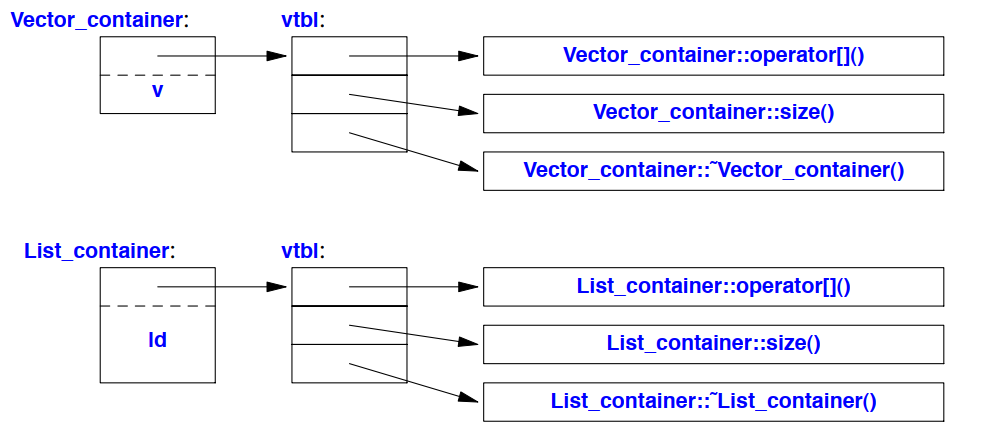
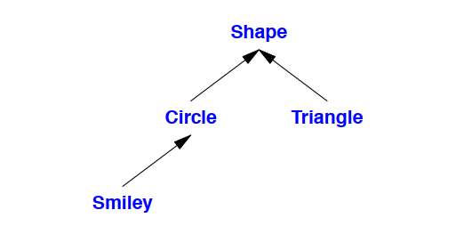

# Abstraction Mechanism

## Introduction
این فصل تلاش می‌کند تا ایده‌ای از پشتیبانی C++ در زمینه‌ی انتزاع و مدیریت منابع ارائه دهد، بدون اینکه وارد جزئیات زیادی شود. این فصل به‌صورت غیررسمی روش‌هایی برای تعریف و استفاده از انواع جدید (انواع تعریف‌شده توسط کاربر) ارائه می‌دهد. به‌طور خاص، خصوصیات پایه‌ای، تکنیک‌های پیاده‌سازی، و امکانات زبان برای کلاس‌های مشخص، کلاس‌های انتزاعی، و سلسله‌مراتب کلاس‌ها را معرفی می‌کند. قالب‌ها (templates) به عنوان یک مکانیزم برای پارامتردهی انواع و الگوریتم‌ها با انواع و الگوریتم‌های دیگر معرفی می‌شوند. محاسبات بر روی انواع تعریف‌شده توسط کاربر و انواع داخلی به‌عنوان توابع نشان داده می‌شوند که گاهی به قالب‌های تابع و اشیای تابع تعمیم داده می‌شوند. این امکانات زبانی از سبک‌های برنامه‌نویسی پشتیبانی می‌کنند که به برنامه‌نویسی شی‌گرا و برنامه‌نویسی عمومی (generic programming) معروف هستند. دو فصل بعدی با ارائه‌ی مثال‌هایی از امکانات کتابخانه‌ی استاندارد و نحوه‌ی استفاده از آن‌ها ادامه می‌یابند.

فرض این است که شما قبلاً برنامه‌نویسی کرده‌اید. اگر این‌گونه نیست، لطفاً قبل از ادامه‌ی اینجا، کتابی مانند «Programming: Principles and Practice Using C++ [Stroustrup, 2009]» را مطالعه کنید. حتی اگر قبلاً برنامه‌نویسی کرده‌اید، ممکن است زبانی که استفاده کرده‌اید یا برنامه‌هایی که نوشته‌اید، بسیار متفاوت از سبک C++ ارائه‌شده در اینجا باشد. اگر این «تور سریع» گیج‌کننده است، به ارائه‌ی سیستماتیک‌تر از فصل ۶ بپردازید. همانند فصل ۲، این تور C++ را به‌عنوان یک کل یکپارچه ارائه می‌دهد، نه به‌عنوان یک مجموعه‌ی لایه‌ای. بنابراین، ویژگی‌های زبان را به‌عنوان موجود در C، بخشی از C++98، یا جدید در C++11 مشخص نمی‌کند. چنین اطلاعات تاریخی را می‌توانید در بخش ۱.۴ و فصل ۴۴ بیابید.

## Classes
ویژگی اصلی زبان C++، کلاس است. کلاس یک نوع تعریف‌شده توسط کاربر است که برای نمایش یک مفهوم در کد برنامه ارائه می‌شود. هر زمان که در طراحی یک برنامه، یک مفهوم، ایده، موجودیت و غیره وجود داشته باشد که مفید باشد، سعی می‌کنیم آن را به‌صورت یک کلاس در برنامه نمایان کنیم تا ایده در کد وجود داشته باشد، نه فقط در ذهن ما، در یک سند طراحی، یا در برخی توضیحات. برنامه‌ای که از مجموعه‌ای خوب از کلاس‌ها ساخته شده باشد، بسیار راحت‌تر قابل درک و درست کردن است نسبت به برنامه‌ای که همه چیز را به‌صورت مستقیم با استفاده از انواع پایه‌ای پیاده‌سازی می‌کند. به‌طور خاص، کتابخانه‌ها اغلب کلاس‌ها را ارائه می‌دهند.

اساساً تمام امکانات زبان فراتر از انواع پایه‌ای، عملگرها و دستورات وجود دارد تا به تعریف کلاس‌های بهتر یا استفاده راحت‌تر از آنها کمک کند. منظور از «بهتر» یعنی درست‌تر، آسان‌تر برای نگهداری، کارآمدتر، شیک‌تر، راحت‌تر برای استفاده، خواناتر، و آسان‌تر برای تحلیل. اکثر تکنیک‌های برنامه‌نویسی به طراحی و پیاده‌سازی انواع خاصی از کلاس‌ها تکیه دارند. نیازها و سلیقه‌های برنامه‌نویسان بسیار متفاوت است. بنابراین، پشتیبانی از کلاس‌ها گسترده است. در اینجا، فقط به پشتیبانی پایه برای سه نوع مهم از کلاس‌ها می‌پردازیم:

- کلاس‌های مشخص (Concrete classes) (§3.2.1)
- کلاس‌های انتزاعی (Abstract classes) (§3.2.2)
- کلاس‌ها در سلسله‌مراتب کلاس‌ها (Classes in class hierarchies) (§3.2.4)

تعداد شگفت‌آوری از کلاس‌های مفید از این سه نوع هستند. حتی تعداد بیشتری از کلاس‌ها را می‌توان به‌عنوان تغییرات ساده‌ای از این انواع در نظر گرفت یا با استفاده از ترکیبی از تکنیک‌هایی که برای این‌ها استفاده می‌شوند، پیاده‌سازی کرد.

## Concrete Types
ایده‌ی اصلی کلاس‌های مشخص (Concrete classes) این است که آن‌ها «دقیقاً مانند انواع پایه‌ای» رفتار می‌کنند. برای مثال، نوع عدد مختلط و عدد صحیح با دقت نامحدود، بسیار شبیه به نوع `int` پایه‌ای هستند، به‌جز اینکه طبیعتاً معنای خود و مجموعه‌ای از عملیات خاص خود را دارند. به‌طور مشابه، `vector` و `string` مانند آرایه‌های پایه‌ای هستند، به‌جز اینکه رفتار بهتری دارند.

ویژگی تعریف‌کننده‌ی یک نوع مشخص این است که نمایش آن (representation) بخشی از تعریف آن است. در بسیاری از موارد مهم، مانند `vector`، این نمایش فقط یک یا چند اشاره‌گر به داده‌های ذخیره‌شده در جای دیگری است، اما در هر شیء از کلاس مشخص حضور دارد. این به پیاده‌سازی اجازه می‌دهد تا از نظر زمانی و مکانی بهینه باشد. به‌طور خاص، این ویژگی به ما اجازه می‌دهد:

- اشیاء از انواع مشخص را روی پشته (stack)، در حافظه‌ای که به‌صورت ایستا تخصیص یافته، و در سایر اشیاء قرار دهیم.
- به اشیاء به‌طور مستقیم (و نه فقط از طریق اشاره‌گرها یا ارجاعات) دسترسی داشته باشیم.
- اشیاء را بلافاصله و به‌طور کامل مقداردهی اولیه کنیم (برای مثال، با استفاده از سازنده‌ها).
- اشیاء را کپی کنیم.

نمایش می‌تواند خصوصی (private) باشد (مانند `Vector`) و تنها از طریق توابع عضو قابل دسترسی باشد، اما حضور دارد. بنابراین، اگر نمایش به‌طور قابل توجهی تغییر کند، کاربر باید برنامه را دوباره کامپایل کند. این بهایی است که برای داشتن انواع مشخص که دقیقاً مانند انواع پایه‌ای رفتار می‌کنند، باید پرداخت. برای انواعی که اغلب تغییر نمی‌کنند و جایی که متغیرهای محلی وضوح و کارایی مورد نیاز را فراهم می‌کنند، این قابل قبول و اغلب ایده‌آل است. برای افزایش انعطاف‌پذیری، یک نوع مشخص می‌تواند بخش‌های اصلی نمایش خود را در حافظه آزاد (حافظه پویا، heap) نگه دارد و از طریق بخش ذخیره‌شده در شیء کلاس به آن‌ها دسترسی یابد. این روشی است که `vector` و `string` پیاده‌سازی شده‌اند؛ می‌توان آن‌ها را به عنوان کنترل‌کننده‌های منابع با رابط‌های دقیق و طراحی‌شده در نظر گرفت.

---

این جمله در واقع به ویژگی اصلی *Concrete Types* اشاره دارد: یعنی این نوع‌ها دارای نمایشی (representation) هستند که بخشی از تعریف آن‌ها است. به این معنا که ساختار داخلی یا نحوه‌ی ذخیره‌سازی داده‌ها در این نوع‌ها به‌طور مشخص و ثابت در تعریف آن‌ها گنجانده شده است.

در بسیاری از موارد مهم، مانند کلاس `vector`، این نمایش فقط یک یا چند اشاره‌گر (pointer) است که به داده‌هایی در جای دیگری از حافظه (مثل حافظه‌ی پویا یا heap) اشاره می‌کند. با این حال، این اشاره‌گرها به عنوان بخشی از هر شیء از این کلاس مشخص، در حافظه‌ی آن شیء ذخیره می‌شوند. 

به عبارت دیگر:

- هر *Concrete Type*، یک نمای داخلی دارد که در تعریف آن کاملاً مشخص شده است.
- این نمایش می‌تواند شامل یک یا چند اشاره‌گر به داده‌هایی باشد که خارج از شیء ذخیره شده‌اند.
- در هر شیء از نوع *Concrete Type*، این نمایش (مانند آن اشاره‌گرها) حضور دارد.

به عنوان مثال، در `std::vector`، داده‌های واقعی (عناصر آرایه) ممکن است در حافظه‌ی پویا ذخیره شوند، اما `vector` حاوی یک اشاره‌گر به این داده‌ها است و این اشاره‌گر بخشی از هر نمونه از `vector` است.

---


---

در برنامه‌نویسی، *Concrete Types* یا *Concrete Classes* به نوع‌هایی گفته می‌شود که به‌صورت کامل پیاده‌سازی شده و رفتار مشخصی دارند. این کلاس‌ها برخلاف کلاس‌های انتزاعی، تمام جزئیات مربوط به عملکردشان را دارند و می‌توانند مستقیماً در کد استفاده شوند. Concrete Types به گونه‌ای طراحی شده‌اند که رفتارشان مشابه انواع پایه‌ای (مثل `int` یا `double`) باشد، اما ویژگی‌ها و امکانات بیشتری را ارائه می‌دهند.

### Concrete Types (انواع مشخص)
انواع مشخص، نمایشی (representation) دارند که بخشی از تعریف آن‌ها است؛ یعنی نحوه‌ی ذخیره‌سازی داده‌ها در این نوع‌ها مشخص و ثابت است. به همین دلیل، Concrete Types در حافظه و پردازش بهینه هستند و می‌توانند به‌صورت زیر استفاده شوند:

- **استفاده به‌صورت متغیر محلی**: می‌توان این نوع‌ها را مستقیماً روی پشته (stack) یا در حافظه‌ای که به‌صورت ایستا تخصیص یافته، ذخیره کرد.
- **مقداردهی اولیه و کپی‌برداری**: به دلیل داشتن سازنده‌ها و امکان کپی‌برداری، این نوع‌ها را می‌توان بلافاصله و به‌طور کامل مقداردهی اولیه کرد.
- **دسترسی مستقیم**: می‌توان به داده‌های این نوع‌ها مستقیماً و بدون نیاز به اشاره‌گرها یا ارجاعات دسترسی داشت.

### مثال‌هایی از Concrete Classes
کلاس‌های مانند `std::vector` و `std::string` نمونه‌هایی از Concrete Classes در C++ هستند. آن‌ها نمایشی مشخص دارند و داده‌های خود را در حافظه‌ی پویا (heap) ذخیره می‌کنند، در حالی که به واسطه‌ی این نما و توابع عضو، رفتار مشخصی دارند و می‌توانند مانند انواع پایه‌ای استفاده شوند. 

### تفاوت با کلاس‌های انتزاعی (Abstract Classes)
برخلاف Concrete Classes، *کلاس‌های انتزاعی* حاوی یک یا چند متد مجازی خالص (pure virtual) هستند که باید در کلاس‌های مشتق‌شده پیاده‌سازی شوند. این کلاس‌ها به خودی خود نمی‌توانند نمونه‌سازی شوند و صرفاً برای تعریف رابط‌ها و رفتارهای مشترک در سلسله‌مراتب کلاس‌ها استفاده می‌شوند.

به‌طور خلاصه، Concrete Types به نوع‌هایی اشاره دارند که همه‌ی ویژگی‌های لازم برای استفاده را به‌طور کامل و واضح دارند و مستقیماً قابل استفاده در کد هستند، در حالی که Abstract Classes بیشتر برای تعریف قراردادها و واسط‌ها در سلسله‌مراتب شی‌گرایی کاربرد دارند.

---

---

این بخش توضیح می‌دهد که در *Concrete Types*، ساختار داده یا نمایش (representation) آن‌ها می‌تواند به‌صورت *خصوصی (private)* تعریف شود؛ یعنی به اعضای داخلی کلاس محدود شده و فقط از طریق توابع عضو کلاس قابل دسترسی باشد. با این حال، این نمایش همچنان در هر شیء از آن نوع وجود دارد.

به عبارت دیگر، هرچند که این نمایش به کاربران کلاس نمایش داده نمی‌شود، ولی درون هر شیء از نوع مشخص ذخیره شده است. اگر این نمایش در تعریف کلاس به شکلی اساسی تغییر کند، برنامه‌ای که از این کلاس استفاده می‌کند باید دوباره کامپایل شود. این *هزینه‌ای* است که باید برای داشتن انواع مشخصی که دقیقاً مانند انواع پایه‌ای رفتار می‌کنند، پرداخت شود.

این خصوصیت زمانی که نوع تغییرات زیادی نداشته باشد و متغیرهای محلی برای وضوح و کارایی مهم باشند، مطلوب و قابل قبول است. 

### افزایش انعطاف‌پذیری با حافظه پویا
برای اینکه این نوع‌ها انعطاف‌پذیری بیشتری داشته باشند، می‌توانند بخش‌های اصلی نمایش خود را در *حافظه پویا* (heap یا free store) ذخیره کنند و از طریق اشاره‌گرهایی که در خود شیء کلاس قرار دارد، به آن‌ها دسترسی پیدا کنند. 

مثال‌های `vector` و `string` دقیقاً به این صورت پیاده‌سازی شده‌اند:

- در `std::vector`، داده‌های واقعی (مثل عناصر آرایه) در حافظه پویا ذخیره می‌شوند، ولی اشاره‌گرهایی که به این داده‌ها اشاره می‌کنند، درون شیء `vector` ذخیره می‌شوند.
- این نوع پیاده‌سازی باعث می‌شود که `vector` و `string` مانند یک *کنترل‌کننده‌ی منابع* (resource handle) عمل کنند که واسط‌های دقیق و کاملی برای کار با داده‌ها دارند.

به‌طور خلاصه، این ساختار به کلاس‌هایی مانند `vector` و `string` امکان می‌دهد تا از حافظه پویا استفاده کنند و همزمان مزایای انعطاف‌پذیری و کارایی را ارائه دهند، بدون اینکه پیچیدگی نمای داخلی آن‌ها برای کاربران آشکار شود.

---

## An Arithmetic Type
"نوع حسابی تعریف‌شده توسط کاربر کلاسیک" در اینجا نوع `complex` است:

```cpp
class complex {
    double re, im; // نمایش: دو عدد double
public:
    complex(double r, double i) :re{r}, im{i} {} // ساختن عدد مختلط از دو عدد حقیقی
    complex(double r) :re{r}, im{0} {} // ساختن عدد مختلط از یک عدد حقیقی
    complex() :re{0}, im{0} {} // مقدار پیش‌فرض: {0,0}
    
    double real() const { return re; }
    void real(double d) { re=d; }
    double imag() const { return im; }
    void imag(double d) { im=d; }
    
    complex& operator+=(complex z) { re+=z.re , im+=z.im; return *this; } // جمع با re و im و بازگرداندن نتیجه
    complex& operator-=(complex z) { re-=z.re, im-=z.im; return *this; }
    complex& operator*=(complex); // تعریف در خارج از کلاس
    complex& operator/=(complex); // تعریف در خارج از کلاس
};
```

```
c != b
وقتی شرط c != b نوشته می‌شود، کامپایلر آن را به تابع زیر تبدیل می‌کند:

cpp
Copy code
operator!=(c, b);
```

این نسخه‌ای کمی ساده‌شده از `complex` موجود در کتابخانه‌ی استاندارد است. خود تعریف کلاس فقط شامل عملیات‌هایی است که نیاز به دسترسی مستقیم به نمایش داخلی (re و im) دارند. نمایش داخلی این نوع ساده و متداول است. از نظر کاربردی، لازم است با پیاده‌سازی فرترن از ۵۰ سال پیش سازگار باشد و باید مجموعه‌ای از عملگرهای متداول داشته باشد. علاوه بر نیازهای منطقی، نوع `complex` باید کارآمد باشد، وگرنه مورد استفاده قرار نمی‌گیرد. این به این معناست که عملیات‌های ساده باید *درون‌خطی* (inline) باشند. 

یعنی، عملیات‌های ساده (مثل سازنده‌ها، `+=`، و `imag()`) باید بدون فراخوانی تابع در کد ماشین پیاده‌سازی شوند. توابع تعریف‌شده در کلاس به‌طور پیش‌فرض درون‌خطی هستند. یک نوع `complex` صنعتی (مانند نمونه‌ی موجود در کتابخانه‌ی استاندارد) با دقت پیاده‌سازی شده تا درون‌خطی‌سازی مناسبی انجام دهد.

سازنده‌ای که بدون آرگومان قابل فراخوانی باشد، *سازنده پیش‌فرض* نامیده می‌شود. بنابراین، `complex()` سازنده پیش‌فرض برای نوع `complex` است. با تعریف یک سازنده پیش‌فرض، احتمال داشتن متغیرهای مقداردهی‌نشده از این نوع را از بین می‌برید.

*const* در توابع بازگرداننده‌ی قسمت‌های حقیقی و موهومی نشان می‌دهد که این توابع شیء را تغییر نمی‌دهند.

بسیاری از عملیات‌های مفید نیازی به دسترسی مستقیم به نمایش `complex` ندارند، بنابراین می‌توان آن‌ها را جدا از تعریف کلاس تعریف کرد:

```cpp
complex operator+(complex a, complex b) { return a += b; }
complex operator-(complex a, complex b) { return a -= b; }
complex operator-(complex a) { return {-a.real(), -a.imag()}; } // منفی‌سازی یکانی
complex operator*(complex a, complex b) { return a *= b; }
complex operator/(complex a, complex b) { return a /= b; }
```

در اینجا از این نکته استفاده کرده‌ایم که یک آرگومان که با مقدار پاس داده می‌شود کپی می‌شود، بنابراین می‌توانیم آن را تغییر دهیم بدون اینکه نسخه‌ی فراخواننده تحت تأثیر قرار گیرد، و نتیجه را به عنوان مقدار بازگشتی استفاده کنیم.

تعاریف `==` و `!=` ساده هستند:

```cpp
bool operator==(complex a, complex b) // برابر
{
    return a.real() == b.real() && a.imag() == b.imag();
}
bool operator!=(complex a, complex b) // نابرابر
{
    return !(a == b);
}
```

در اینجا `complex` می‌تواند به این شکل استفاده شود:

```cpp
void f(complex z)
{
    complex a {2.3}; // ساختن {2.3,0.0} از 2.3
    complex b {1 / a};
    complex c {a + z * complex{1,2.3}};
    // ...
    if (c != b)
        c = -(b / a) + 2 * b;
}
```

کامپایلر، عملگرهای مربوط به اعداد مختلط را به فراخوانی تابع مناسب تبدیل می‌کند. برای مثال، `c != b` به معنی `operator!=(c, b)` و `1 / a` به معنی `operator/(complex{1}, a)` است.

عملگرهای تعریف‌شده توسط کاربر (عملگرهای "اضافه‌بارگذاری‌شده") باید با دقت و به‌صورت متعارف استفاده شوند. نحو (syntax) عملگرها توسط زبان ثابت شده است، بنابراین نمی‌توانید یک `/` یکانی تعریف کنید. همچنین امکان تغییر معنای یک عملگر برای انواع پایه‌ای وجود ندارد، بنابراین نمی‌توانید `+` را برای `int`ها طوری تعریف کنید که کم کردن انجام دهد.

## A Container
یک *container* (مخزن) شی‌ای است که مجموعه‌ای از عناصر را نگه می‌دارد، بنابراین به `Vector` یک *container* می‌گوییم چون نوعی از اشیاء است که مخزن هستند. همان‌طور که در بخش ۲.۳.۲ تعریف شده است، `Vector` برای ذخیره‌ی اعداد `double` چندان نامعقول نیست: این کلاس به‌سادگی قابل فهم است، یک خاصیت ثابت و مفید ایجاد می‌کند (بخش ۲.۴.۳.۲)، دسترسی بررسی‌شده در بازه ارائه می‌دهد (بخش ۲.۴.۳.۱)، و تابع `size()` را برای پیمایش عناصر فراهم می‌کند. با این حال، یک ایراد اساسی دارد: عناصر را با `new` تخصیص می‌دهد، اما هرگز آن‌ها را آزاد نمی‌کند. این روش مناسب نیست، زیرا اگرچه C++ یک رابط برای جمع‌آوری زباله (garbage collector) تعریف می‌کند (بخش ۳۴.۵)، اما تضمینی نیست که در دسترس باشد تا حافظه‌ی استفاده‌نشده را برای اشیاء جدید آزاد کند. در برخی محیط‌ها نمی‌توانید از جمع‌آوری زباله استفاده کنید، و گاهی به دلایل منطقی یا کارایی، کنترل دقیق‌تری بر تخریب اشیاء ترجیح می‌دهید (بخش ۱۳.۶.۴). ما به مکانیزمی نیاز داریم که اطمینان حاصل کند حافظه‌ای که توسط سازنده تخصیص داده شده، آزاد شود؛ این مکانیزم یک *destructor* است:

```cpp
class Vector {
private:
    double* elem; // elem به آرایه‌ای از sz عدد double اشاره می‌کند
    int sz;
public:
    Vector(int s) :elem{new double[s]}, sz{s} // سازنده: تخصیص منابع
    {
        for (int i = 0; i != s; ++i) elem[i] = 0; // مقداردهی اولیه به عناصر
    }
    ~Vector() { delete[] elem; } // مخرب: آزادسازی منابع
    double& operator[](int i);
    int size() const;
};
```

در اینجا:

- سازنده `Vector(int s)` حافظه‌ای برای `s` عدد `double` تخصیص می‌دهد و مقدار اولیه‌ی هر عنصر را `0` قرار می‌دهد.
- مخرب `~Vector()` با `delete[] elem` حافظه‌ی تخصیص‌یافته را آزاد می‌کند تا از نشت حافظه (memory leak) جلوگیری شود.

نام یک مخرب (*destructor*) شامل عملگر مکمل (`~`) است که به دنبال آن نام کلاس می‌آید؛ به‌عنوان مکملی برای سازنده (*constructor*) عمل می‌کند. سازنده‌ی `Vector` مقداری حافظه را در حافظه‌ی آزاد (که به آن heap یا dynamic store هم می‌گویند) با استفاده از عملگر `new` تخصیص می‌دهد. مخرب، با استفاده از عملگر `delete` این حافظه را آزاد کرده و پاک‌سازی را انجام می‌دهد. این همه به‌صورت خودکار و بدون نیاز به مداخله‌ی کاربران `Vector` انجام می‌شود. کاربران تنها `Vector`‌ها را ایجاد کرده و مانند متغیرهای انواع پایه‌ای از آن‌ها استفاده می‌کنند. برای مثال:

```cpp
void fct(int n)
{
    Vector v(n);
    // ... استفاده از v ...
    {
        Vector v2(2 * n);
        // ... استفاده از v و v2 ...
    } // v2 در اینجا از بین می‌رود
    // ... استفاده از v ...
} // v در اینجا از بین می‌رود
```

در اینجا:

- وقتی `v` و `v2` به‌طور محلی تعریف می‌شوند، سازنده‌ی آن‌ها به‌طور خودکار فراخوانی می‌شود و حافظه موردنیاز آن‌ها را تخصیص می‌دهد.
- وقتی بلوک‌های آن‌ها به پایان می‌رسد (در پایان بلوک‌های مربوطه)، مخرب‌ها به‌طور خودکار فراخوانی می‌شوند و حافظه‌ی تخصیص‌یافته را آزاد می‌کنند.

در `Vector` قوانین نام‌گذاری، حوزه، تخصیص، طول عمر و غیره دقیقاً مانند یک نوع پایه‌ای، مثل `int` و `char` رعایت می‌شود. برای جزئیات در مورد چگونگی کنترل طول عمر یک شیء، به بخش ۶.۴ مراجعه کنید. این نسخه از `Vector` ساده‌سازی شده و شامل مدیریت خطا نمی‌شود؛ برای مدیریت خطا به بخش ۲.۴.۳ مراجعه کنید.

ترکیب سازنده و مخرب پایه‌ی بسیاری از تکنیک‌های زیبا و کارآمد است. به‌طور خاص، این ترکیب مبنای بیشتر تکنیک‌های عمومی مدیریت منابع در C++ است (بخش ۵.۲ و ۱۳.۳). در نظر بگیرید که سازنده‌ی `Vector` عناصر را تخصیص می‌دهد و اعضای `Vector` را به‌طور مناسب مقداردهی اولیه می‌کند. مخرب نیز عناصر را آزاد می‌کند. این مدل *دستگیره به داده‌ها* (handle-to-data model) به طور گسترده برای مدیریت داده‌هایی استفاده می‌شود که اندازه‌ی آن‌ها در طول عمر شیء تغییر می‌کند. تکنیک به‌دست‌آوردن منابع در سازنده و آزادسازی آن‌ها در مخرب که به عنوان *RAII (Resource Acquisition Is Initialization)* شناخته می‌شود، به ما اجازه می‌دهد تا از «عملیات new خالص» خودداری کنیم؛ یعنی تخصیص حافظه را از کد عمومی حذف کنیم و آن‌ها را درون پیاده‌سازی‌های انتزاعی خوب پنهان کنیم. به‌همین ترتیب، باید از «عملیات delete خالص» نیز اجتناب کرد. اجتناب از `new` و `delete` خالص، کد را بسیار کم‌خطاتر می‌کند و احتمال نشت منابع را کاهش می‌دهد (بخش ۵.۲).

---

این بخش به مفهومی کلیدی در C++ به نام *RAII* (Resource Acquisition Is Initialization) می‌پردازد که برای مدیریت کارآمد منابع به کار می‌رود. 

### ۱. رفتار مشابه انواع پایه‌ای
در C++، کلاس `Vector` مانند انواع پایه‌ای (مثل `int` و `char`) از قوانین نام‌گذاری، محدوده (scope)، تخصیص و طول عمر پیروی می‌کند. این به این معنی است که می‌توان از `Vector` درست مثل یک نوع پایه‌ای استفاده کرد و انتظار داشت که به طور خودکار از بین برود وقتی که محدوده‌ی آن به پایان می‌رسد. برای کنترل طول عمر یک شیء، می‌توان به جزئیات موجود در بخش ۶.۴ مراجعه کرد.

### ۲. ترکیب سازنده و مخرب
سازنده و مخرب در C++ تکنیک‌های کارآمد و ظریفی را ایجاد می‌کنند. به طور خاص، این ترکیب اساس مدیریت منابع در C++ است. برای مثال، در کلاس `Vector`:

- **سازنده**: مسئول تخصیص حافظه‌ی موردنیاز برای عناصر `Vector` و مقداردهی اولیه به آن‌ها است.
- **مخرب**: مسئول آزاد کردن حافظه‌ی تخصیص‌یافته به هنگام از بین رفتن `Vector` است.

این مدل *«اشاره‌گر به داده‌ها»* (handle-to-data model) به‌صورت گسترده برای مدیریت داده‌هایی که اندازه‌ی آن‌ها در طول عمر شیء تغییر می‌کند، به کار می‌رود.

### ۳. تکنیک RAII
این *RAII*، یا *Resource Acquisition Is Initialization*، به معنای «دریافت منابع در زمان مقداردهی اولیه» است و ایده‌ای بسیار مهم در C++ برای مدیریت منابع است. 

- در RAII، منابع (مانند حافظه، فایل‌ها، یا قفل‌های سیستم) در سازنده‌ها تخصیص می‌یابند و در مخرب‌ها آزاد می‌شوند.
- این روش به ما کمک می‌کند تا از تخصیص مستقیم حافظه با استفاده از `new` در کد عمومی جلوگیری کنیم و این تخصیص‌ها را در داخل پیاده‌سازی کلاس‌ها نگه داریم.
- همچنین RAII از عملیات `delete` مستقیم نیز جلوگیری می‌کند. 

### مزایای استفاده از RAII
با جلوگیری از تخصیص و آزادسازی مستقیم منابع (`naked new` و `naked delete`)، این تکنیک کد را بسیار امن‌تر و کمتر مستعد خطا می‌کند. با استفاده از RAII:

1. **نشت منابع** به حداقل می‌رسد، زیرا هر شیء که از بین برود، مخرب آن به طور خودکار منابع تخصیص‌یافته را آزاد می‌کند.
2. **مدیریت خودکار منابع** ایجاد می‌شود، زیرا سازنده و مخرب به طور خودکار اجرا می‌شوند و نیازی به مدیریت دستی منابع نداریم.

به عنوان مثال، با استفاده از `Vector`، کد به این صورت خواهد بود:

```cpp
void exampleFunction(int n) {
    Vector v(n); // سازنده، حافظه را تخصیص می‌دهد
    // ... استفاده از v ...
} // در اینجا، v از بین می‌رود و مخرب حافظه را آزاد می‌کند
```

در این کد، نیازی به `new` و `delete` نیست و تمام تخصیص و آزادسازی حافظه به صورت خودکار انجام می‌شود.

---

RAII یا *Resource Acquisition Is Initialization* به معنای «دریافت منابع در زمان مقداردهی اولیه» است و یکی از مهم‌ترین اصول مدیریت منابع در C++ به شمار می‌رود. ایده‌ی اصلی RAII این است که منابعی مانند حافظه، فایل، یا قفل‌های سیستم، هم‌زمان با ایجاد یک شیء در سازنده‌ی آن تخصیص داده شوند و به محض از بین رفتن شیء، توسط مخرب آن آزاد شوند.

### مثال ساده RAII

فرض کنید که می‌خواهیم یک فایل را باز کنیم و داده‌هایی در آن بنویسیم. در حالت معمول، باید فایل را باز کنیم، عملیات مورد نظر را انجام دهیم و سپس فایل را ببندیم. اگر بستن فایل را فراموش کنیم یا یک خطا پیش بیاید، ممکن است فایل باز بماند و منابع سیستم اشغال شوند.

با RAII، این کار به این صورت انجام می‌شود که باز کردن و بستن فایل را در یک کلاس قرار می‌دهیم و فایل هم‌زمان با ساختن شیء باز می‌شود و هنگام از بین رفتن شیء، بسته می‌شود.

### پیاده‌سازی با استفاده از RAII

در این مثال، کلاسی به نام `FileHandler` ایجاد می‌کنیم که به محض ساخت شیء، فایل را باز می‌کند و هنگام از بین رفتن شیء، فایل را می‌بندد:

```cpp
#include <iostream>
#include <fstream>
#include <string>

class FileHandler {
private:
    std::ofstream file;
public:
    // سازنده: باز کردن فایل
    FileHandler(const std::string& filename) {
        file.open(filename);
        if (!file.is_open()) {
            std::cerr << "Failed to open file!" << std::endl;
        }
    }

    // تابعی برای نوشتن در فایل
    void write(const std::string& text) {
        if (file.is_open()) {
            file << text << std::endl;
        }
    }

    // مخرب: بستن فایل
    ~FileHandler() {
        if (file.is_open()) {
            file.close();
            std::cout << "File closed." << std::endl;
        }
    }
};
```

### استفاده از کلاس `FileHandler`

حالا می‌توانیم از `FileHandler` استفاده کنیم و مطمئن باشیم که فایل به‌طور خودکار بسته می‌شود، حتی اگر خطایی رخ دهد:

```cpp
void exampleFunction() {
    FileHandler fh("example.txt"); // فایل باز می‌شود
    fh.write("Hello, RAII!"); // نوشتن در فایل
} // در اینجا fh از بین می‌رود و فایل بسته می‌شود
```

در این کد:

1. با ایجاد شیء `fh` از نوع `FileHandler`، فایل `"example.txt"` به طور خودکار باز می‌شود.
2. عملیات نوشتن روی فایل انجام می‌شود.
3. هنگامی که `fh` از محدوده خارج می‌شود، مخرب آن به طور خودکار اجرا شده و فایل بسته می‌شود.

### مزایای RAII

- **کاهش خطا**: نیازی به یادآوری بستن فایل نداریم؛ RAII این کار را به‌طور خودکار انجام می‌دهد.
- **جلوگیری از نشت منابع**: اگر خطایی پیش بیاید، فایل باز نمی‌ماند و از بین می‌رود.
- **کد تمیزتر و خواناتر**: کد اصلی تنها نیاز به ساخت شیء و استفاده از آن دارد، بدون نیاز به مدیریت دستی منابع.

RAII به همین روش می‌تواند برای مدیریت حافظه، قفل‌ها و سایر منابعی که نیاز به آزادسازی دارند، به کار برود و کد را ساده‌تر و ایمن‌تر کند.

---

در برنامه‌نویسی C++، *naked new operations* به تخصیص حافظه با استفاده از عملگر `new` به صورت مستقیم اشاره دارد، به طوری که این تخصیص خارج از یک ساختار مدیریت منابع انجام می‌شود و به همین دلیل *naked* یا «برهنه» نامیده می‌شود. 

### چرا `naked new` یک مشکل محسوب می‌شود؟

وقتی از `new` به صورت مستقیم استفاده می‌کنیم، حافظه در *heap* یا حافظه‌ی پویا تخصیص داده می‌شود و برای آزادسازی آن باید حتماً از `delete` استفاده کنیم. اگر `delete` را فراموش کنیم یا در هنگام بروز خطا به آن دسترسی پیدا نکنیم، ممکن است نشت حافظه (*memory leak*) رخ دهد. این نشت باعث می‌شود که حافظه‌ای که تخصیص داده شده، به سیستم بازگردانده نشود و در نتیجه منابع سیستم هدر برود.

### مثال یک `naked new`

در مثال زیر، از `new` برای ایجاد یک شیء به صورت مستقیم استفاده شده است:

```cpp
int main() {
    int* ptr = new int(10); // تخصیص مستقیم حافظه با new
    // برخی عملیات روی ptr
    // فراموشی delete باعث نشت حافظه می‌شود
}
```

در این کد:

- حافظه‌ای برای یک `int` تخصیص داده شده است و `ptr` به آن اشاره می‌کند.
- اگر `delete ptr` را فراموش کنیم، حافظه آزاد نمی‌شود و به یک نشت حافظه منجر می‌شود.

### راه‌حل: استفاده از RAII و اجتناب از `naked new`

برای جلوگیری از این مشکل، می‌توان از تکنیک *RAII* استفاده کرد. در RAII، تخصیص حافظه و آزادسازی آن در سازنده و مخرب یک کلاس مدیریت می‌شود. به این ترتیب، هرگاه یک شیء از این کلاس ساخته شود، حافظه به طور خودکار تخصیص داده می‌شود و زمانی که از بین می‌رود، حافظه نیز آزاد می‌شود.

### مثال با استفاده از RAII

در این مثال از کلاس `std::unique_ptr` استفاده می‌کنیم که به عنوان یک کلاس مدیریت حافظه هوشمند در C++ استاندارد تعریف شده است:

```cpp
#include <memory>

int main() {
    std::unique_ptr<int> ptr = std::make_unique<int>(10); // تخصیص خودکار حافظه
    // برخی عملیات روی ptr
} // ptr به طور خودکار از بین می‌رود و حافظه آزاد می‌شود
```

در اینجا:

- با استفاده از `std::unique_ptr`، تخصیص حافظه و آزادسازی آن به صورت خودکار انجام می‌شود.
- نیازی به `delete` نداریم؛ وقتی `ptr` از بین می‌رود، حافظه‌ی مربوطه نیز به طور خودکار آزاد می‌شود.

### مزایای اجتناب از `naked new`

1. **کاهش خطا**: نیازی به `delete` دستی نیست، و این باعث کاهش احتمال نشت حافظه می‌شود.
2. **کد خواناتر و تمیزتر**: مدیریت حافظه درون یک ساختار مشخص انجام می‌شود، که کد را قابل فهم‌تر می‌کند.
3. **افزایش ایمنی**: در صورت بروز خطا یا خروج زودهنگام از بلوک کد، حافظه به طور خودکار آزاد می‌شود.

به طور خلاصه، اجتناب از `naked new` باعث می‌شود که کد ایمن‌تر و کمتر مستعد نشت حافظه باشد. RAII و استفاده از پوینترهای هوشمند مانند `std::unique_ptr` و `std::shared_ptr` راه‌حل‌های مناسبی برای مدیریت خودکار منابع و جلوگیری از مشکلات `naked new` هستند.

## Initializing Containers
یک *container* (مخزن) برای نگهداری عناصر ایجاد شده است، بنابراین بدیهی است که به روش‌های ساده‌ای برای قرار دادن عناصر در یک container نیاز داریم. می‌توانیم این کار را با ایجاد یک `Vector` با تعداد مناسب عناصر و سپس انتساب به آن‌ها انجام دهیم، اما معمولاً روش‌های دیگری هستند که زیباتر به نظر می‌رسند. در اینجا دو روش محبوب را معرفی می‌کنیم:

- **سازنده‌ی initializer-list**: مقداردهی اولیه با یک لیست از عناصر.
- **`push_back()`**: افزودن یک عنصر جدید در انتهای توالی (دنباله).

این‌ها را می‌توان به صورت زیر اعلام کرد:

```cpp
class Vector {
public:
    Vector(std::initializer_list<double>); // مقداردهی اولیه با یک لیست
    // ...
    void push_back(double); // افزودن عنصر در انتها و افزایش اندازه به میزان یک
    // ...
};
```

تابع `push_back()` برای ورودی گرفتن تعداد دلخواهی از عناصر مفید است. برای مثال:

```cpp
Vector read(istream& is)
{
    Vector v;
    for (double d; is >> d;) // خواندن مقادیر اعشاری در d
        v.push_back(d); // افزودن d به v
    return v;
}
```

این حلقه‌ی ورودی با رسیدن به انتهای فایل یا یک خطای قالب‌بندی متوقف می‌شود. تا زمانی که این اتفاق نیفتاده، هر عددی که خوانده می‌شود به `Vector` اضافه می‌شود، بنابراین در پایان، اندازه‌ی `v` برابر با تعداد عناصر خوانده شده است. من از یک عبارت `for` به جای عبارت `while` متداول‌تر استفاده کردم تا محدوده‌ی `d` را به خود حلقه محدود کنم. پیاده‌سازی `push_back()` در بخش ۱۳.۶.۴.۳ بحث شده است. روش ارائه‌ی یک سازنده‌ی move برای `Vector`، تا بازگرداندن حجم زیادی از داده‌ها از `read()` ارزان باشد، در بخش ۳.۳.۲ توضیح داده شده است.

نوع `std::initializer_list` که برای تعریف سازنده‌ی initializer-list استفاده می‌شود، یک نوع از کتابخانه استاندارد است که برای کامپایلر شناخته شده است: وقتی از یک لیست `{}` مانند `{1,2,3,4}` استفاده می‌کنیم، کامپایلر یک شیء از نوع `initializer_list` ایجاد می‌کند تا به برنامه بدهد. بنابراین، می‌توانیم به این شکل بنویسیم:

```cpp
Vector v1 = {1,2,3,4,5}; // v1 دارای 5 عنصر است
Vector v2 = {1.23, 3.45, 6.7, 8}; // v2 دارای 4 عنصر است
```

سازنده‌ی initializer-list برای `Vector` ممکن است به این صورت تعریف شود:

```cpp
Vector::Vector(std::initializer_list<double> lst) // مقداردهی اولیه با یک لیست
    :elem{new double[lst.size()]}, sz{lst.size()}
{
    copy(lst.begin(), lst.end(), elem); // کپی کردن از lst به elem
}
```

---

این بخش توضیح می‌دهد که حلقه‌ی ورودی در تابع `read` چگونه کار می‌کند و چرا از یک عبارت `for` استفاده شده است به جای `while`. همچنین، به بهینه‌سازی‌هایی برای بازگرداندن داده‌ها اشاره می‌کند.

### ۱. پایان یافتن حلقه ورودی
در تابع `read`، یک حلقه‌ی ورودی وجود دارد که اعداد اعشاری را از ورودی (مثل فایل یا ورودی کاربر) می‌خواند. این حلقه تا زمانی ادامه پیدا می‌کند که به یکی از موارد زیر برسد:

- **پایان فایل (end-of-file)**: یعنی تمام محتویات فایل یا ورودی کاربر خوانده شده باشد.
- **خطای قالب‌بندی (formatting error)**: یعنی مقدار ورودی از نوع مورد انتظار نباشد (مثلاً، وارد کردن کاراکتر غیرعددی).

تا زمانی که این اتفاق نیفتاده، هر عددی که خوانده می‌شود به `Vector` اضافه می‌شود. در پایان، اندازه‌ی `Vector` برابر خواهد بود با تعداد عناصری که از ورودی خوانده شده‌اند.

### ۲. استفاده از `for` به جای `while`
در اینجا از یک عبارت `for` استفاده شده است تا محدوده‌ی متغیر `d` به داخل حلقه محدود شود. به این معنی که `d` تنها در محدوده‌ی حلقه قابل دسترسی است و پس از پایان حلقه، دیگر در دسترس نیست. این تکنیک باعث خوانایی بیشتر و جلوگیری از دسترسی ناخواسته به `d` خارج از حلقه می‌شود.

### ۳. سازنده‌ی move برای بهینه‌سازی بازگشت داده‌های حجیم
برای بازگرداندن داده‌های حجیم از تابع `read`، نیاز به **سازنده‌ی move** داریم. این سازنده به `Vector` اجازه می‌دهد تا داده‌های خود را بدون کپی‌کردن کامل بازگرداند، که این کار باعث بهبود کارایی می‌شود، به خصوص اگر تعداد زیادی داده در `Vector` باشد.

### جمع‌بندی
در این کد:
- حلقه‌ی `for` به سادگی تا زمان رسیدن به پایان فایل یا خطای ورودی ادامه می‌یابد و از `push_back` برای افزودن داده‌ها به `Vector` استفاده می‌کند.
- سازنده‌ی move در `Vector` از کپی غیرضروری داده‌های حجیم جلوگیری کرده و بازگشت داده‌ها را سریع‌تر و ارزان‌تر می‌کند.

---


---

در `std::initializer_list` در C++ نوعی است که به ما امکان می‌دهد مجموعه‌ای از مقادیر را به صورت یک لیست `{}` به سازنده یا تابعی پاس دهیم. این نوع در مواردی مفید است که بخواهیم تعداد متغیری از مقادیر را به یک سازنده یا تابع بفرستیم و به کد این اجازه را می‌دهد که این مقادیر را به صورت یک لیست ثابت بخواند. این نوع در استاندارد C++11 معرفی شده است.

### ساختار `std::initializer_list`

وقتی یک لیست مقادیر `{}` را به یک سازنده یا تابعی که یک پارامتر `std::initializer_list` دارد ارسال می‌کنیم، کامپایلر به طور خودکار شیء `initializer_list` را می‌سازد. این شیء شامل مقادیر داخل لیست و اندازه‌ی آن‌ها است.

### مثال ساده: استفاده از `std::initializer_list` در یک کلاس

بیایید کلاسی به نام `MyVector` تعریف کنیم که می‌تواند با لیستی از اعداد مقداردهی اولیه شود:

```cpp
#include <iostream>
#include <initializer_list>

class MyVector {
private:
    int* data;
    size_t size;

public:
    // سازنده با استفاده از std::initializer_list
    MyVector(std::initializer_list<int> init_list) 
        : size(init_list.size())
    {
        data = new int[size];
        size_t index = 0;
        for (int value : init_list) {
            data[index++] = value;
        }
    }

    // نمایش عناصر
    void print() const {
        for (size_t i = 0; i < size; ++i) {
            std::cout << data[i] << " ";
        }
        std::cout << std::endl;
    }

    // مخرب برای آزاد کردن حافظه
    ~MyVector() {
        delete[] data;
    }
};

int main() {
    MyVector vec = {1, 2, 3, 4, 5}; // مقداردهی اولیه با لیست
    vec.print(); // خروجی: 1 2 3 4 5
    return 0;
}
```

### توضیح کد

در اینجا:

1. **سازنده‌ی `MyVector`**: سازنده‌ی `MyVector` یک پارامتر `std::initializer_list<int>` می‌گیرد که به آن `init_list` می‌گوییم. این پارامتر لیستی از مقادیر `{1, 2, 3, 4, 5}` را دریافت می‌کند.
2. **کپی کردن مقادیر**: با استفاده از یک حلقه `for`، مقادیر در `init_list` را به آرایه‌ی `data` کپی می‌کنیم.
3. **استفاده در `main`**: در تابع `main`، با استفاده از `{}`، `MyVector` را مقداردهی اولیه می‌کنیم و سپس عناصر آن را چاپ می‌کنیم.

### مزایای `std::initializer_list`

- **ساده و خوانا**: به ما اجازه می‌دهد به شکل ساده و خوانایی کلاس‌ها یا توابع را با لیست مقادیر مقداردهی اولیه کنیم.
- **ایمنی بیشتر**: `initializer_list` به عنوان یک لیست ثابت است، بنابراین نمی‌توان مقادیر آن را تغییر داد.

### مثال دیگر: تابعی با `initializer_list`

می‌توانیم توابعی تعریف کنیم که پارامتر `initializer_list` دریافت می‌کنند. برای مثال، تابعی که تعدادی عدد را دریافت کرده و مجموع آن‌ها را محاسبه می‌کند:

```cpp
#include <iostream>
#include <initializer_list>

int sum(std::initializer_list<int> numbers) {
    int total = 0;
    for (int value : numbers) {
        total += value;
    }
    return total;
}

int main() {
    int result = sum({10, 20, 30, 40});
    std::cout << "Sum is: " << result << std::endl; // خروجی: Sum is: 100
    return 0;
}
```

در این کد:

- تابع `sum` یک `std::initializer_list<int>` به نام `numbers` می‌گیرد و مجموع مقادیر آن را محاسبه می‌کند.
- سپس در `main`، `{10, 20, 30, 40}` به عنوان لیست مقادیر پاس داده می‌شود.

### جمع‌بندی

`std::initializer_list` یک روش راحت و امن برای پاس دادن لیست ثابت مقادیر به توابع یا سازنده‌ها است. این نوع در C++ کدی تمیزتر و خواناتر تولید می‌کند و نیاز به نوشتن چندین سازنده یا تابع مختلف برای مقادیر متفاوت را کاهش می‌دهد.

---


---

این بخش توضیح می‌دهد که حلقه‌ی ورودی در تابع `read` چگونه کار می‌کند و چرا از یک عبارت `for` استفاده شده است به جای `while`. همچنین، به بهینه‌سازی‌هایی برای بازگرداندن داده‌ها اشاره می‌کند.

### ۱. پایان یافتن حلقه ورودی
در تابع `read`، یک حلقه‌ی ورودی وجود دارد که اعداد اعشاری را از ورودی (مثل فایل یا ورودی کاربر) می‌خواند. این حلقه تا زمانی ادامه پیدا می‌کند که به یکی از موارد زیر برسد:

- **پایان فایل (end-of-file)**: یعنی تمام محتویات فایل یا ورودی کاربر خوانده شده باشد.
- **خطای قالب‌بندی (formatting error)**: یعنی مقدار ورودی از نوع مورد انتظار نباشد (مثلاً، وارد کردن کاراکتر غیرعددی).

تا زمانی که این اتفاق نیفتاده، هر عددی که خوانده می‌شود به `Vector` اضافه می‌شود. در پایان، اندازه‌ی `Vector` برابر خواهد بود با تعداد عناصری که از ورودی خوانده شده‌اند.

### ۲. استفاده از `for` به جای `while`
در اینجا از یک عبارت `for` استفاده شده است تا محدوده‌ی متغیر `d` به داخل حلقه محدود شود. به این معنی که `d` تنها در محدوده‌ی حلقه قابل دسترسی است و پس از پایان حلقه، دیگر در دسترس نیست. این تکنیک باعث خوانایی بیشتر و جلوگیری از دسترسی ناخواسته به `d` خارج از حلقه می‌شود.

### ۳. سازنده‌ی move برای بهینه‌سازی بازگشت داده‌های حجیم
برای بازگرداندن داده‌های حجیم از تابع `read`، نیاز به **سازنده‌ی move** داریم. این سازنده به `Vector` اجازه می‌دهد تا داده‌های خود را بدون کپی‌کردن کامل بازگرداند، که این کار باعث بهبود کارایی می‌شود، به خصوص اگر تعداد زیادی داده در `Vector` باشد.

### جمع‌بندی
در این کد:
- حلقه‌ی `for` به سادگی تا زمان رسیدن به پایان فایل یا خطای ورودی ادامه می‌یابد و از `push_back` برای افزودن داده‌ها به `Vector` استفاده می‌کند.
- سازنده‌ی move در `Vector` از کپی غیرضروری داده‌های حجیم جلوگیری کرده و بازگشت داده‌ها را سریع‌تر و ارزان‌تر می‌کند.

---

عبارت `for (double d; is >> d;)` یک حلقه `for` است که به شکلی غیرمعمول نوشته شده تا یک عدد اعشاری را از ورودی بخواند و آن را در `d` ذخیره کند. این بخش را می‌توانیم به صورت دقیق‌تری بشکافیم:

### ساختار کلی
حلقه `for` به شکل کلی زیر است:

```cpp
for (initialization; condition; increment) {
    // loop body
}
```

اما در اینجا ساختار `for` به این صورت است:

```cpp
for (double d; is >> d;) {
    // loop body
}
```

* `initialization` (مقداردهی اولیه): `double d;` - اینجا یک متغیر `d` از نوع `double` تعریف شده است.
* `condition` (شرط): `is >> d;` - عملگر `>>` سعی می‌کند یک عدد اعشاری از `is` (جریان ورودی) بخواند و در `d` قرار دهد. اگر خواندن موفق باشد، مقدار شرط `true` می‌شود و حلقه ادامه پیدا می‌کند. اگر خواندن به مشکل بخورد (مثلاً به انتهای فایل برسد یا ورودی نادرستی داشته باشیم)، مقدار شرط `false` می‌شود و حلقه متوقف می‌شود.
* `increment` (افزایش): این قسمت در این حلقه خالی است چون نیازی به عمل اضافه‌ای در پایان هر تکرار نداریم.

### مثال‌های کاربردی

فرض کنید یک جریان ورودی (مثلاً از یک فایل یا کاربر) داریم که شامل اعداد اعشاری است.

#### مثال 1: خواندن اعداد از ورودی کاربر

```cpp
#include <iostream>
#include <vector>

std::vector<double> read(std::istream& is) {
    std::vector<double> v;
    for (double d; is >> d;) {
        v.push_back(d);
    }
    return v;
}

int main() {
    std::cout << "Enter numbers (non-number to stop): ";
    std::vector<double> numbers = read(std::cin);
    std::cout << "You entered: ";
    for (double num : numbers) {
        std::cout << num << " ";
    }
}
```

**نحوه‌ی کار این کد:**
1. کاربر می‌تواند اعداد اعشاری را وارد کند، مانند: `3.14 2.71 1.41`.
2. هر بار که کاربر یک عدد وارد می‌کند و `Enter` را می‌زند، آن عدد خوانده می‌شود و در `d` ذخیره می‌شود.
3. سپس `d` به وکتور `v` اضافه می‌شود.
4. اگر کاربر عددی غیر از `double` وارد کند، مثلاً یک حرف، حلقه متوقف می‌شود.

**مثال اجرا:**

```
Enter numbers (non-number to stop): 3.14 2.71 1.41 hello
You entered: 3.14 2.71 1.41
```

در اینجا وقتی کاربر `hello` را وارد کرده، حلقه به دلیل خطای قالب‌بندی متوقف شده است.

#### مثال 2: خواندن اعداد از یک فایل

فرض کنید فایلی به نام `numbers.txt` داریم که شامل داده‌های زیر است:

```
1.23
4.56
7.89
```

کد:

```cpp
#include <iostream>
#include <fstream>
#include <vector>

std::vector<double> read(std::istream& is) {
    std::vector<double> v;
    for (double d; is >> d;) {
        v.push_back(d);
    }
    return v;
}

int main() {
    std::ifstream file("numbers.txt");
    std::vector<double> numbers = read(file);
    std::cout << "Numbers from file: ";
    for (double num : numbers) {
        std::cout << num << " ";
    }
}
```

**نحوه‌ی کار این کد:**
1. فایل `numbers.txt` باز می‌شود.
2. حلقه `for` هر خط از فایل را می‌خواند و به عنوان یک عدد اعشاری (`double`) در `d` ذخیره می‌کند.
3. مقادیر خوانده شده به وکتور `v` اضافه می‌شود.

**نتیجه:**

```
Numbers from file: 1.23 4.56 7.89
```

#### مثال 3: حلقه‌ای که به دلیل پایان فایل متوقف می‌شود

فایلی داریم به نام `numbers.txt` با محتوای زیر:

```
1.23
4.56
7.89
```

و کد زیر را اجرا می‌کنیم:

```cpp
#include <iostream>
#include <fstream>
#include <vector>

std::vector<double> read(std::istream& is) {
    std::vector<double> v;
    for (double d; is >> d;) {
        v.push_back(d);
    }
    return v;
}

int main() {
    std::ifstream file("numbers.txt");
    std::vector<double> numbers = read(file);
    std::cout << "Numbers from file: ";
    for (double num : numbers) {
        std::cout << num << " ";
    }
}
```

وقتی به انتهای فایل برسیم، عملگر `is >> d` مقدار `false` برمی‌گرداند و حلقه متوقف می‌شود.

**خروجی:**

```
Numbers from file: 1.23 4.56 7.89
```

#### خلاصه

عبارت `for (double d; is >> d;)` به این شکل عمل می‌کند:
- یک متغیر `double` به نام `d` تعریف می‌کند.
- در هر تکرار، یک عدد اعشاری را از ورودی می‌خواند و در `d` ذخیره می‌کند.
- اگر خواندن موفق باشد، حلقه ادامه پیدا می‌کند؛ در غیر این صورت، متوقف می‌شود.

## Abstract Types
انواعی مانند `complex` و `Vector` به دلیل اینکه نمایش آن‌ها بخشی از تعریفشان است، به عنوان انواع **مجزا** (concrete types) شناخته می‌شوند. از این لحاظ، آن‌ها شبیه انواع داخلی زبان هستند. در مقابل، یک **نوع انتزاعی** (abstract type) نوعی است که کاربر را به طور کامل از جزئیات پیاده‌سازی جدا می‌کند. برای انجام این کار، رابط (interface) را از نمایش (representation) جدا می‌کنیم و از متغیرهای محلی واقعی صرف‌نظر می‌کنیم. از آنجا که هیچ اطلاعی از نمایش یک نوع انتزاعی نداریم (حتی اندازه آن)، مجبوریم اشیا را روی حافظه آزاد (free store) اختصاص دهیم (§3.2.1.2, §11.2) و از طریق مراجع یا اشاره‌گرها به آن‌ها دسترسی پیدا کنیم (§2.2.5, §7.2, §7.7).

ابتدا رابط (interface) یک کلاس به نام `Container` را تعریف می‌کنیم که به عنوان نسخه‌ای انتزاعی‌تر از `Vector` طراحی خواهد شد:

```cpp
class Container {
public:
    virtual double& operator[](int) = 0; // تابع مجازی خالص
    virtual int size() const = 0;       // تابع عضو ثابت (§3.2.1.1)
    virtual ~Container() {}            // سازنده مخرب (§3.2.1.2)
};
```

این کلاس یک رابط کاملاً انتزاعی برای کانتینرهای خاصی است که در مراحل بعد تعریف خواهند شد. واژه `virtual` به این معناست که «می‌توان بعداً در یک کلاس مشتق‌شده از این کلاس بازتعریف شود.» همان‌طور که انتظار می‌رود، تابعی که به صورت `virtual` اعلام می‌شود، یک **تابع مجازی** (virtual function) نام دارد. یک کلاس مشتق‌شده از `Container` پیاده‌سازی رابط `Container` را فراهم می‌کند. نحو جالب `=0` نشان می‌دهد که این تابع، یک **تابع مجازی خالص** (pure virtual function) است؛ به عبارت دیگر، باید در یک کلاس مشتق‌شده از `Container` تعریف شود. بنابراین، امکان تعریف شی‌ای که فقط یک `Container` باشد وجود ندارد؛ `Container` فقط می‌تواند به عنوان رابطی برای کلاسی که توابع `operator[]()` و `size()` آن را پیاده‌سازی می‌کند، استفاده شود. کلاسی که یک تابع مجازی خالص دارد، **کلاس انتزاعی** (abstract class) نامیده می‌شود.

از این `Container` می‌توان به این شکل استفاده کرد:

```cpp
void use(Container& c)
{
    const int sz = c.size();
    for (int i = 0; i != sz; ++i)
        cout << c[i] << '\n';
}
```

---

این بخش از متن به مفهوم انواع مجزا (Concrete Types) و انواع انتزاعی (Abstract Types) در برنامه‌نویسی شیءگرا می‌پردازد و توضیح می‌دهد چگونه می‌توان این دو نوع را از هم متمایز کرد و از آن‌ها استفاده کرد. اجازه بدهید جزئیات را برای شما توضیح دهم:

---

### **1. انواع مجزا (Concrete Types):**
- **مثال:** `complex` یا `Vector`
- **ویژگی‌ها:**
  - نمایش (representation) آن‌ها مستقیماً در تعریفشان آمده است.
  - به نوعی شبیه به انواع داخلی زبان برنامه‌نویسی مانند `int` یا `double` هستند.
  - این نوع مستقیماً قابل استفاده است و نیازی به توضیح بیشتر یا ایجاد یک پیاده‌سازی دیگر ندارد.

---

### **2. انواع انتزاعی (Abstract Types):**
- نوعی است که کاربر را از **جزئیات پیاده‌سازی** جدا می‌کند.
- برای دستیابی به این هدف:
  - **رابط (Interface)** از **نمایش (Representation)** جدا می‌شود.
  - به جای استفاده مستقیم از متغیرها، اشیاء باید در حافظه دینامیک (free store) ساخته شوند.
  - این اشیاء فقط از طریق **اشاره‌گرها** یا **مراجع (References)** دسترسی‌پذیر هستند.

---

### **3. تعریف کلاس انتزاعی با استفاده از توابع مجازی خالص:**
برای پیاده‌سازی یک نوع انتزاعی، کلاسی به نام `Container` تعریف شده که ویژگی‌های زیر را دارد:

```cpp
class Container {
public:
    virtual double& operator[](int) = 0; // تابع مجازی خالص
    virtual int size() const = 0;       // تابع عضو ثابت
    virtual ~Container() {}            // مخرب مجازی
};
```

- **Virtual**: 
  - توابع `operator[]` و `size` به صورت **مجازی** تعریف شده‌اند. این یعنی این توابع **می‌توانند** در کلاس‌های مشتق‌شده بازتعریف شوند.
  - اگر یک تابع در کلاس پایه به صورت `virtual` تعریف شود، هنگام فراخوانی آن تابع، پیاده‌سازی کلاس مشتق‌شده (در زمان اجرا) اجرا می‌شود، نه پیاده‌سازی کلاس پایه.
  
- **Pure Virtual Functions (`= 0`)**:
  - با استفاده از `= 0`، توابع به صورت **مجازی خالص** تعریف شده‌اند. این یعنی این توابع فقط به عنوان یک قرارداد یا رابط وجود دارند و حتماً باید در کلاس‌های مشتق‌شده **پیاده‌سازی شوند**.
  - کلاس `Container` چون شامل توابع مجازی خالص است، به یک **کلاس انتزاعی (Abstract Class)** تبدیل شده. بنابراین:
    - نمی‌توان مستقیماً از `Container` یک شیء ایجاد کرد.
    - فقط می‌توان از آن به عنوان رابط (Interface) استفاده کرد.

- **Destructor مجازی**:
  - مخرب کلاس (`~Container`) به صورت مجازی تعریف شده است تا در صورت حذف شیء از طریق یک اشاره‌گر به کلاس پایه، مخرب کلاس مشتق‌شده نیز اجرا شود. این باعث جلوگیری از نشت حافظه می‌شود.

---

### **4. استفاده از کلاس انتزاعی:**
یک تابع به نام `use` تعریف شده که یک مرجع به `Container` دریافت می‌کند و از توابع `size` و `operator[]` برای دسترسی به عناصر کانتینر استفاده می‌کند:

```cpp
void use(Container& c)
{
    const int sz = c.size();
    for (int i = 0; i != sz; ++i)
        cout << c[i] << '\n';
}
```

- `use` فقط به رابط `Container` وابسته است، نه به پیاده‌سازی خاص آن. این یعنی می‌توان از هر کلاسی که از `Container` مشتق شده و توابع `size` و `operator[]` را پیاده‌سازی کرده باشد، استفاده کرد.
- این انعطاف‌پذیری یکی از مزایای اصلی استفاده از انواع انتزاعی است: تغییر در پیاده‌سازی کلاس مشتق‌شده تأثیری روی کدی که از کلاس پایه استفاده می‌کند (مانند `use`) نخواهد داشت.

---

### **نتیجه‌گیری:**
- **انواع مجزا:** نمایش آن‌ها مستقیماً قابل مشاهده است و نیازی به پیاده‌سازی اضافی ندارند.
- **انواع انتزاعی:** برای جداسازی جزئیات پیاده‌سازی از رابط استفاده می‌شوند و از مفاهیم کلاس‌های انتزاعی و توابع مجازی خالص بهره می‌برند. این روش باعث انعطاف‌پذیری و قابلیت گسترش بیشتر در طراحی نرم‌افزار می‌شود.

---

توجه کنید که چگونه تابع `use()` از رابط (interface) کلاس `Container` استفاده می‌کند، بدون اینکه هیچ اطلاعی از جزئیات پیاده‌سازی داشته باشد. این تابع از متدهای `size()` و `operator[]` استفاده می‌کند، بدون اینکه بداند کدام نوع خاص این متدها را پیاده‌سازی کرده است. 

کلاسی که رابطی برای مجموعه‌ای از کلاس‌های دیگر فراهم می‌کند، اغلب یک نوع **چندشکلی (Polymorphic Type)** نامیده می‌شود (§20.3.2). 

همان‌طور که برای کلاس‌های انتزاعی رایج است، `Container` سازنده (Constructor) ندارد. دلیل این امر آن است که این کلاس داده‌ای برای مقداردهی اولیه ندارد. 

در مقابل، `Container` دارای یک **سازنده مخرب (Destructor)** است که این مخرب به صورت مجازی (Virtual) تعریف شده است. این امر نیز در کلاس‌های انتزاعی رایج است، زیرا این کلاس‌ها معمولاً از طریق مراجع (References) یا اشاره‌گرها (Pointers) مدیریت می‌شوند. 

زمانی که یک شیء از نوع `Container` از طریق یک اشاره‌گر تخریب می‌شود، کاربر هیچ اطلاعی از منابعی که توسط پیاده‌سازی آن شیء نگهداری می‌شوند، ندارد. به همین دلیل، سازنده مخرب مجازی تضمین می‌کند که مخرب کلاس مشتق‌شده نیز به درستی اجرا شود. برای اطلاعات بیشتر، به §3.2.4 مراجعه کنید.

---

این بخش به نکات مهمی درباره طراحی و استفاده از کلاس‌های انتزاعی (abstract classes) و مفاهیم چندشکلی (polymorphism) اشاره دارد. اجازه دهید به صورت دقیق‌تر توضیح دهم:

---

### **1. تابع `use()` و جدایی از جزئیات پیاده‌سازی:**
- **هدف اصلی کلاس‌های انتزاعی و رابط‌ها این است که کاربر را از جزئیات پیاده‌سازی جدا کنند.** تابع `use()` مثالی عالی برای این مفهوم است.
- تابع `use()` از دو متد `size()` و `operator[]` استفاده می‌کند، اما:
  - هیچ اطلاعی ندارد که کدام کلاس خاص این متدها را پیاده‌سازی کرده است.
  - تنها چیزی که تابع می‌داند این است که `Container` این متدها را به عنوان بخشی از رابط خود تعریف کرده است.
  
  **مزیت این جدایی:** اگر بعداً کلاسی جدیدی از `Container` مشتق شود و متدهای مورد نیاز را پیاده‌سازی کند، تابع `use()` بدون نیاز به تغییر، می‌تواند با آن کلاس جدید کار کند. این انعطاف‌پذیری یکی از اصول کلیدی طراحی شیءگرا است.

---

### **2. مفهوم نوع چندشکلی (Polymorphic Type):**
- کلاس `Container` به عنوان یک **نوع چندشکلی (polymorphic type)** عمل می‌کند.
  - **چندشکلی چیست؟** قابلیتی که اجازه می‌دهد یک تابع یا شیء از طریق یک رابط مشترک (مثل `Container`) با چندین پیاده‌سازی متفاوت کار کند.
  - در اینجا، کلاس‌های مشتق‌شده از `Container` می‌توانند پیاده‌سازی‌های مختلفی برای `size()` و `operator[]` ارائه دهند، اما از دید کاربر نهایی (مثلاً تابع `use()`)، همگی به شکل یک `Container` عمل می‌کنند.

---

### **3. عدم وجود سازنده در کلاس‌های انتزاعی:**
- کلاس `Container` سازنده‌ای (constructor) ندارد.
  - **دلیل:** این کلاس هیچ داده‌ای برای مقداردهی اولیه ندارد، زیرا به عنوان یک رابط (interface) عمل می‌کند و خودش چیزی را نگهداری نمی‌کند.
  - کلاس‌های انتزاعی معمولاً برای تعریف رفتارها (مثل توابع مجازی خالص) استفاده می‌شوند، نه نگهداری داده.

---

### **4. وجود مخرب (Destructor) مجازی:**
- `Container` دارای یک مخرب است که به صورت **مجازی (virtual)** تعریف شده است.
  - **چرا؟** 
    - کلاس‌های انتزاعی معمولاً از طریق **اشاره‌گرها یا مراجع** مدیریت می‌شوند. به عنوان مثال:
      ```cpp
      Container* p = new SomeContainer(); // SomeContainer یک کلاس مشتق‌شده از Container است
      delete p; // تخریب شیء
      ```
    - در اینجا، اگر مخرب کلاس پایه (`Container`) مجازی نباشد، هنگام استفاده از `delete`، فقط مخرب کلاس پایه فراخوانی می‌شود و مخرب کلاس مشتق‌شده (مثل `SomeContainer`) اجرا نمی‌شود. این می‌تواند منجر به نشت حافظه شود.
    - با تعریف مخرب به صورت مجازی، C++ تضمین می‌کند که هنگام تخریب، ابتدا مخرب کلاس مشتق‌شده اجرا شود و سپس مخرب کلاس پایه.

  **مزیت:** این روش تخریب صحیح شیء و آزادسازی منابع (مثل حافظه، فایل‌ها، یا کانکشن‌های شبکه) را تضمین می‌کند.

---

### **5. مدیریت منابع با کلاس‌های انتزاعی:**
- فرض کنید `Container` توسط کلاسی مثل `VectorContainer` یا `ListContainer` پیاده‌سازی شود. این پیاده‌سازی‌ها ممکن است منابعی مثل:
  - آرایه‌های پویا (Dynamic Arrays)
  - لیست‌های پیوندی (Linked Lists)
  - یا دیگر ساختارهای داده را مدیریت کنند.
  
  اگر شیء کلاس مشتق‌شده (مثل `VectorContainer`) از طریق اشاره‌گر `Container` حذف شود، کاربر نیازی به دانستن جزئیات پیاده‌سازی ندارد. اما باید مطمئن باشیم که این منابع به درستی آزاد می‌شوند. به همین دلیل، مخرب مجازی اهمیت دارد.

---

### **نتیجه‌گیری:**
- **چندشکلی:** کلاس `Container` یک رابط است که به کاربران اجازه می‌دهد با کلاس‌های مختلف مشتق‌شده، بدون وابستگی به جزئیات پیاده‌سازی کار کنند.
- **عدم وجود سازنده:** کلاس‌های انتزاعی داده‌ای برای مقداردهی اولیه ندارند، بنابراین سازنده نیاز نیست.
- **مخرب مجازی:** تضمین می‌کند که تخریب اشیاء به درستی انجام شود و از نشت حافظه جلوگیری می‌کند.
- **انعطاف‌پذیری:** جداسازی رابط از پیاده‌سازی باعث می‌شود کد قابل گسترش باشد و بتوانیم به راحتی کلاس‌های جدیدی اضافه کنیم بدون اینکه کدهای موجود تغییر کنند.

این اصول در طراحی نرم‌افزارهای شیءگرا پایه و اساس طراحی‌های ماژولار و قابل توسعه هستند.

---

---

این جمله به یکی از مفاهیم مهم در طراحی و استفاده از کلاس‌های انتزاعی (abstract classes) اشاره دارد: **نحوه مدیریت و تخریب صحیح اشیاء کلاس‌های مشتق‌شده از طریق مراجع (references) یا اشاره‌گرها (pointers)**.

### **مشکل اصلی:**
وقتی از کلاس‌های انتزاعی استفاده می‌کنیم، معمولاً به جای کار با اشیاء به صورت مستقیم، از مراجع یا اشاره‌گرها استفاده می‌کنیم. دلیل این امر این است که:
1. **کلاس‌های انتزاعی نمی‌توانند به تنهایی نمونه‌سازی شوند.**
   - مثلاً:
     ```cpp
     Container c; // خطا: نمی‌توان از کلاس انتزاعی شیء ساخت.
     ```
   - تنها می‌توان از کلاس‌های مشتق‌شده که تمام توابع مجازی خالص را پیاده‌سازی کرده‌اند، شیء ساخت.
   
2. **کاربر فقط رابط کلاس پایه را می‌شناسد، نه جزئیات پیاده‌سازی.**
   - اگر یک اشاره‌گر به کلاس پایه داشته باشیم، مانند:
     ```cpp
     Container* p = new VectorContainer(...); // VectorContainer یک کلاس مشتق‌شده است.
     ```
     کاربر (`p`) نمی‌داند که `VectorContainer` چه منابعی را مدیریت می‌کند؛ مثلاً:
     - آرایه‌های پویا (Dynamic Arrays)
     - فایل‌های باز شده
     - کانکشن‌های شبکه
   - هنگام حذف (`delete`) این شیء، باید مطمئن شویم که این منابع به درستی آزاد می‌شوند.

---

### **نقش مخرب (Destructor) مجازی:**
برای حل این مشکل، مخرب کلاس پایه (`Container`) به صورت **مجازی** تعریف می‌شود:

```cpp
virtual ~Container() {}
```

- وقتی مخرب مجازی است، اگر یک اشاره‌گر به کلاس پایه برای حذف شیء استفاده شود، مخرب کلاس مشتق‌شده به درستی فراخوانی می‌شود:
  ```cpp
  Container* p = new VectorContainer(...);
  delete p; // مخرب VectorContainer اجرا می‌شود، سپس مخرب Container
  ```
  - این تضمین می‌کند که تمام منابع اختصاص داده‌شده در کلاس مشتق‌شده آزاد می‌شوند.
  - در صورتی که مخرب کلاس پایه مجازی نباشد، تنها مخرب کلاس پایه اجرا می‌شود و این می‌تواند منجر به نشت منابع (Resource Leak) شود.

---

### **چرا کاربر از جزئیات پیاده‌سازی بی‌اطلاع است؟**
- وقتی از یک کلاس انتزاعی استفاده می‌کنیم، فقط **رابط** (interface) کلاس پایه مشخص است:
  - `size()`
  - `operator[]`
- هیچ اطلاعاتی از نحوه پیاده‌سازی کلاس‌های مشتق‌شده یا منابعی که مدیریت می‌کنند، وجود ندارد.
- به عنوان مثال:
  - کلاس `VectorContainer` ممکن است از آرایه‌ها استفاده کند.
  - کلاس `ListContainer` ممکن است از لیست‌های پیوندی استفاده کند.
  - کلاس دیگری ممکن است داده‌های خود را در دیسک ذخیره کند.
  
  در تمامی این موارد، کاربر نباید نگران مدیریت منابع یا نحوه تخریب آن‌ها باشد.

---

### **مزیت اصلی مخرب مجازی:**
- فرض کنید یک کلاس مشتق‌شده مانند `VectorContainer` آرایه‌ای پویا تخصیص دهد:
  ```cpp
  class VectorContainer : public Container {
  private:
      double* data;
  public:
      VectorContainer(int sz) : data(new double[sz]) {}
      ~VectorContainer() { delete[] data; } // آزادسازی حافظه
  };
  ```
  اگر مخرب `Container` مجازی نباشد:
  ```cpp
  Container* p = new VectorContainer(10);
  delete p; // فقط مخرب Container اجرا می‌شود، و حافظه آزاد نمی‌شود!
  ```
  این باعث نشت حافظه می‌شود، زیرا مخرب کلاس مشتق‌شده (`VectorContainer`) اجرا نمی‌شود.

- اگر مخرب مجازی باشد:
  ```cpp
  Container* p = new VectorContainer(10);
  delete p; // مخرب VectorContainer اجرا می‌شود، سپس مخرب Container
  ```
  در این حالت، حافظه به درستی آزاد می‌شود.

---

### **جمع‌بندی:**
1. **چرا کلاس‌های انتزاعی معمولاً با اشاره‌گرها/مراجع استفاده می‌شوند؟**
   - به دلیل ماهیت انتزاعی بودن، نمی‌توان مستقیماً از آن‌ها شیء ساخت.
   - این کلاس‌ها به عنوان رابط برای پیاده‌سازی‌های مختلف عمل می‌کنند.

2. **چرا مخرب مجازی مهم است؟**
   - زیرا هنگام تخریب یک شیء از طریق اشاره‌گر به کلاس پایه، باید مخرب کلاس مشتق‌شده اجرا شود.
   - این کار از نشت منابع جلوگیری می‌کند.

3. **چرا کاربر از جزئیات پیاده‌سازی بی‌اطلاع است؟**
   - کاربر فقط با رابط کلاس پایه کار می‌کند و نیازی ندارد بداند کلاس مشتق‌شده چه منابعی را مدیریت می‌کند یا چگونه این منابع آزاد می‌شوند. مخرب مجازی این مشکل را حل می‌کند.

---

---

### توضیح کامل `virtual` در C++ همراه با مثال

در زبان C++، کلمه کلیدی **`virtual`** به طور خاص در مواردی استفاده می‌شود که بخواهیم در سیستم‌های شی‌گرا، مفهوم **چندریختی** (Polymorphism) را پیاده‌سازی کنیم. این ویژگی اجازه می‌دهد که متدهای کلاس پایه (Base Class) بتوانند در کلاس‌های مشتق‌شده (Derived Classes) بازنویسی شوند و فراخوانی آن‌ها در زمان اجرا (Runtime) تصمیم‌گیری شود، نه در زمان کامپایل.

---

### نقش `virtual`
- زمانی که متدی در کلاس پایه به صورت **`virtual`** تعریف می‌شود، C++ از **جدول مجازی (V-Table)** برای نگهداری اشاره‌گرهای این متدها استفاده می‌کند.
- هنگام فراخوانی یک متد مجازی از طریق اشاره‌گر یا مرجع کلاس پایه، نسخه‌ای که به کلاس مشتق‌شده مرتبط است، در زمان اجرا فراخوانی می‌شود. این رفتار به **چندریختی پویا (Dynamic Polymorphism)** معروف است.

---

### نحوه تعریف و استفاده
1. در کلاس پایه، متدی را با کلمه کلیدی `virtual` تعریف می‌کنیم.
2. در کلاس مشتق‌شده، متد موردنظر را با همان امضا بازنویسی (Override) می‌کنیم.
3. متدهای مجازی معمولاً از طریق اشاره‌گرها یا مراجع کلاس پایه فراخوانی می‌شوند.

---

### مثال ساده: بدون استفاده از `virtual`
```cpp
#include <iostream>
using namespace std;

class Base {
public:
    void show() {
        cout << "Base class method" << endl;
    }
};

class Derived : public Base {
public:
    void show() {
        cout << "Derived class method" << endl;
    }
};

int main() {
    Base* basePtr;
    Derived derivedObj;
    basePtr = &derivedObj;

    // بدون virtual، متد کلاس پایه فراخوانی می‌شود
    basePtr->show(); // خروجی: "Base class method"

    return 0;
}
```

---

### مثال با استفاده از `virtual`
```cpp
#include <iostream>
using namespace std;

class Base {
public:
    virtual void show() {
        cout << "Base class method" << endl;
    }
};

class Derived : public Base {
public:
    void show() override { // override فقط برای خوانایی کد استفاده شده
        cout << "Derived class method" << endl;
    }
};

int main() {
    Base* basePtr;
    Derived derivedObj;
    basePtr = &derivedObj;

    // با virtual، متد کلاس مشتق‌شده فراخوانی می‌شود
    basePtr->show(); // خروجی: "Derived class method"

    return 0;
}
```

---

### نکات مهم در مورد `virtual`
1. **متدهای مجازی باید در کلاس مشتق‌شده بازنویسی شوند:**
   - اگر بازنویسی نشوند، نسخه کلاس پایه فراخوانی می‌شود.
2. **تأثیر بر عملکرد:**
   - استفاده از متدهای مجازی باعث می‌شود که فراخوانی آن‌ها به جای زمان کامپایل، در زمان اجرا تصمیم‌گیری شود. این موضوع ممکن است کمی عملکرد را کاهش دهد.
3. **تخریب‌کننده‌های مجازی (Virtual Destructors):**
   - اگر از کلاس پایه به صورت اشاره‌گر برای مدیریت اشیای کلاس مشتق‌شده استفاده کنید، تخریب‌کننده باید `virtual` باشد تا از نشت حافظه جلوگیری شود.
   - مثال:
     ```cpp
     class Base {
     public:
         virtual ~Base() {
             cout << "Base destructor" << endl;
         }
     };

     class Derived : public Base {
     public:
         ~Derived() {
             cout << "Derived destructor" << endl;
         }
     };

     int main() {
         Base* basePtr = new Derived();
         delete basePtr; // Destructor درست اجرا می‌شود
         return 0;
     }
     ```

---

### مثال پیچیده‌تر
```cpp
#include <iostream>
using namespace std;

class Animal {
public:
    virtual void sound() {
        cout << "Animal makes a sound" << endl;
    }
};

class Dog : public Animal {
public:
    void sound() override {
        cout << "Dog barks" << endl;
    }
};

class Cat : public Animal {
public:
    void sound() override {
        cout << "Cat meows" << endl;
    }
};

int main() {
    Animal* animal1 = new Dog();
    Animal* animal2 = new Cat();

    // با استفاده از virtual، متد کلاس مشتق‌شده فراخوانی می‌شود
    animal1->sound(); // خروجی: "Dog barks"
    animal2->sound(); // خروجی: "Cat meows"

    delete animal1;
    delete animal2;

    return 0;
}
```

---

### جمع‌بندی
کلمه کلیدی **`virtual`** در C++ برای تعریف متدهای مجازی استفاده می‌شود و امکان چندریختی پویا را فراهم می‌کند. با استفاده از آن، می‌توان اطمینان حاصل کرد که فراخوانی متدها به طور صحیح به نسخه مناسب در زمان اجرا هدایت می‌شود.

---

---

### توضیح کامل تخریب‌کننده‌های مجازی (Virtual Destructors) در C++

در زبان C++، اگر یک شی از یک کلاس مشتق‌شده توسط اشاره‌گر به کلاس پایه حذف شود (با استفاده از `delete`)، تخریب‌کننده‌ی کلاس پایه باید به صورت **`virtual`** تعریف شود. در غیر این صورت، تنها تخریب‌کننده‌ی کلاس پایه فراخوانی می‌شود و تخریب‌کننده‌ی کلاس مشتق‌شده اجرا نمی‌شود. این موضوع ممکن است باعث **نشت حافظه (Memory Leak)** شود.

---

### چرا تخریب‌کننده‌ها باید مجازی باشند؟
1. زمانی که یک اشاره‌گر به کلاس پایه به یک شی از کلاس مشتق‌شده اشاره می‌کند، در هنگام حذف شی (با استفاده از `delete`)، تخریب‌کننده‌ی کلاس پایه به صورت پیش‌فرض صدا زده می‌شود، بدون اینکه تخریب‌کننده‌ی کلاس مشتق‌شده اجرا شود.
2. با تعریف تخریب‌کننده به صورت **`virtual`**، مطمئن می‌شویم که تخریب‌کننده‌ی کلاس مشتق‌شده نیز اجرا خواهد شد.

---

### مثال بدون استفاده از تخریب‌کننده‌ی مجازی

```cpp
#include <iostream>
using namespace std;

class Base {
public:
    ~Base() { // تخریب‌کننده غیر مجازی
        cout << "Base destructor called" << endl;
    }
};

class Derived : public Base {
private:
    int* data;
public:
    Derived() {
        data = new int[10]; // تخصیص حافظه
        cout << "Derived constructor called" << endl;
    }
    ~Derived() {
        delete[] data; // آزادسازی حافظه
        cout << "Derived destructor called" << endl;
    }
};

int main() {
    Base* basePtr = new Derived(); // اشاره‌گر کلاس پایه به کلاس مشتق‌شده
    delete basePtr; // فقط تخریب‌کننده‌ی Base اجرا می‌شود
    return 0;
}
```

**خروجی:**
```
Derived constructor called
Base destructor called
```

**مشکل:**
- تخریب‌کننده‌ی کلاس مشتق‌شده (`Derived`) فراخوانی نمی‌شود.
- حافظه‌ای که در کلاس مشتق‌شده با `new` تخصیص داده شده بود، آزاد نمی‌شود و نشت حافظه رخ می‌دهد.

---

### مثال با استفاده از تخریب‌کننده‌ی مجازی

```cpp
#include <iostream>
using namespace std;

class Base {
public:
    virtual ~Base() { // تخریب‌کننده مجازی
        cout << "Base destructor called" << endl;
    }
};

class Derived : public Base {
private:
    int* data;
public:
    Derived() {
        data = new int[10]; // تخصیص حافظه
        cout << "Derived constructor called" << endl;
    }
    ~Derived() {
        delete[] data; // آزادسازی حافظه
        cout << "Derived destructor called" << endl;
    }
};

int main() {
    Base* basePtr = new Derived(); // اشاره‌گر کلاس پایه به کلاس مشتق‌شده
    delete basePtr; // تخریب‌کننده‌ی Derived و سپس Base اجرا می‌شود
    return 0;
}
```

**خروجی:**
```
Derived constructor called
Derived destructor called
Base destructor called
```

**مزیت:**
- تخریب‌کننده‌ی کلاس مشتق‌شده فراخوانی شده و حافظه‌ای که در کلاس مشتق‌شده تخصیص داده شده بود، آزاد می‌شود.
- از نشت حافظه جلوگیری می‌شود.

---

### نکات مهم
1. **پاسخ به مشکل نشت حافظه:**
   - اگر تخریب‌کننده‌ها مجازی نباشند، تنها تخریب‌کننده‌ی کلاس پایه اجرا می‌شود، حتی اگر شی از کلاس مشتق‌شده باشد.

2. **تخریب زنجیره‌ای:**
   - با مجازی‌سازی تخریب‌کننده، تخریب‌کننده‌ی کلاس مشتق‌شده و سپس کلاس پایه به ترتیب اجرا می‌شوند.

3. **پرفورمنس:**
   - تخریب‌کننده‌ی مجازی کمی سربار (Overhead) بیشتری نسبت به تخریب‌کننده‌ی غیرمجازی دارد، زیرا برای فراخوانی آن باید از جدول مجازی (V-Table) استفاده شود. اما این سربار معمولاً ناچیز است.

4. **قانون کلی:**
   - اگر یک کلاس دارای حداقل یک متد مجازی است یا به طور بالقوه به صورت کلاس پایه استفاده می‌شود، تخریب‌کننده‌ی آن باید مجازی باشد.

---

### مثال پیشرفته‌تر
```cpp
#include <iostream>
using namespace std;

class Base {
public:
    Base() {
        cout << "Base constructor called" << endl;
    }
    virtual ~Base() { // تخریب‌کننده مجازی
        cout << "Base destructor called" << endl;
    }
};

class Derived : public Base {
private:
    int* data;
public:
    Derived() {
        data = new int[20]; // تخصیص حافظه
        cout << "Derived constructor called" << endl;
    }
    ~Derived() {
        delete[] data; // آزادسازی حافظه
        cout << "Derived destructor called" << endl;
    }
};

class MoreDerived : public Derived {
private:
    int* moreData;
public:
    MoreDerived() {
        moreData = new int[30]; // تخصیص حافظه
        cout << "MoreDerived constructor called" << endl;
    }
    ~MoreDerived() {
        delete[] moreData; // آزادسازی حافظه
        cout << "MoreDerived destructor called" << endl;
    }
};

int main() {
    Base* basePtr = new MoreDerived(); // اشاره‌گر کلاس پایه به کلاس MoreDerived
    delete basePtr; // فراخوانی زنجیره‌ای تخریب‌کننده‌ها
    return 0;
}
```

**خروجی:**
```
Base constructor called
Derived constructor called
MoreDerived constructor called
MoreDerived destructor called
Derived destructor called
Base destructor called
```

**توضیح:**
1. ابتدا سازنده‌ی کلاس پایه و سپس کلاس‌های مشتق‌شده فراخوانی می‌شوند.
2. هنگام حذف شی، تخریب‌کننده‌ها از کلاس مشتق‌شده به پایه اجرا می‌شوند.
3. تمامی حافظه‌های تخصیص داده‌شده به درستی آزاد می‌شوند. 

---

### جمع‌بندی
- تخریب‌کننده‌ی مجازی تضمین می‌کند که تخریب‌کننده‌ی کلاس مشتق‌شده به درستی فراخوانی شود.
- این ویژگی در برنامه‌هایی که از اشاره‌گرهای کلاس پایه برای مدیریت اشیای کلاس مشتق‌شده استفاده می‌کنند، بسیار حیاتی است.
- همیشه در کلاس‌های پایه‌ای که قرار است به عنوان پایه‌ی کلاس‌های دیگر استفاده شوند، تخریب‌کننده را **`virtual`** تعریف کنید.

---

/////////////////////////////////////////////////////////////////////
### جدول توابع مجازی یا VTable (Virtual Function Table) در C++

جدول توابع مجازی، که به اختصار **`vtbl`** نامیده می‌شود، یک سازوکار داخلی در زبان C++ است که برای پیاده‌سازی **چندریختی پویا (Dynamic Polymorphism)** استفاده می‌شود. این جدول در زمان کامپایل توسط کامپایلر ایجاد می‌شود و برای مدیریت فراخوانی متدهای مجازی در زمان اجرا استفاده می‌گردد.

---

### مفهوم `vtbl`
1. **ساختار جدول:**
   - برای هر کلاس که شامل حداقل یک تابع مجازی است، یک جدول مجازی (VTable) ایجاد می‌شود.
   - این جدول شامل آدرس تمام توابع مجازی است که در آن کلاس تعریف شده‌اند یا از کلاس‌های پایه به ارث رسیده‌اند.

2. **Pointer to VTable:**
   - هر شیء از کلاسی که دارای توابع مجازی است، یک **اشاره‌گر به جدول توابع مجازی (vptr)** دارد.
   - این اشاره‌گر در زمان ایجاد شیء تنظیم می‌شود تا به جدول مرتبط با کلاس اشاره کند.

3. **نحوه عملکرد:**
   - هنگامی که یک تابع مجازی از طریق اشاره‌گر یا مرجع کلاس پایه فراخوانی می‌شود، کامپایلر از `vptr` برای پیدا کردن آدرس تابع واقعی در `vtbl` استفاده می‌کند و تابع مرتبط با کلاس مشتق‌شده فراخوانی می‌شود.

---

### مثالی ساده برای درک VTable

```cpp
#include <iostream>
using namespace std;

class Base {
public:
    virtual void show() {
        cout << "Base class show()" << endl;
    }
    virtual void print() {
        cout << "Base class print()" << endl;
    }
};

class Derived : public Base {
public:
    void show() override {
        cout << "Derived class show()" << endl;
    }
    void print() override {
        cout << "Derived class print()" << endl;
    }
};

int main() {
    Base* basePtr;
    Derived derivedObj;

    basePtr = &derivedObj;

    // توابع مجازی
    basePtr->show();  // خروجی: "Derived class show()"
    basePtr->print(); // خروجی: "Derived class print()"

    return 0;
}
```

---

### ساختار VTable برای مثال بالا

#### 1. کلاس `Base`
- جدول VTable برای `Base` شامل آدرس توابع مجازی کلاس `Base` است:
  ```
  Base VTable:
  +--------------------+
  | Address of Base::show()  |
  | Address of Base::print() |
  +--------------------+
  ```

#### 2. کلاس `Derived`
- جدول VTable برای `Derived` شامل آدرس توابع مجازی بازنویسی‌شده در کلاس `Derived` است:
  ```
  Derived VTable:
  +----------------------+
  | Address of Derived::show()  |
  | Address of Derived::print() |
  +----------------------+
  ```

#### نحوه استفاده:
- زمانی که `basePtr->show()` فراخوانی می‌شود، اشاره‌گر `vptr` موجود در شیء `derivedObj` به `Derived VTable` اشاره می‌کند.
- در `Derived VTable`، آدرس `Derived::show()` پیدا شده و فراخوانی می‌شود.

---

### جزئیات نحوه مدیریت `vtbl` توسط کامپایلر
1. **برای هر کلاس دارای توابع مجازی:**
   - کامپایلر یک `vptr` به هر شیء اضافه می‌کند که به جدول `vtbl` اشاره می‌کند.
   - این اشاره‌گر به محض ایجاد شیء مقداردهی می‌شود.

2. **برای هر کلاس مشتق‌شده:**
   - اگر توابع مجازی بازنویسی شوند، کامپایلر آدرس توابع بازنویسی‌شده را در جدول `vtbl` به‌روزرسانی می‌کند.
   - در غیر این صورت، آدرس توابع کلاس پایه در جدول باقی می‌ماند.

---

### مثال پیچیده‌تر: بررسی چند سطح از ارث‌بری

```cpp
#include <iostream>
using namespace std;

class Base {
public:
    virtual void func1() {
        cout << "Base::func1()" << endl;
    }
    virtual void func2() {
        cout << "Base::func2()" << endl;
    }
};

class Intermediate : public Base {
public:
    void func1() override {
        cout << "Intermediate::func1()" << endl;
    }
};

class Derived : public Intermediate {
public:
    void func2() override {
        cout << "Derived::func2()" << endl;
    }
};

int main() {
    Base* basePtr;
    Derived derivedObj;

    basePtr = &derivedObj;

    // توابع مجازی
    basePtr->func1(); // خروجی: "Intermediate::func1()"
    basePtr->func2(); // خروجی: "Derived::func2()"

    return 0;
}
```

#### جدول‌های `vtbl`
1. **Base VTable:**
   ```
   +--------------------+
   | Address of Base::func1() |
   | Address of Base::func2() |
   +--------------------+
   ```

2. **Intermediate VTable:**
   ```
   +--------------------------+
   | Address of Intermediate::func1() |
   | Address of Base::func2()         |
   +--------------------------+
   ```

3. **Derived VTable:**
   ```
   +--------------------------+
   | Address of Intermediate::func1() |
   | Address of Derived::func2()      |
   +--------------------------+
   ```

---

### نکات مهم
1. **هزینه عملکرد:**
   - استفاده از `vtbl` باعث اضافه‌شدن سربار ناچیز می‌شود، زیرا هر فراخوانی متد مجازی نیازمند یک جستجوی جدول است.

2. **تفاوت در زمان کامپایل و اجرا:**
   - متدهای معمولی در زمان کامپایل تصمیم‌گیری می‌شوند، اما متدهای مجازی در زمان اجرا توسط `vtbl` مشخص می‌شوند.

3. **عدم استفاده از توابع مجازی:**
   - اگر کلاس شما نیازی به چندریختی ندارد، بهتر است از توابع مجازی استفاده نکنید تا از هزینه اضافی جلوگیری شود.

---

### جمع‌بندی
- **`vtbl`** جدول توابع مجازی است که توسط کامپایلر برای مدیریت فراخوانی متدهای مجازی ایجاد می‌شود.
- هر شیء دارای یک اشاره‌گر (`vptr`) به جدول توابع مجازی کلاس خود است.
- این مکانیسم امکان پیاده‌سازی چندریختی پویا را فراهم می‌کند و تعیین می‌کند که کدام نسخه از تابع فراخوانی شود.
/////////////////////////////////////////////////////////////////////


کلاسی که توابع موردنیاز رابط تعریف‌شده توسط کلاس انتزاعی `Container` را پیاده‌سازی می‌کند، می‌تواند از کلاس مجزای `Vector` استفاده کند. به عنوان مثال:

```cpp
class Vector_container : public Container { // Vector_container پیاده‌سازی کننده Container
    Vector v;
public:
    Vector_container(int s) : v(s) { } // ایجاد یک Vector با s عنصر
    ~Vector_container() {}
    double& operator[](int i) { return v[i]; }
    int size() const { return v.size(); }
};
```

عبارت `:public` را می‌توان به صورت «از ... مشتق شده» یا «یک زیرنوع از ... است» خواند. در اینجا، کلاس `Vector_container` گفته می‌شود که از کلاس `Container` مشتق شده است و کلاس `Container` به عنوان پایه کلاس `Vector_container` عمل می‌کند. 

در اصطلاحی دیگر، `Vector_container` و `Container` به ترتیب به عنوان **زیرکلاس** (subclass) و **ابرکلاس** (superclass) شناخته می‌شوند. همچنین گفته می‌شود که کلاس مشتق‌شده اعضا (توابع و داده‌ها) را از کلاس پایه **به ارث می‌برد**. بنابراین، استفاده از کلاس‌های پایه و مشتق‌شده به طور معمول **وراثت (Inheritance)** نامیده می‌شود.

### **پیاده‌سازی توابع در کلاس مشتق‌شده:**
- اعضای `operator[]()` و `size()` در `Vector_container` گفته می‌شود که اعضای متناظر در کلاس پایه `Container` را **بازنویسی (override)** کرده‌اند.
- مخرب `~Vector_container()` نیز مخرب کلاس پایه `~Container()` را بازنویسی می‌کند.
- توجه داشته باشید که مخرب عضو `~Vector()` (که متعلق به کلاس `Vector` است) به صورت خودکار توسط مخرب کلاس `~Vector_container()` فراخوانی می‌شود.

---

### **استفاده از کلاس مشتق‌شده در تابعی مانند `use`:**
برای اینکه تابعی مانند `use(Container&)` بتواند بدون اطلاع از جزئیات پیاده‌سازی یک `Container` را استفاده کند، تابع دیگری باید یک شیء بسازد که `use` بتواند روی آن عمل کند. مثلاً:

```cpp
void g()
{
    Vector_container vc {10, 9, 8, 7, 6, 5, 4, 3, 2, 1, 0};
    use(vc);
}
```

از آنجایی که `use()` چیزی درباره `Vector_container` نمی‌داند و فقط رابط `Container` را می‌شناسد، همین کد می‌تواند برای پیاده‌سازی دیگری از یک `Container` نیز استفاده شود. 

---

### **مثال دیگری از پیاده‌سازی کلاس مشتق‌شده:**
```cpp
class List_container : public Container { // List_container پیاده‌سازی کننده Container
    std::list<double> ld; // لیست (کتابخانه استاندارد) از نوع double
public:
    List_container() { } // لیست خالی
    List_container(std::initializer_list<double> il) : ld{il} { }
    ~List_container() {}
    double& operator[](int i);
    int size() const { return ld.size(); }
};

double& List_container::operator[](int i)
{
    for (auto& x : ld) {
        if (i==0) return x;
        --i;
    }
    throw out_of_range("List container");
}
```

در اینجا، نمایش داده (representation) یک `list<double>` از کتابخانه استاندارد است. در عمل، معمولاً از یک `list` برای عملیات زیرنویسی استفاده نمی‌کنیم، زیرا عملکرد زیرنویسی یک لیست بسیار ضعیف‌تر از یک بردار (vector) است. با این حال، این مثال برای نشان دادن یک پیاده‌سازی کاملاً متفاوت ارائه شده است.

---

### **استفاده از `List_container` در تابع `use`:**
می‌توان تابعی ایجاد کرد که یک `List_container` بسازد و از `use()` برای استفاده از آن استفاده کند:

```cpp
void h()
{
    List_container lc = { 1, 2, 3, 4, 5, 6, 7, 8, 9 };
    use(lc);
}
```

---

### **مزایا:**
نکته اصلی این است که `use(Container&)` هیچ اطلاعی ندارد که آرگومان آن یک `Vector_container` است، یک `List_container` است یا نوع دیگری از `Container`. نیازی هم به دانستن آن ندارد. این تابع می‌تواند از هر نوع `Container` استفاده کند، زیرا تنها رابط تعریف‌شده توسط `Container` را می‌شناسد.

### **انعطاف‌پذیری:**
1. اگر پیاده‌سازی `List_container` تغییر کند، نیازی به بازکامپایل کردن تابع `use()` نیست.
2. اگر کلاسی کاملاً جدید از `Container` مشتق شود، `use()` می‌تواند بدون تغییر و بدون نیاز به بازکامپایل با آن کار کند.

---

### **معایب:**
1. **کار با اشاره‌گرها یا مراجع:** 
   - انعطاف‌پذیری این طراحی به این معناست که اشیاء باید از طریق **اشاره‌گرها (pointers)** یا **مراجع (references)** مدیریت شوند.
   - این کار می‌تواند پیچیدگی مدیریت حافظه را افزایش دهد، زیرا معمولاً برای اطمینان از تخریب صحیح، نیاز به مخرب‌های مجازی (virtual destructors) داریم.
   
### **نتیجه‌گیری:**
این طراحی، قدرت و انعطاف‌پذیری بالایی را به کد اضافه می‌کند، اما نیازمند مدیریت دقیق حافظه و توجه به جزئیات است. از طریق استفاده از رابط‌ها (interfaces) و وراثت، می‌توان سیستم‌هایی طراحی کرد که به راحتی قابل گسترش و نگهداری باشند.


## Virtual Functions
می‌توانیم دوباره به استفاده از کلاس **Container** توجه کنیم:

```cpp
void use(Container& c)
{
    const int sz = c.size();
    for (int i=0; i!=sz; ++i)
        cout << c[i] << '\n';
}
```

چگونه فراخوانی **c[i]** در تابع **use()** به عملگر **operator[]()** صحیح مرتبط می‌شود؟ وقتی **h()** تابع **use()** را فراخوانی می‌کند، باید از **operator[]()** کلاس **List_container** استفاده شود. در حالی که وقتی **g()** تابع **use()** را فراخوانی می‌کند، باید از **operator[]()** کلاس **Vector_container** استفاده شود. برای دستیابی به این رزولوشن، یک شیء از کلاس **Container** باید اطلاعاتی داشته باشد که به آن اجازه دهد تابع صحیح را در زمان اجرا انتخاب کند.

روش پیاده‌سازی معمول این است که کامپایلر نام یک تابع مجازی را به یک اندیس در یک جدول اشاره‌گر به توابع تبدیل می‌کند. این جدول معمولاً **virtual function table** یا به اختصار **vtbl** نامیده می‌شود. هر کلاسی که توابع مجازی داشته باشد، جدول **vtbl** مخصوص به خود را دارد که توابع مجازی آن را مشخص می‌کند. این جدول می‌تواند به صورت گرافیکی این‌گونه نمایش داده شود:



توابع موجود در جدول **vtbl** اجازه می‌دهند شیء به درستی استفاده شود، حتی زمانی که اندازه شیء و ساختار داده‌های آن برای فراخواننده ناشناخته است. پیاده‌سازی فراخواننده فقط نیاز دارد که مکان اشاره‌گر به جدول **vtbl** را در کلاس **Container** و اندیس مورد استفاده برای هر تابع مجازی بداند.

این مکانیزم فراخوانی مجازی می‌تواند تقریباً به اندازه مکانیزم فراخوانی «معمولی» توابع کارآمد باشد (در حد 25% اختلاف). هزینه فضایی آن نیز شامل یک اشاره‌گر در هر شیء از کلاسی با توابع مجازی به‌علاوه یک **vtbl** برای هر کلاس دارای توابع مجازی است.


---

برای درک بهتر مکانیزم **vtbl** (Virtual Table) و نحوه کارکرد آن، بیایید قدم‌به‌قدم توضیح دهیم:

---

### 1. **تعریف مسئله**
فرض کنید کلاسی به نام **Container** داریم که به صورت یک کلاس پایه عمل می‌کند و توابع مجازی تعریف کرده است. دو کلاس مشتق‌شده از آن داریم:
- **Vector_container**: که داده‌ها را در قالب یک وکتور مدیریت می‌کند.
- **List_container**: که داده‌ها را در قالب یک لیست مدیریت می‌کند.

```cpp
class Container {
public:
    virtual int size() const = 0; // تابع مجازی خالص
    virtual int operator[](int i) const = 0; // عملگر [] به صورت مجازی تعریف شده
    virtual ~Container() {} // مخرب مجازی
};

class Vector_container : public Container {
    vector<int> vec;
public:
    Vector_container(const vector<int>& v) : vec(v) {}
    int size() const override { return vec.size(); }
    int operator[](int i) const override { return vec[i]; }
};

class List_container : public Container {
    list<int> lst;
public:
    List_container(const list<int>& l) : lst(l) {}
    int size() const override { return lst.size(); }
    int operator[](int i) const override {
        auto it = lst.begin();
        advance(it, i);
        return *it;
    }
};
```

---

### 2. **تابع استفاده‌کننده**

تابع **use()** به صورت زیر تعریف شده است:

```cpp
void use(Container& c) {
    const int sz = c.size();
    for (int i = 0; i < sz; ++i) {
        cout << c[i] << '\n';
    }
}
```

- **use()** هیچ ایده‌ای ندارد که **c** از چه نوع است (کلاس پایه یا یکی از کلاس‌های مشتق‌شده). این تابع فقط از واسط تعریف‌شده در کلاس پایه استفاده می‌کند.
- بنابراین در زمان کامپایل مشخص نیست که باید از کدام نسخه‌ی تابع **operator[]** یا **size()** استفاده کند.

---

### 3. **چگونه از vtbl استفاده می‌شود؟**

برای حل این مشکل، کامپایلر جدولی به نام **vtbl** (Virtual Table) برای هر کلاسی که دارای توابع مجازی است، ایجاد می‌کند. این جدول شامل اشاره‌گرهایی به نسخه‌ی خاص هر تابع مجازی برای آن کلاس است.

#### ساختار کلی:
- هر شیء از کلاسی که توابع مجازی دارد، یک اشاره‌گر به **vtbl** دارد. این اشاره‌گر معمولاً در اولین مکان از حافظه‌ شیء قرار می‌گیرد.
- **vtbl** برای هر کلاس به صورت ثابت است و شامل آدرس تمام توابع مجازی آن کلاس است.

---

### 4. **چگونه تابع صحیح انتخاب می‌شود؟**
فرض کنید دو شیء از کلاس‌های مشتق‌شده داریم:

```cpp
Vector_container vc({1, 2, 3, 4, 5});
List_container lc({10, 20, 30, 40, 50});
```

حالا، وقتی **use(vc)** یا **use(lc)** فراخوانی شود:
1. اشاره‌گر **vtbl** در شیء مربوطه تعیین می‌کند که کدام نسخه از **size()** و **operator[]** فراخوانی شود.
2. برای مثال:
   - برای **vc**: اشاره‌گر **vtbl** به توابع کلاس **Vector_container** اشاره می‌کند.
   - برای **lc**: اشاره‌گر **vtbl** به توابع کلاس **List_container** اشاره می‌کند.

---

### 5. **نمایش گرافیکی**

#### **ساختار حافظه و vtbl:**

**حافظه شیء از کلاس Vector_container:**

| بخش حافظه شیء     | مقدار                     |
|-------------------|---------------------------|
| اشاره‌گر به vtbl  | آدرس vtbl کلاس Vector_container |
| داده‌های داخلی    | داده‌های وکتور             |

**ساختار vtbl برای Vector_container:**

| اندیس در vtbl | تابع              |
|---------------|-------------------|
| 0             | آدرس تابع size() |
| 1             | آدرس تابع operator[]() |

---

### 6. **مثال اجرا**

1. وقتی **use(vc)** فراخوانی می‌شود:
   - **vc** اشاره‌گر به vtbl کلاس **Vector_container** دارد.
   - **c.size()** از طریق vtbl به **Vector_container::size()** اشاره می‌کند.
   - **c[i]** از طریق vtbl به **Vector_container::operator[]()** اشاره می‌کند.

2. وقتی **use(lc)** فراخوانی می‌شود:
   - **lc** اشاره‌گر به vtbl کلاس **List_container** دارد.
   - **c.size()** از طریق vtbl به **List_container::size()** اشاره می‌کند.
   - **c[i]** از طریق vtbl به **List_container::operator[]()** اشاره می‌کند.

---

### 7. **مزایا و معایب مکانیزم vtbl**

#### **مزایا:**
- انعطاف‌پذیری: این مکانیزم به ما اجازه می‌دهد که توابع مختلف برای کلاس‌های مختلف به درستی اجرا شوند، حتی زمانی که از یک واسط عمومی استفاده می‌کنیم.
- انتزاع: جزئیات مربوط به نوع دقیق شیء برای کاربر نهایی مخفی است.

#### **معایب:**
- هزینه حافظه: هر شیء یک اشاره‌گر به vtbl دارد.
- هزینه زمان اجرا: دسترسی به تابع از طریق vtbl کمی کندتر از فراخوانی مستقیم تابع است.

---

### 8. **نتیجه‌گیری**

مکانیزم vtbl یکی از پایه‌های اصلی برنامه‌نویسی شیءگرا در C++ است که امکان **پلی‌مورفیسم** (چندریختی) را فراهم می‌کند. این روش با استفاده از جدول اشاره‌گرهای مجازی به کلاس‌های مشتق‌شده اجازه می‌دهد که نسخه‌های خاص خود را از توابع مجازی اجرا کنند، بدون اینکه برنامه‌نویس نیازی به دانستن جزئیات نوع دقیق شیء داشته باشد.

---

## Class Hierarchies
مثال **Container** نمونه‌ای بسیار ساده از یک سلسله‌مراتب کلاسی است. سلسله‌مراتب کلاسی مجموعه‌ای از کلاس‌هاست که در یک شبکه (lattice) ایجاد شده توسط اشتقاق (مثلاً `: public`) مرتب شده‌اند. از سلسله‌مراتب کلاسی برای نمایش مفاهیمی استفاده می‌کنیم که روابط سلسله‌مراتبی دارند، مانند «ماشین آتش‌نشانی نوعی کامیون است که خود نوعی وسیله نقلیه است» و «صورتک خندان نوعی دایره است که خود نوعی شکل است.» سلسله‌مراتب عظیم، با صدها کلاس که هم عمیق و هم گسترده هستند، رایج‌اند. به‌عنوان یک مثال کلاسیک نیمه‌واقعی، بیایید اشکالی روی یک صفحه‌نمایش را در نظر بگیریم:



فلش‌ها روابط ارث‌بری (inheritance) را نمایش می‌دهند. برای مثال، کلاس `Circle` از کلاس `Shape` مشتق شده است. برای نمایش این دیاگرام ساده در کد، ابتدا باید کلاسی تعریف کنیم که ویژگی‌های عمومی تمام اشکال را مشخص کند:

```cpp
class Shape {
public:
    virtual Point center() const = 0; // تابع مجازی خالص
    virtual void move(Point to) = 0;
    virtual void draw() const = 0; // رسم روی "Canvas" فعلی
    virtual void rotate(int angle) = 0;
    virtual ~Shape() {} // تخریب‌کننده
    // ...
};
```

طبیعتاً این واسط یک کلاس انتزاعی (abstract class) است: از نظر نمایش، هیچ چیز (به‌جز مکان اشاره‌گر به جدول مجازی یا `vtbl`) برای هر `Shape` مشترک نیست. با توجه به این تعریف، می‌توانیم توابع عمومی بنویسیم که بردارهایی از اشاره‌گرهای به اشکال را مدیریت کنند:

```cpp
void rotate_all(vector<Shape*>& v, int angle) // چرخش عناصر v به اندازه degrees angle
{
    for (auto p : v)
        p->rotate(angle);
}
```

برای تعریف یک شکل خاص، باید مشخص کنیم که این شکل یک `Shape` است و ویژگی‌های خاص خود (از جمله توابع مجازی آن) را تعریف کنیم:

```cpp
class Circle : public Shape {
public:
    Circle(Point p, int rr); // سازنده
    Point center() const { return x; }
    void move(Point to) { x = to; }
    void draw() const;
    void rotate(int) {} // الگوریتم ساده و زیبا
private:
    Point x; // مرکز
    int r; // شعاع
};
```

تا اینجا، مثال `Shape` و `Circle` تفاوت چندانی با مثال `Container` و `Vector_container` ندارد، اما می‌توانیم این ساختار را گسترش دهیم:

```cpp
class Smiley : public Circle { // استفاده از دایره به‌عنوان پایه‌ای برای یک صورتک
public:
    Smiley(Point p, int r) : Circle{p, r}, mouth{nullptr} { }
    ~Smiley()
    {
        delete mouth;
        for (auto p : eyes) delete p;
    }
    void move(Point to);
    void draw() const;
    void rotate(int);
    void add_eye(Shape* s) { eyes.push_back(s); }
    void set_mouth(Shape* s);
    virtual void wink(int i); // چشم شماره i را چشمک بزند
    // ...
private:
    vector<Shape*> eyes; // معمولاً دو چشم
    Shape* mouth;
};
```

تابع عضو `push_back()` آرگومان خود را به بردار (در اینجا، `eyes`) اضافه می‌کند و اندازه بردار را یک واحد افزایش می‌دهد.

اکنون می‌توانیم `Smiley::draw()` را با استفاده از فراخوانی به توابع `draw()` پایه و اعضای `Smiley` تعریف کنیم:

```cpp
void Smiley::draw()
{
    Circle::draw();
    for (auto p : eyes)
        p->draw();
    mouth->draw();
}
```

توجه کنید که چگونه کلاس `Smiley` چشمان خود را در یک بردار (vector) از کتابخانه استاندارد ذخیره کرده و در تخریب‌کننده خود آن‌ها را حذف می‌کند. تخریب‌کننده‌ی کلاس `Shape` به صورت مجازی تعریف شده است و تخریب‌کننده‌ی `Smiley` آن را بازنویسی می‌کند. یک تخریب‌کننده مجازی برای یک کلاس انتزاعی ضروری است زیرا یک شیء از کلاس مشتق شده معمولاً از طریق واسطی که کلاس پایه انتزاعی ارائه می‌دهد، مدیریت می‌شود. به‌خصوص ممکن است از طریق یک اشاره‌گر به کلاس پایه حذف شود. سپس مکانیزم فراخوانی تابع مجازی تضمین می‌کند که تخریب‌کننده مناسب فراخوانی می‌شود. این تخریب‌کننده به طور ضمنی تخریب‌کننده‌های پایه‌ها و اعضا را نیز فراخوانی می‌کند.

در این مثال ساده، وظیفه برنامه‌نویس است که چشمان و دهان را به درستی در داخل دایره‌ای که صورت را نشان می‌دهد، قرار دهد.

### گسترش سلسله‌مراتب کلاس‌ها
با تعریف یک کلاس جدید از طریق ارث‌بری، می‌توانیم اعضای داده‌ای، عملیات یا هر دو را اضافه کنیم. این کار انعطاف‌پذیری زیادی ارائه می‌دهد، اما در عین حال فرصت‌هایی برای اشتباه و طراحی ضعیف ایجاد می‌کند.

یک سلسله‌مراتب کلاسی دو نوع مزیت ارائه می‌دهد:
1. **ارث‌بری واسط (Interface Inheritance):** یک شیء از کلاس مشتق شده می‌تواند هر جایی که یک شیء از کلاس پایه موردنیاز است، استفاده شود. به این ترتیب، کلاس پایه به‌عنوان یک واسط برای کلاس مشتق شده عمل می‌کند. کلاس‌های `Container` و `Shape` نمونه‌هایی از این نوع هستند.
2. **ارث‌بری پیاده‌سازی (Implementation Inheritance):** یک کلاس پایه توابع یا داده‌هایی ارائه می‌دهد که پیاده‌سازی کلاس‌های مشتق شده را ساده‌تر می‌کند. استفاده‌ی `Smiley` از سازنده و تابع `Circle::draw()` مثال‌هایی از این نوع هستند.

کلاس‌های واقعی (Concrete Classes) – به‌ویژه کلاس‌هایی با نمایش کوچک – بسیار شبیه به انواع داخلی هستند: آن‌ها را به‌عنوان متغیرهای محلی تعریف می‌کنیم، با نام آن‌ها به آن‌ها دسترسی پیدا می‌کنیم، و آن‌ها را کپی می‌کنیم. اما کلاس‌های موجود در سلسله‌مراتب‌های کلاسی متفاوت‌اند: معمولاً آن‌ها را با استفاده از `new` در حافظه پویا (free store) تخصیص می‌دهیم و از طریق اشاره‌گرها یا ارجاعات به آن‌ها دسترسی پیدا می‌کنیم.

### مثال: خواندن و ساخت اشکال
مثالی از تابعی که داده‌هایی را از یک جریان ورودی می‌خواند و اشیای مناسب `Shape` را می‌سازد:

```cpp
enum class Kind { circle, triangle, smiley };

Shape* read_shape(istream& is) // خواندن توضیحات شکل از جریان ورودی
{
    // خواندن هدر شکل و پیدا کردن نوع آن (Kind k)
    switch (k) {
    case Kind::circle:
        // خواندن داده‌های دایره {Point,int} و ذخیره در p و r
        return new Circle{p, r};
    case Kind::triangle:
        // خواندن داده‌های مثلث {Point, Point, Point} و ذخیره در p1, p2, p3
        return new Triangle{p1, p2, p3};
    case Kind::smiley:
        // خواندن داده‌های صورتک {Point, int, Shape, Shape, Shape} و ذخیره در p, r, e1, e2, m
        Smiley* ps = new Smiley{p, r};
        ps->add_eye(e1);
        ps->add_eye(e2);
        ps->set_mouth(m);
        return ps;
    }
}
```

برنامه‌ای که از این تابع استفاده می‌کند:

```cpp
void user()
{
    std::vector<Shape*> v;
    while (cin)
        v.push_back(read_shape(cin));
    draw_all(v); // فراخوانی draw() برای هر عنصر
    rotate_all(v, 45); // چرخش 45 درجه برای هر عنصر
    for (auto p : v) delete p; // حذف عناصر
}
```

در این کد، هیچ اشاره‌گری به اشکال خارج از `user()` وجود ندارد، بنابراین این تابع مسئول آزادسازی حافظه است.

### جلوگیری از خطاها با استفاده از `unique_ptr`
یکی از راه‌حل‌ها برای کاهش خطاهای احتمالی، استفاده از `unique_ptr` به جای اشاره‌گرهای خام است:

```cpp
unique_ptr<Shape> read_shape(istream& is)
{
    // خواندن هدر شکل و پیدا کردن نوع آن (Kind k)
    switch (k) {
    case Kind::circle:
        // خواندن داده‌های دایره {Point,int} و ذخیره در p و r
        return unique_ptr<Shape>{new Circle{p, r}};
    // ...
    }
}
```

برنامه‌ای با استفاده از `unique_ptr`:

```cpp
void user()
{
    vector<unique_ptr<Shape>> v;
    while (cin)
        v.push_back(read_shape(cin));
    draw_all(v);
    rotate_all(v, 45);
} // تمام اشکال به طور خودکار نابود می‌شوند
```

در این نسخه، اشیا توسط `unique_ptr` مدیریت می‌شوند که با خروج از محدوده به طور خودکار حافظه را آزاد می‌کنند.


---

در زبان برنامه‌نویسی C++، کلمه کلیدی `virtual` برای تعریف **متد مجازی** استفاده می‌شود. این متدها در کلاس‌های پایه تعریف می‌شوند و به فرزندان کلاس اجازه می‌دهند که رفتار این متد را **بازنویسی (override)** کنند. هدف اصلی متدهای مجازی این است که به شما امکان دهد از **پلی‌مورفیسم (چندریختی)** استفاده کنید، به این معنا که هنگام دسترسی به شیء از طریق اشاره‌گر یا مرجع به کلاس پایه، نسخه صحیح متد (متناسب با نوع شیء) فراخوانی شود.

### مثال:
```cpp
#include <iostream>
using namespace std;

class Base {
public:
    virtual void show() { // متد مجازی
        cout << "This is the Base class" << endl;
    }
};

class Derived : public Base {
public:
    void show() override { // بازنویسی متد مجازی
        cout << "This is the Derived class" << endl;
    }
};

int main() {
    Base* basePtr; // اشاره‌گر به کلاس پایه
    Derived derivedObj;

    basePtr = &derivedObj;

    basePtr->show(); // فراخوانی متد کلاس فرزند به دلیل مجازی بودن
    return 0;
}
```

### خروجی کد:
```
This is the Derived class
```

### توضیح:
1. متد `show` در کلاس پایه با استفاده از کلمه کلیدی `virtual` تعریف شده است.
2. کلاس فرزند (`Derived`) این متد را بازنویسی کرده است.
3. اشاره‌گر `basePtr` به نوع `Base*` است، اما به شیء از نوع `Derived` اشاره می‌کند.
4. به لطف `virtual` بودن متد، هنگام فراخوانی `basePtr->show()` نسخه بازنویسی‌شده در کلاس `Derived` اجرا می‌شود.

### اگر `virtual` نباشد:
اگر کلمه کلیدی `virtual` حذف شود، متد `show` کلاس پایه فراخوانی می‌شود، حتی اگر اشاره‌گر به شیء کلاس فرزند اشاره کند. در این صورت، خروجی کد به شکل زیر خواهد بود:
```
This is the Base class
```

### نکات:
- وقتی یک متد مجازی در کلاس پایه تعریف می‌کنید، بهتر است همیشه از کلمه کلیدی `override` در کلاس فرزند استفاده کنید تا مطمئن شوید متد بازنویسی شده است.
- اگر یک کلاس دارای حداقل یک متد مجازی باشد، بهتر است یک **سازنده مجازی (virtual destructor)** نیز تعریف کنید تا از مشکلات مدیریت حافظه جلوگیری شود.

--- 

در زبان C++، کلمه کلیدی `virtual` در متدهای کلاس‌ها برای پیاده‌سازی **پلی‌مورفیسم (Polymorphism)** استفاده می‌شود. با استفاده از متدهای مجازی، شما می‌توانید از قابلیت فراخوانی متد مناسب از نوع شیء در زمان اجرا استفاده کنید، حتی اگر به آن شیء از طریق اشاره‌گر یا مرجع به کلاس پایه دسترسی داشته باشید.

حالا با جزئیات بیشتر، مفاهیم اصلی و مثال‌های کاربردی را توضیح می‌دهم.

---

## **مفهوم متد مجازی**

وقتی یک متد را در کلاس پایه به صورت `virtual` تعریف می‌کنید:
- در زمان کامپایل تصمیم گرفته نمی‌شود که کدام نسخه از متد (کلاس پایه یا کلاس فرزند) فراخوانی شود.
- این تصمیم در **زمان اجرا** گرفته می‌شود، بسته به نوع واقعی شیء.

اگر یک متد `virtual` نباشد، تصمیم‌گیری در مورد فراخوانی متد در **زمان کامپایل** انجام می‌شود و نسخه کلاس پایه (نه فرزند) فراخوانی خواهد شد، حتی اگر به شیء کلاس فرزند اشاره شود.

---

## **مثال پایه**

### بدون استفاده از `virtual`
```cpp
#include <iostream>
using namespace std;

class Base {
public:
    void show() { // متد غیرمجازی
        cout << "Base class method" << endl;
    }
};

class Derived : public Base {
public:
    void show() { // بازنویسی متد
        cout << "Derived class method" << endl;
    }
};

int main() {
    Base* basePtr; // اشاره‌گر به کلاس Base
    Derived derivedObj;

    basePtr = &derivedObj; // اشاره‌گر کلاس پایه به شیء فرزند اشاره می‌کند

    basePtr->show(); // متد کلاس Base فراخوانی می‌شود
    return 0;
}
```

### خروجی:
```
Base class method
```

- اینجا حتی اگر اشاره‌گر به کلاس پایه به شیء فرزند اشاره کند، متد کلاس پایه اجرا می‌شود چون متد `show` مجازی نیست.

---

### با استفاده از `virtual`
```cpp
#include <iostream>
using namespace std;

class Base {
public:
    virtual void show() { // متد مجازی
        cout << "Base class method" << endl;
    }
};

class Derived : public Base {
public:
    void show() override { // بازنویسی متد مجازی
        cout << "Derived class method" << endl;
    }
};

int main() {
    Base* basePtr; // اشاره‌گر به کلاس Base
    Derived derivedObj;

    basePtr = &derivedObj; // اشاره‌گر کلاس پایه به شیء فرزند اشاره می‌کند

    basePtr->show(); // متد کلاس Derived فراخوانی می‌شود
    return 0;
}
```

### خروجی:
```
Derived class method
```

---

## **جزئیات پیاده‌سازی و رفتار**

1. **ساختار جدول مجازی (Virtual Table یا VTable):**
   - در پشت صحنه، کامپایلر جدولی به نام **VTable** می‌سازد که لیستی از آدرس‌های متدهای مجازی است.
   - هر کلاس فرزند که متد مجازی را بازنویسی می‌کند، یک نسخه جدید از آدرس آن متد را در VTable خود قرار می‌دهد.
   - وقتی متد فراخوانی می‌شود، کامپایلر به جدول مجازی نگاه می‌کند تا آدرس صحیح را پیدا کند.

2. **مثال با چند متد مجازی:**
```cpp
#include <iostream>
using namespace std;

class Shape {
public:
    virtual void draw() { // متد مجازی
        cout << "Drawing a generic shape" << endl;
    }
    virtual void area() { // متد مجازی
        cout << "Calculating area of a generic shape" << endl;
    }
};

class Circle : public Shape {
public:
    void draw() override { // بازنویسی متد draw
        cout << "Drawing a circle" << endl;
    }
    void area() override { // بازنویسی متد area
        cout << "Calculating area of a circle" << endl;
    }
};

class Rectangle : public Shape {
public:
    void draw() override { // بازنویسی متد draw
        cout << "Drawing a rectangle" << endl;
    }
    void area() override { // بازنویسی متد area
        cout << "Calculating area of a rectangle" << endl;
    }
};

int main() {
    Shape* shapePtr; // اشاره‌گر به کلاس Shape

    Circle circleObj;
    Rectangle rectangleObj;

    // کار با Circle
    shapePtr = &circleObj;
    shapePtr->draw(); // فراخوانی نسخه Circle
    shapePtr->area(); // فراخوانی نسخه Circle

    // کار با Rectangle
    shapePtr = &rectangleObj;
    shapePtr->draw(); // فراخوانی نسخه Rectangle
    shapePtr->area(); // فراخوانی نسخه Rectangle

    return 0;
}
```

### خروجی:
```
Drawing a circle
Calculating area of a circle
Drawing a rectangle
Calculating area of a rectangle
```

---

## **چرا باید از `virtual` استفاده کنیم؟**

1. **پشتیبانی از پلی‌مورفیسم:**
   - به شما اجازه می‌دهد رفتارهای مختلفی برای متدهای مشترک در کلاس‌های مختلف تعریف کنید.
2. **قابلیت گسترش کد:**
   - می‌توانید کلاس‌های جدید اضافه کنید و بدون نیاز به تغییر کد موجود، رفتار متدها را بازنویسی کنید.
3. **انعطاف‌پذیری:**
   - کدهای مبتنی بر اشاره‌گر به کلاس پایه می‌توانند با انواع مختلف کلاس‌های فرزند کار کنند.

---

## **نکات پیشرفته**

1. **سازنده‌های مجازی وجود ندارند:**
   - سازنده‌ها نمی‌توانند `virtual` باشند، اما مخرب‌ها (**destructors**) می‌توانند و باید مجازی باشند تا از مشکلات مدیریت حافظه جلوگیری شود.

### مثال مشکل بدون مخرب مجازی:
```cpp
#include <iostream>
using namespace std;

class Base {
public:
    ~Base() { // مخرب غیرمجازی
        cout << "Base destructor called" << endl;
    }
};

class Derived : public Base {
public:
    ~Derived() { // مخرب فرزند
        cout << "Derived destructor called" << endl;
    }
};

int main() {
    Base* basePtr = new Derived;
    delete basePtr; // فقط مخرب Base فراخوانی می‌شود
    return 0;
}
```

### خروجی:
```
Base destructor called
```

### راه‌حل: مخرب مجازی
```cpp
class Base {
public:
    virtual ~Base() { // مخرب مجازی
        cout << "Base destructor called" << endl;
    }
};
```

---

2. **متدهای خالص مجازی (Pure Virtual Methods):**
   - متدی که در کلاس پایه هیچ پیاده‌سازی ندارد و باید در کلاس فرزند بازنویسی شود.
   - برای تعریف این متدها از `= 0` استفاده می‌شود.

### مثال:
```cpp
class Shape {
public:
    virtual void draw() = 0; // متد خالص مجازی
    virtual void area() = 0; // متد خالص مجازی
};

class Circle : public Shape {
public:
    void draw() override {
        cout << "Drawing a circle" << endl;
    }
    void area() override {
        cout << "Calculating area of a circle" << endl;
    }
};
```

- کلاس‌هایی که شامل متدهای خالص مجازی هستند، **کلاس‌های انتزاعی (Abstract Classes)** نامیده می‌شوند.


اگر به جزئیات بیشتری نیاز داری، بگو تا بخش خاصی را بیشتر توضیح بدهم! 😊

---


### در C++، سه نوع پوینتر هوشمند اصلی وجود دارد:
1. **`std::unique_ptr`**  
2. **`std::shared_ptr`**  
3. **`std::weak_ptr`**

این پوینترها برای مدیریت خودکار حافظه و جلوگیری از نشت حافظه طراحی شده‌اند. در ادامه، هر یک از این پوینترها به همراه ویژگی‌ها و مثال‌ها توضیح داده می‌شود:

---

## 1. **`std::unique_ptr`**
### ویژگی‌ها:
- مالکیت **یکتا** دارد: تنها یک `unique_ptr` می‌تواند مالک یک شی باشد.
- غیرقابل کپی است: نمی‌توانید آن را کپی کنید، فقط می‌توانید مالکیت آن را با استفاده از `std::move` منتقل کنید.
- حافظه را **خودکار** آزاد می‌کند وقتی که `unique_ptr` از بین برود.

### مثال:
```cpp
#include <iostream>
#include <memory> // برای استفاده از unique_ptr

void uniquePtrExample() {
    std::unique_ptr<int> ptr1 = std::make_unique<int>(42); // تخصیص عدد 42
    std::cout << "Value in ptr1: " << *ptr1 << std::endl;

    // انتقال مالکیت
    std::unique_ptr<int> ptr2 = std::move(ptr1); 
    if (!ptr1) {
        std::cout << "ptr1 is now nullptr" << std::endl;
    }

    std::cout << "Value in ptr2: " << *ptr2 << std::endl;
}

int main() {
    uniquePtrExample();
    return 0;
}
```

### خروجی:
```
Value in ptr1: 42  
ptr1 is now nullptr  
Value in ptr2: 42
```

---

## 2. **`std::shared_ptr`**
### ویژگی‌ها:
- مالکیت **مشترک** دارد: چندین `shared_ptr` می‌توانند به یک شی اشاره کنند.
- از **شمارش مرجع** استفاده می‌کند: حافظه آزاد نمی‌شود تا زمانی که آخرین `shared_ptr` که به آن اشاره می‌کند از بین برود.
- سنگین‌تر از `unique_ptr` است به دلیل نگهداری شمارش مرجع.

### مثال:
```cpp
#include <iostream>
#include <memory> // برای استفاده از shared_ptr

void sharedPtrExample() {
    std::shared_ptr<int> shared1 = std::make_shared<int>(10); // تخصیص عدد 10
    std::cout << "shared1 value: " << *shared1 << std::endl;

    // ایجاد shared_ptr دیگر که به همان شی اشاره می‌کند
    std::shared_ptr<int> shared2 = shared1; 
    std::cout << "shared2 value: " << *shared2 << std::endl;

    std::cout << "Reference count: " << shared1.use_count() << std::endl;
}

int main() {
    sharedPtrExample();
    return 0;
}
```

### خروجی:
```
shared1 value: 10  
shared2 value: 10  
Reference count: 2
```

---

## 3. **`std::weak_ptr`**
### ویژگی‌ها:
- مالکیت ندارد؛ فقط **اشاره‌گر ضعیف** است که به یک `shared_ptr` اشاره می‌کند.
- شمارش مرجع را افزایش نمی‌دهد.
- معمولاً برای جلوگیری از **چرخه مرجع** استفاده می‌شود.

### مثال:
```cpp
#include <iostream>
#include <memory> // برای استفاده از weak_ptr

void weakPtrExample() {
    std::shared_ptr<int> shared = std::make_shared<int>(50); // تخصیص عدد 50
    std::weak_ptr<int> weak = shared; // weak_ptr به shared_ptr اشاره می‌کند

    if (auto locked = weak.lock()) { // بررسی اینکه shared_ptr هنوز معتبر است
        std::cout << "Locked value: " << *locked << std::endl;
    } else {
        std::cout << "The shared_ptr has been destroyed." << std::endl;
    }

    shared.reset(); // آزاد کردن حافظه shared_ptr

    if (auto locked = weak.lock()) {
        std::cout << "Locked value: " << *locked << std::endl;
    } else {
        std::cout << "The shared_ptr has been destroyed." << std::endl;
    }
}

int main() {
    weakPtrExample();
    return 0;
}
```

### خروجی:
```
Locked value: 50  
The shared_ptr has been destroyed.
```

---

## مقایسه `unique_ptr`، `shared_ptr` و `weak_ptr`

| ویژگی                     | `std::unique_ptr`                | `std::shared_ptr`                  | `std::weak_ptr`                    |
|----------------------------|----------------------------------|------------------------------------|------------------------------------|
| **مالکیت**                | مالکیت یکتا.                    | مالکیت مشترک.                     | مالکیت ندارد.                     |
| **شمارش مرجع**            | ندارد.                          | دارد.                             | ندارد.                            |
| **کپی‌پذیری**             | غیرقابل کپی، فقط قابل انتقال.    | قابل کپی.                         | غیرقابل کپی، فقط به `shared_ptr` اشاره می‌کند. |
| **کاربرد اصلی**           | مدیریت حافظه با مالکیت یکتا.     | اشتراک‌گذاری مالکیت منابع.        | جلوگیری از چرخه‌های مرجع.         |

---

## چه زمانی از کدام استفاده کنیم؟

- **`std::unique_ptr`**:
  - وقتی مالکیت یکتا نیاز است.
  - برای مدیریت منابع موقت یا اشیایی که چرخه زندگی ساده‌ای دارند.

- **`std::shared_ptr`**:
  - وقتی مالکیت بین چند بخش از کد باید مشترک باشد.
  - برای اشیایی که در چندین جای برنامه استفاده می‌شوند.

- **`std::weak_ptr`**:
  - برای جلوگیری از چرخه مرجع در `std::shared_ptr`.
  - وقتی فقط نیاز به یک اشاره‌گر ضعیف به یک شی دارید بدون اینکه مالک آن باشید.

این ابزارها به شما کمک می‌کنند کدهای ایمن‌تر و بدون نشت حافظه بنویسید.


---

### توضیح کامل `std::unique_ptr` در C++

**`std::unique_ptr`** یکی از انواع **Smart Pointer**‌ ها در C++ است که مدیریت خودکار حافظه را فراهم می‌کند. این کلاس در **C++11** معرفی شده و بخشی از فضای نام `std` است. از این کلاس برای مدیریت پویا (Dynamic) حافظه استفاده می‌شود به‌گونه‌ای که تنها یک **مالک** (Owner) برای شیء تخصیص‌یافته وجود دارد.

---

### ویژگی‌های کلیدی `std::unique_ptr`

1. **مالکیت منحصر به فرد:**
   - تنها یک `unique_ptr` می‌تواند مالک یک شیء باشد.
   - مالکیت نمی‌تواند بین چند `unique_ptr` به اشتراک گذاشته شود (برخلاف `std::shared_ptr`).

2. **انتقال مالکیت:**
   - مالکیت را می‌توان با استفاده از `std::move` به یک `unique_ptr` دیگر منتقل کرد.

3. **تخریب خودکار:**
   - وقتی `unique_ptr` از بین می‌رود یا مقداردهی مجدد می‌شود، حافظه‌ای که مدیریت می‌کند به طور خودکار آزاد می‌شود.

4. **سبک‌تر از `std::shared_ptr`:**
   - سربار عملکردی کمتری دارد زیرا نیازی به شمارش مرجع (Reference Counting) ندارد.

---

### نحوه استفاده از `std::unique_ptr`

#### 1. تعریف ساده
```cpp
#include <iostream>
#include <memory> // برای unique_ptr

int main() {
    std::unique_ptr<int> ptr = std::make_unique<int>(10); // تخصیص حافظه برای یک عدد صحیح
    std::cout << "Value: " << *ptr << std::endl; // دسترسی به مقدار
    return 0;
}
```

**خروجی:**
```
Value: 10
```

**توضیح:**
- `std::make_unique` یک شیء جدید در حافظه پویا ایجاد می‌کند و مالکیت آن را به `std::unique_ptr` می‌دهد.
- وقتی `ptr` از بین می‌رود، حافظه به طور خودکار آزاد می‌شود.

---

#### 2. انتقال مالکیت با `std::move`
```cpp
#include <iostream>
#include <memory>

int main() {
    std::unique_ptr<int> ptr1 = std::make_unique<int>(20);
    std::unique_ptr<int> ptr2;

    // انتقال مالکیت
    ptr2 = std::move(ptr1);

    if (!ptr1) {
        std::cout << "ptr1 is now empty." << std::endl;
    }
    std::cout << "Value in ptr2: " << *ptr2 << std::endl;

    return 0;
}
```

**خروجی:**
```
ptr1 is now empty.
Value in ptr2: 20
```

**توضیح:**
- مالکیت شیء از `ptr1` به `ptr2` منتقل می‌شود.
- پس از انتقال، `ptr1` خالی (`nullptr`) می‌شود.

---

#### 3. استفاده با آرایه‌ها
```cpp
#include <iostream>
#include <memory>

int main() {
    std::unique_ptr<int[]> arr = std::make_unique<int[]>(5); // تخصیص آرایه

    for (int i = 0; i < 5; ++i) {
        arr[i] = i * 10;
    }

    for (int i = 0; i < 5; ++i) {
        std::cout << "arr[" << i << "] = " << arr[i] << std::endl;
    }

    return 0;
}
```

**خروجی:**
```
arr[0] = 0
arr[1] = 10
arr[2] = 20
arr[3] = 30
arr[4] = 40
```

**توضیح:**
- برای آرایه‌ها، از `std::make_unique<int[]>` استفاده می‌شود.
- دسترسی به عناصر آرایه مشابه استفاده از اشاره‌گر خام است.

---

### مقایسه با دیگر Smart Pointerها

| ویژگی              | `std::unique_ptr`      | `std::shared_ptr`    | `std::weak_ptr`           |
|---------------------|------------------------|-----------------------|---------------------------|
| **مالکیت**          | منحصر به فرد          | مشترک                | بدون مالکیت مستقیم       |
| **شمارش مرجع**      | ندارد                 | دارد                  | وابسته به `shared_ptr`   |
| **انتقال مالکیت**    | با `std::move`        | غیرممکن              | غیرممکن                  |
| **کاربرد اصلی**     | مدیریت حافظه با مالکیت یکتا | اشتراک‌گذاری مالکیت بین چندین استفاده‌کننده | جلوگیری از حلقه‌های مرجع |

---

### مزایا و معایب

#### مزایا
1. **ایمنی حافظه:**
   - جلوگیری از نشت حافظه (Memory Leak) از طریق تخریب خودکار.
2. **کارایی:**
   - سبک‌تر از `std::shared_ptr` است زیرا شمارش مرجع ندارد.
3. **سادگی:**
   - مدیریت واضح و ساده‌تر حافظه.

#### معایب
1. **عدم اشتراک‌گذاری مالکیت:**
   - نمی‌توان مالکیت را به اشتراک گذاشت (برای این کار باید از `std::shared_ptr` استفاده کرد).
2. **نیاز به انتقال مالکیت:**
   - برای تغییر مالکیت، استفاده از `std::move` ضروری است.

---

### مثال پیچیده‌تر: استفاده با کلاس‌ها

```cpp
#include <iostream>
#include <memory>

class MyClass {
public:
    MyClass() {
        std::cout << "MyClass Constructor called" << std::endl;
    }
    ~MyClass() {
        std::cout << "MyClass Destructor called" << std::endl;
    }
    void display() {
        std::cout << "Hello from MyClass!" << std::endl;
    }
};

int main() {
    std::unique_ptr<MyClass> obj = std::make_unique<MyClass>();
    obj->display();

    // انتقال مالکیت
    std::unique_ptr<MyClass> obj2 = std::move(obj);

    if (!obj) {
        std::cout << "obj is now empty." << std::endl;
    }

    obj2->display();

    return 0;
}
```

**خروجی:**
```
MyClass Constructor called
Hello from MyClass!
obj is now empty.
Hello from MyClass!
MyClass Destructor called
```

**توضیح:**
1. سازنده کلاس `MyClass` هنگام ایجاد `obj` فراخوانی می‌شود.
2. مالکیت از `obj` به `obj2` منتقل می‌شود.
3. تخریب‌کننده زمانی فراخوانی می‌شود که `obj2` از بین می‌رود.

---

### جمع‌بندی
- **`std::unique_ptr`** یک ابزار قدرتمند برای مدیریت حافظه پویا در C++ است که مالکیت یکتا را فراهم می‌کند.
- این کلاس با تخریب خودکار از نشت حافظه جلوگیری می‌کند و استفاده از آن نسبت به اشاره‌گرهای خام ایمن‌تر است.
- در مواردی که مالکیت به اشتراک گذاشته نمی‌شود، انتخاب بهتری نسبت به `std::shared_ptr` است.

---


## Copy and Move
به‌صورت پیش‌فرض، اشیاء قابل کپی شدن هستند. این موضوع برای اشیاء با انواع تعریف‌شده توسط کاربر و همچنین انواع داخلی (Builtin) صدق می‌کند. معنای پیش‌فرض کپی، کپی به‌صورت عضو به عضو است: یعنی کپی کردن هر عضو. به‌عنوان مثال، با استفاده از `complex` از §3.2.1.1:

```cpp
void test(complex z1)
{
    complex z2 {z1}; // کپی‌سازی اولیه
    complex z3;
    z3 = z2; // تخصیص کپی
    // ...
}
```

اکنون `z1`، `z2` و `z3` دارای مقدار یکسانی هستند، زیرا هم تخصیص و هم مقداردهی اولیه هر دو عضو را کپی کرده‌اند.

هنگامی که یک کلاس طراحی می‌کنیم، همیشه باید در نظر بگیریم که آیا و چگونه یک شیء ممکن است کپی شود. برای انواع ساده و مشخص (Concrete)، کپی عضو به عضو اغلب دقیقاً معنای درستی برای کپی است. اما برای برخی انواع مشخص و پیچیده، مانند `Vector`، کپی عضو به عضو معنای درستی برای کپی نیست و برای انواع انتزاعی (Abstract) تقریباً هیچ‌گاه معنای درستی ندارد.

## Copying Containers
خوشبختانه، این واقعیت که کلاس `Vector` یک مخرب (Destructor) دارد، به‌شدت نشان می‌دهد که معنای کپی پیش‌فرض (کپی عضو به عضو) اشتباه است و کامپایلر باید حداقل در چنین مواردی هشدار بدهد (§17.6). بنابراین، باید معنای کپی بهتری تعریف کنیم.

کپی کردن یک شیء از کلاس با دو عضو تعریف می‌شود: یک سازنده کپی (Copy Constructor) و یک عملگر تخصیص کپی (Copy Assignment Operator):

```cpp
class Vector {
private:
    double∗ elem; // elem به یک آرایه از مقادیر double با اندازه sz اشاره می‌کند
    int sz;
public:
    Vector(int s); // سازنده: تضمین اصول کلاس، تخصیص منابع
    ~Vector() { delete[] elem; } // مخرب: آزادسازی منابع
    Vector(const Vector& a); // سازنده کپی
    Vector& operator=(const Vector& a); // تخصیص کپی
    double& operator[](int i);
    const double& operator[](int i) const;
    int size() const;
};
```

در این طراحی:
- **سازنده کپی** برای ایجاد یک نسخه کپی از یک شیء موجود استفاده می‌شود.
- **عملگر تخصیص کپی** برای تخصیص و کپی مقادیر از یک شیء به شیء دیگر (که از قبل وجود دارد) استفاده می‌شود.
- **مخرب** منابع اختصاص داده شده (مانند آرایه‌ای که `elem` به آن اشاره می‌کند) را آزاد می‌کند.

این پیاده‌سازی تضمین می‌کند که رفتار کپی کردن منابع (مانند آرایه‌ای که توسط اشاره‌گر مدیریت می‌شود) به درستی انجام شود و از مشکلاتی مانند اشاره‌گرهای مشترک یا آزادسازی چندباره حافظه جلوگیری شود.

تعریف مناسب برای سازنده کپی (Copy Constructor) کلاس `Vector`، فضای مورد نیاز برای تعداد عناصر را تخصیص می‌دهد و سپس عناصر را کپی می‌کند، به‌طوری که پس از کپی، هر شیء `Vector` نسخه مستقل خود از عناصر را داشته باشد:

```cpp
Vector::Vector(const Vector& a) // سازنده کپی
    : elem{new double[sz]}, // تخصیص فضا برای عناصر
      sz{a.sz}
{
    for (int i = 0; i != sz; ++i) // کپی عناصر
        elem[i] = a.elem[i];
}
```

نتیجه مثال `v2 = v1` اکنون می‌تواند به‌صورت زیر ارائه شود:

البته علاوه بر سازنده کپی، به یک عملگر تخصیص کپی نیز نیاز داریم:

```cpp
Vector& Vector::operator=(const Vector& a) // تخصیص کپی
{
    double∗ p = new double[a.sz];
    for (int i = 0; i != a.sz; ++i)
        p[i] = a.elem[i];
    delete[] elem; // حذف عناصر قدیمی
    elem = p;
    sz = a.sz;
    return *this;
}
```

نام `this` یک شناسه از پیش تعریف‌شده در توابع عضو است که به شیئی اشاره می‌کند که تابع عضو برای آن فراخوانی شده است.

یک سازنده کپی و یک عملگر تخصیص کپی برای یک کلاس `X` معمولاً به‌گونه‌ای تعریف می‌شوند که آرگومانی از نوع `const X&` بگیرند. این کار تضمین می‌کند که اشیاء اصلی تغییر نکنند و از تخصیص اضافی جلوگیری می‌شود.

---

در زبان‌های برنامه‌نویسی مانند C++، **copy constructor** و **copy assignment operator** دو مفهوم متفاوت برای کپی کردن یک شیء هستند. در ادامه این تفاوت‌ها را توضیح می‌دهیم و با یک مثال کامل نشان می‌دهیم:

---

### 1. **Copy Constructor**:
- **کاربرد**: زمانی که یک شیء جدید از روی یک شیء موجود ایجاد می‌شود.
- **ساختار**: متدی است که به عنوان بخشی از تعریف کلاس تعریف می‌شود و هنگام ساخت یک شیء جدید از طریق مقداردهی به روش کپی فراخوانی می‌شود.
- **امضا**:
  ```cpp
  ClassName(const ClassName& other);
  ```

---

### 2. **Copy Assignment Operator**:
- **کاربرد**: زمانی که یک شیء موجود به وسیله شیء دیگری مقداردهی (کپی) می‌شود.
- **ساختار**: متدی است که برای مقداردهی یا به‌روزرسانی یک شیء موجود از روی شیء دیگر استفاده می‌شود.
- **امضا**:
  ```cpp
  ClassName& operator=(const ClassName& other);
  ```

---

### تفاوت اصلی
1. **Copy Constructor**:
   - زمانی اجرا می‌شود که یک شیء جدید از طریق یک شیء دیگر ایجاد می‌شود.
   - در مرحله ساخت شیء جدید استفاده می‌شود.
   
2. **Copy Assignment Operator**:
   - زمانی اجرا می‌شود که یک شیء موجود به یک شیء دیگر مقداردهی شود.
   - بعد از اینکه شیء از قبل ساخته شده است، استفاده می‌شود.

---

### مثال کامل

```cpp
#include <iostream>
#include <cstring>

class MyClass {
private:
    char* data;

public:
    // Constructor
    MyClass(const char* str) {
        std::cout << "Constructor called\n";
        data = new char[strlen(str) + 1];
        strcpy(data, str);
    }

    // Copy Constructor
    MyClass(const MyClass& other) {
        std::cout << "Copy Constructor called\n";
        data = new char[strlen(other.data) + 1];
        strcpy(data, other.data);
    }

    // Copy Assignment Operator
    MyClass& operator=(const MyClass& other) {
        std::cout << "Copy Assignment Operator called\n";
        if (this == &other) return *this; // جلوگیری از کپی کردن خود شیء

        // پاک کردن داده قبلی
        delete[] data;

        // کپی کردن داده جدید
        data = new char[strlen(other.data) + 1];
        strcpy(data, other.data);
        return *this;
    }

    // Destructor
    ~MyClass() {
        std::cout << "Destructor called\n";
        delete[] data;
    }

    // Print Method
    void print() const {
        std::cout << "Data: " << data << '\n';
    }
};

int main() {
    MyClass obj1("Hello"); // Constructor
    obj1.print();

    MyClass obj2 = obj1;   // Copy Constructor
    obj2.print();

    MyClass obj3("Temporary"); // Constructor
    obj3 = obj1;           // Copy Assignment Operator
    obj3.print();

    return 0;
}
```

---

### خروجی برنامه:
```
Constructor called
Data: Hello
Copy Constructor called
Data: Hello
Constructor called
Copy Assignment Operator called
Data: Hello
Destructor called
Destructor called
Destructor called
```

---

### تحلیل کد:
1. **ساخت اولیه (`MyClass obj1("Hello");`)**:
   - فراخوانی Constructor برای ایجاد یک شیء جدید.

2. **کپی کردن (`MyClass obj2 = obj1;`)**:
   - **Copy Constructor** فراخوانی می‌شود زیرا یک شیء جدید ایجاد شده است.

3. **مقداردهی (`obj3 = obj1;`)**:
   - **Copy Assignment Operator** فراخوانی می‌شود زیرا `obj3` از قبل وجود دارد.

4. **تخریب (`Destructor`)**:
   - در انتها، تمام اشیاء تخریب می‌شوند و حافظه اختصاص داده‌شده آزاد می‌شود.

---

### نکات کلیدی:
- **Copy Constructor** برای ایجاد و کپی همزمان استفاده می‌شود.
- **Copy Assignment Operator** زمانی استفاده می‌شود که کپی پس از ساخت شیء انجام شود.
- معمولاً هنگام مدیریت منابع (مانند حافظه) باید این دو به‌طور دقیق پیاده‌سازی شوند تا از مشکلاتی مانند **دسترسی دوگانه به حافظه** (Double Free) جلوگیری شود.


دستور `return *this;` در عملگر **Copy Assignment Operator** نقش بسیار مهمی دارد. بیایید به طور دقیق‌تر بررسی کنیم:

---

### 1. **عملکرد `this` در C++:**
- اشاره‌گری (pointer) است که به شیء فعلی اشاره می‌کند.
- زمانی که متدی روی یک شیء فراخوانی می‌شود، `this` به آدرس آن شیء اشاره دارد.
  
---

### 2. **هدف از `*this`:**
- `*this` به خود شیء اشاره می‌کند (نه به آدرس آن). در واقع، `*this` همان **شیء فعلی** است.
  
مثال:
```cpp
MyClass& operator=(const MyClass& other) {
    // Copy logic
    return *this; // بازگشت یک ارجاع (reference) به شیء فعلی
}
```

---

### 3. **چرا `return *this;` استفاده می‌شود؟**
بازگشت ارجاع به خود شیء، امکان **زنجیره کردن عملیات تخصیص** را فراهم می‌کند. به عبارت دیگر، این کار اجازه می‌دهد که چندین عمل تخصیص پشت سر هم انجام شوند.

---

### 4. **مثال ساده برای زنجیره کردن تخصیص‌ها:**
فرض کنید کد زیر داریم:
```cpp
obj1 = obj2 = obj3;
```

این دستور به صورت زیر تفسیر می‌شود:
1. ابتدا `obj2 = obj3` انجام می‌شود و نتیجه آن (که یک ارجاع به `obj2` است) بازگردانده می‌شود.
2. سپس `obj1 = (نتیجه obj2 = obj3)` انجام می‌شود.

این کار فقط به لطف بازگرداندن `*this` امکان‌پذیر است.

---

### 5. **بدون `return *this;` چه اتفاقی می‌افتد؟**
اگر در **Copy Assignment Operator** چیزی برنگردانید یا به جای بازگشت ارجاع، فقط یک مقدار ساده برگردانید:
- دیگر نمی‌توانید تخصیص‌ها را زنجیره کنید.
- کدی مانند `obj1 = obj2 = obj3;` منجر به خطا می‌شود یا خروجی مطلوبی ندارد.

---

### 6. **چرا ارجاع برمی‌گردد و نه مقدار؟**
اگر مقدار برگردانده شود، **کپی غیرضروری** از شیء ایجاد می‌شود که می‌تواند عملکرد را کاهش دهد. اما با بازگرداندن ارجاع:
- از کپی شدن شیء جلوگیری می‌شود.
- عملکرد بهبود می‌یابد.
  
---

### 7. **مثال کامل برای روشن‌تر شدن موضوع:**

```cpp
#include <iostream>

class MyClass {
private:
    int value;

public:
    // Constructor
    MyClass(int val) : value(val) {}

    // Copy Assignment Operator
    MyClass& operator=(const MyClass& other) {
        std::cout << "Copy Assignment Operator called\n";
        value = other.value; // کپی مقدار
        return *this;        // بازگشت ارجاع به شیء فعلی
    }

    void print() const {
        std::cout << "Value: " << value << '\n';
    }
};

int main() {
    MyClass obj1(10), obj2(20), obj3(30);

    obj1 = obj2 = obj3; // زنجیره تخصیص

    obj1.print(); // انتظار: Value: 30
    obj2.print(); // انتظار: Value: 30
    obj3.print(); // انتظار: Value: 30

    return 0;
}
```

---

### خروجی برنامه:
```
Copy Assignment Operator called
Copy Assignment Operator called
Value: 30
Value: 30
Value: 30
```

---

### توضیحات:
1. ابتدا `obj2 = obj3` اجرا می‌شود:
   - مقدار `obj3` به `obj2` کپی می‌شود.
   - ارجاع به `obj2` بازمی‌گردد.
   
2. سپس `obj1 = obj2` اجرا می‌شود:
   - مقدار `obj2` به `obj1` کپی می‌شود.
   - ارجاع به `obj1` بازمی‌گردد.

3. تمام اشیاء مقدار `30` را دریافت می‌کنند.

---

### خلاصه:
دستور `return *this;` به ما این امکان را می‌دهد که:
- عملیات تخصیص را زنجیره کنیم.
- از ایجاد کپی غیرضروری جلوگیری کنیم.
- مطمئن شویم که تابع یک **ارجاع به شیء فعلی** بازمی‌گرداند و رفتار استاندارد و قابل پیش‌بینی ارائه می‌دهد.

---